# Summary of 2_DecisionTree

[<< Go back](../README.md)

## Decision Tree
- **n_jobs**: -1
- **criterion**: gini
- **max_depth**: 3
- **explain_level**: 2

## Validation
 - **validation_type**: split
 - **train_ratio**: 0.75
 - **shuffle**: True
 - **stratify**: True

## Optimized metric
logloss

## Training time

7.3 seconds

## Metric details
|           |    score |   threshold |
|:----------|---------:|------------:|
| logloss   | 1.05791  |  nan        |
| auc       | 0.54129  |  nan        |
| f1        | 0.554622 |    0        |
| accuracy  | 0.593023 |    0.813025 |
| precision | 0.473684 |    0.709416 |
| recall    | 0.970588 |    0        |
| mcc       | 0.123319 |    0.170543 |

## Confusion matrix (at threshold=0.813025)
|              |   Predicted as 0 |   Predicted as 1 |
|:-------------|-----------------:|-----------------:|
| Labeled as 0 |               44 |                8 |
| Labeled as 1 |               27 |                7 |

## Learning curves
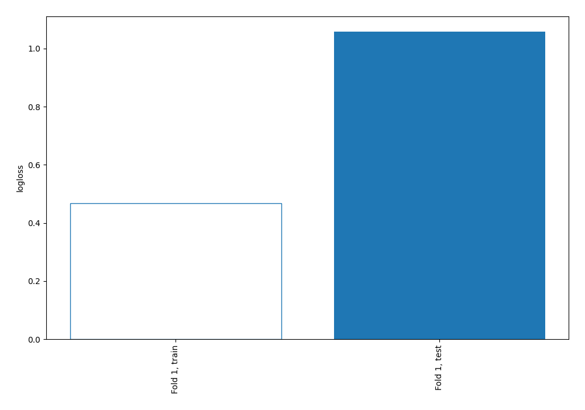

## Decision Tree 

### Tree #1
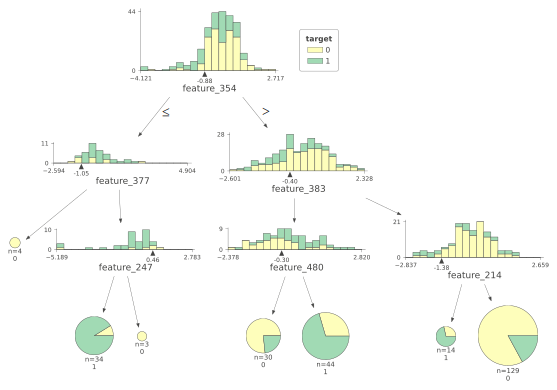

### Rules

if (feature_354 > -0.88) and (feature_383 > -0.399) and (feature_214 > -1.377) then class: 0 (proba: 82.95%) | based on 129 samples

if (feature_354 > -0.88) and (feature_383 <= -0.399) and (feature_480 > -0.296) then class: 1 (proba: 70.45%) | based on 44 samples

if (feature_354 <= -0.88) and (feature_377 > -1.05) and (feature_247 <= 0.459) then class: 1 (proba: 91.18%) | based on 34 samples

if (feature_354 > -0.88) and (feature_383 <= -0.399) and (feature_480 <= -0.296) then class: 0 (proba: 76.67%) | based on 30 samples

if (feature_354 > -0.88) and (feature_383 > -0.399) and (feature_214 <= -1.377) then class: 1 (proba: 71.43%) | based on 14 samples

if (feature_354 <= -0.88) and (feature_377 <= -1.05) then class: 0 (proba: 100.0%) | based on 4 samples

if (feature_354 <= -0.88) and (feature_377 > -1.05) and (feature_247 > 0.459) then class: 0 (proba: 100.0%) | based on 3 samples

## Permutation-based Importance
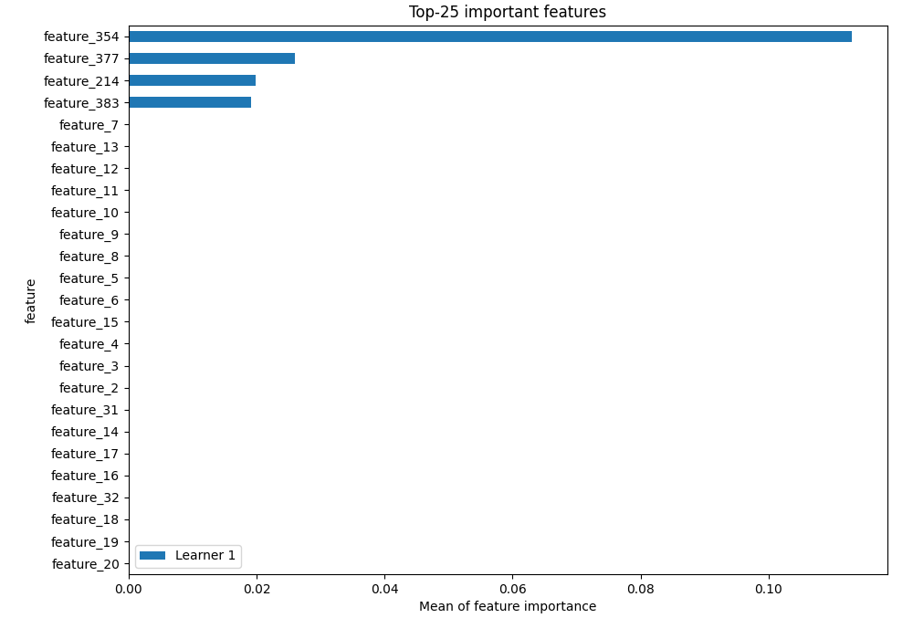
## Confusion Matrix

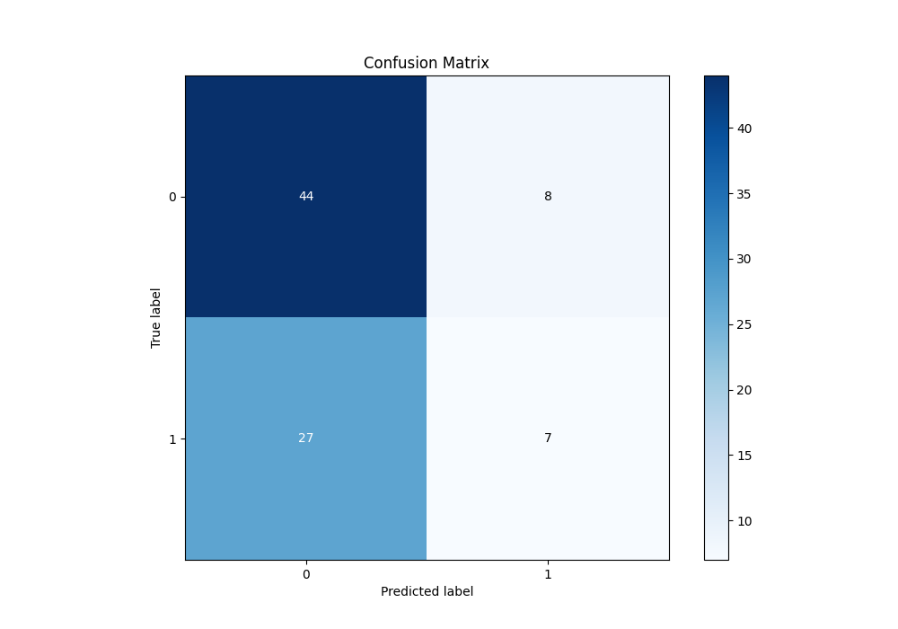

## Normalized Confusion Matrix

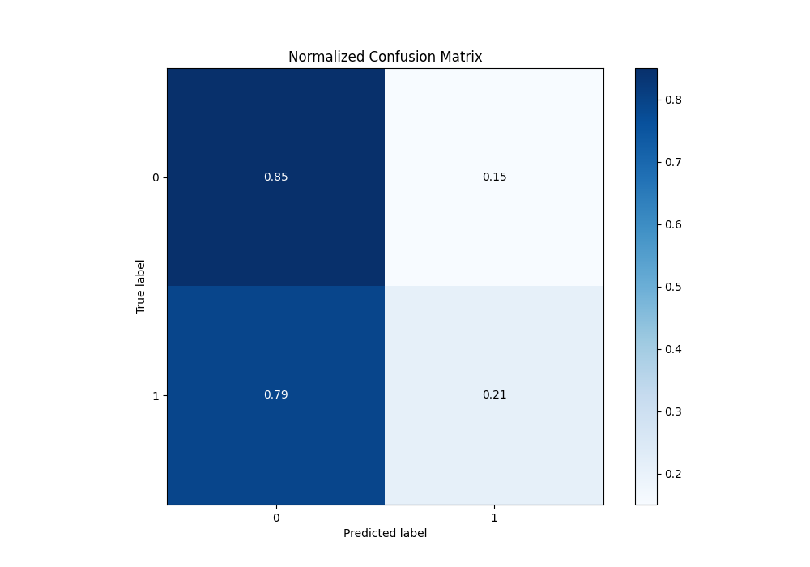

## ROC Curve

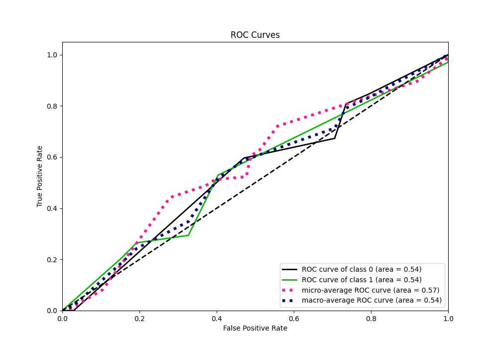

## Kolmogorov-Smirnov Statistic

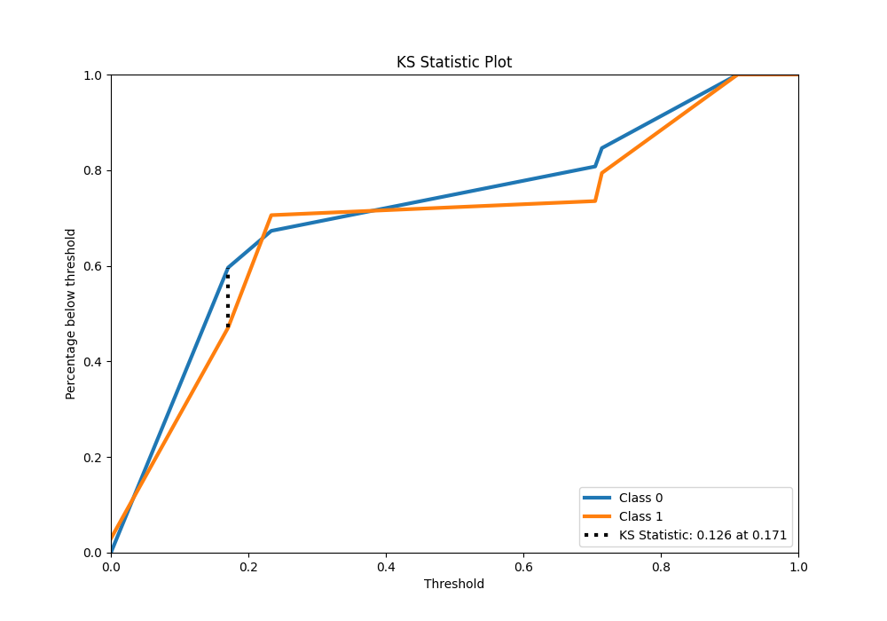

## Precision-Recall Curve

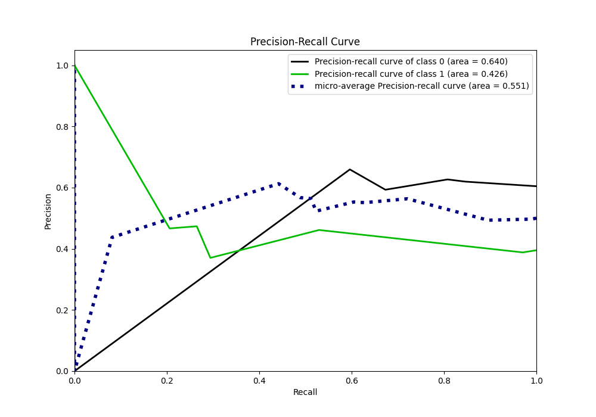

## Calibration Curve

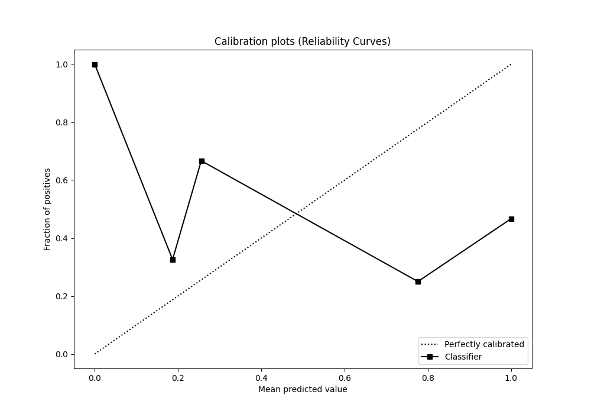

## Cumulative Gains Curve

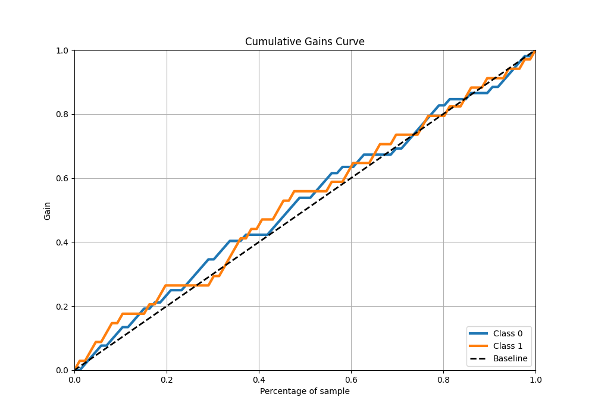

## Lift Curve

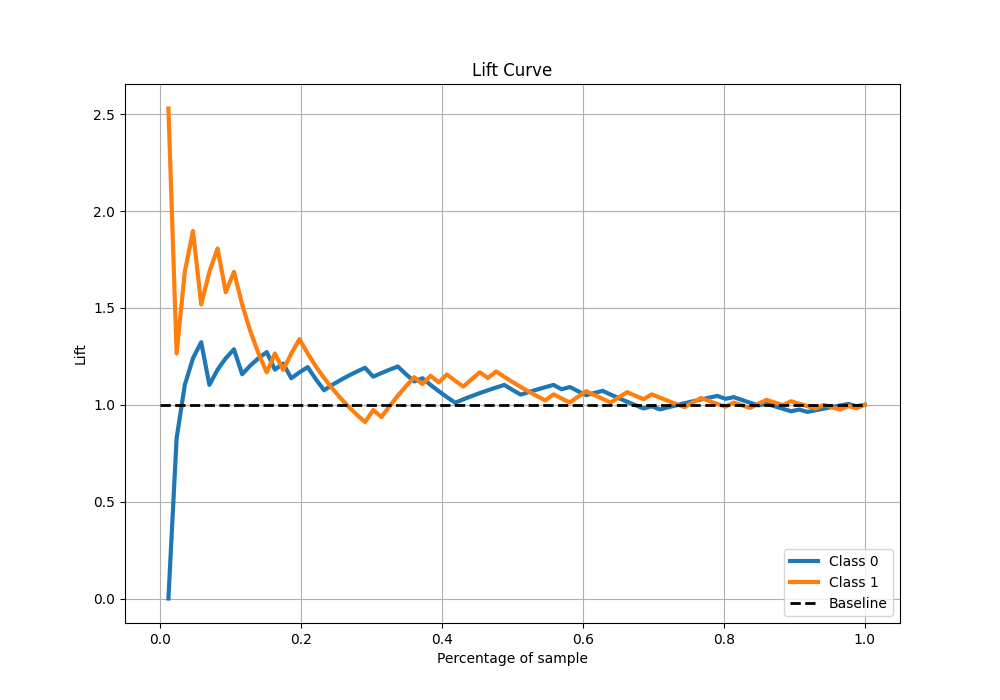

[<< Go back](../README.md)
