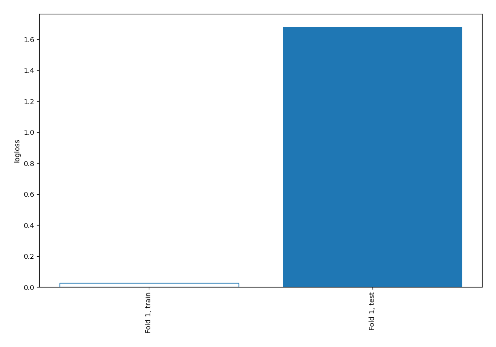
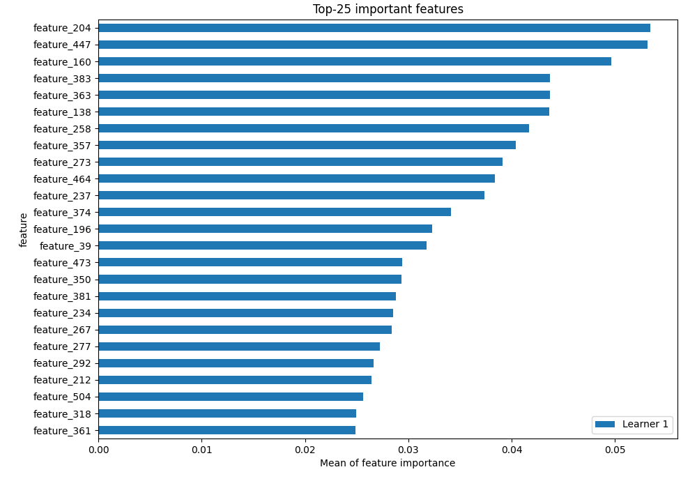
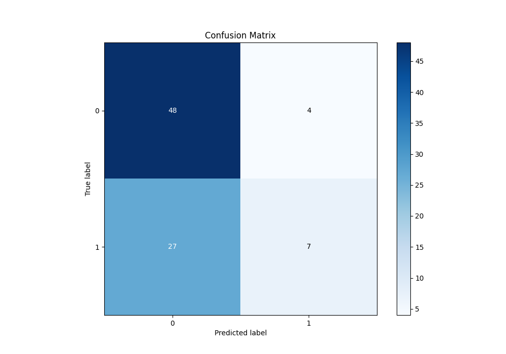
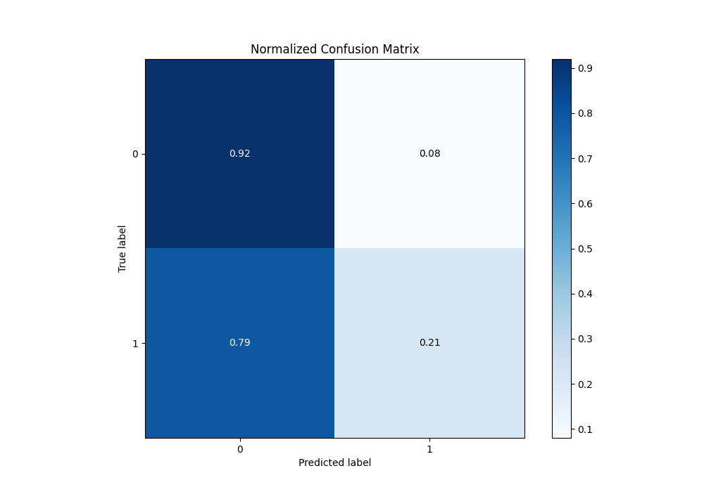
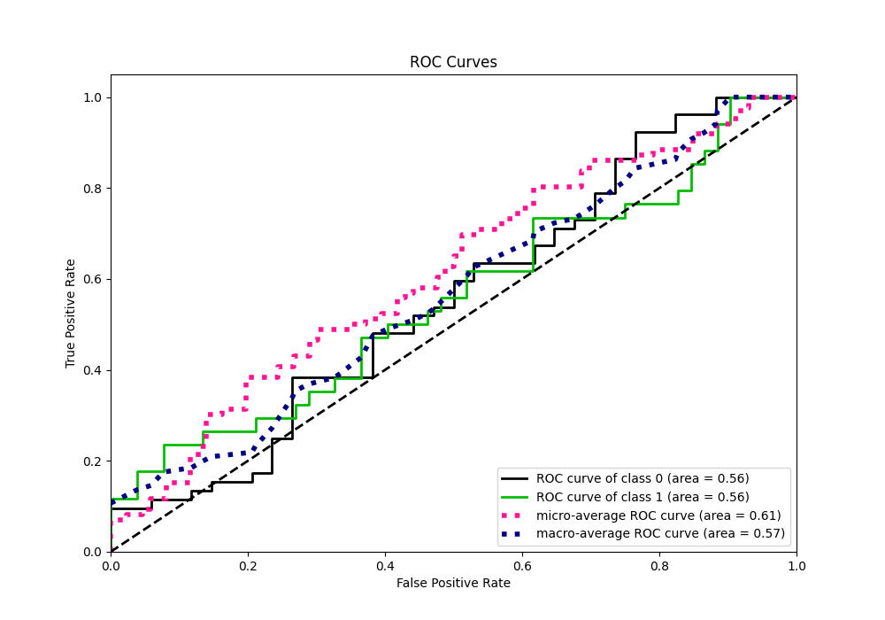
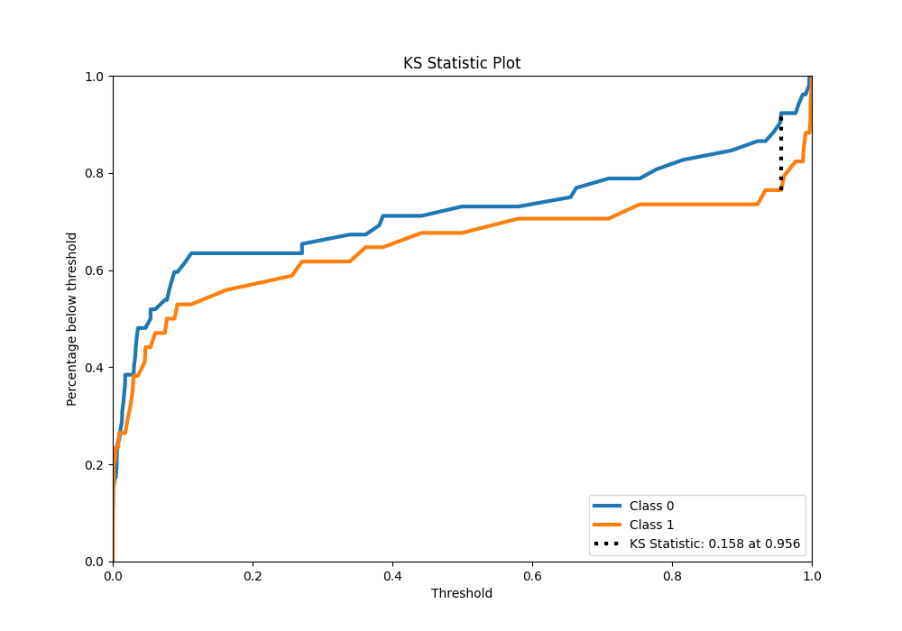
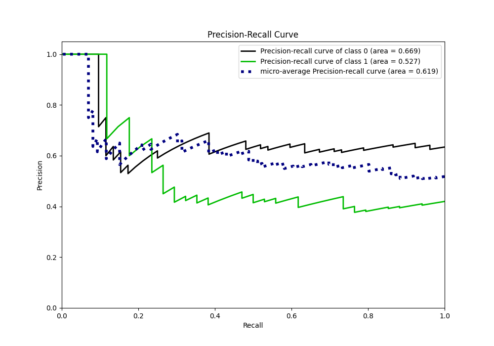
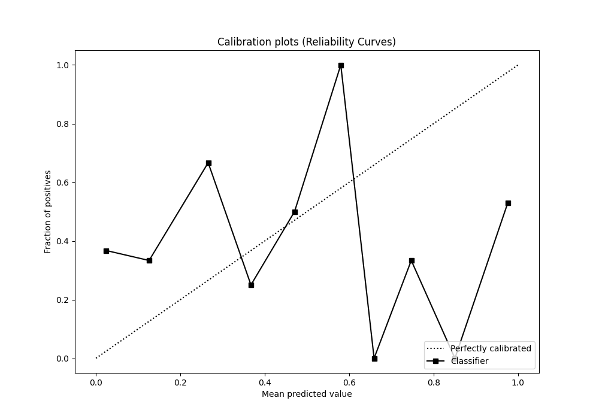
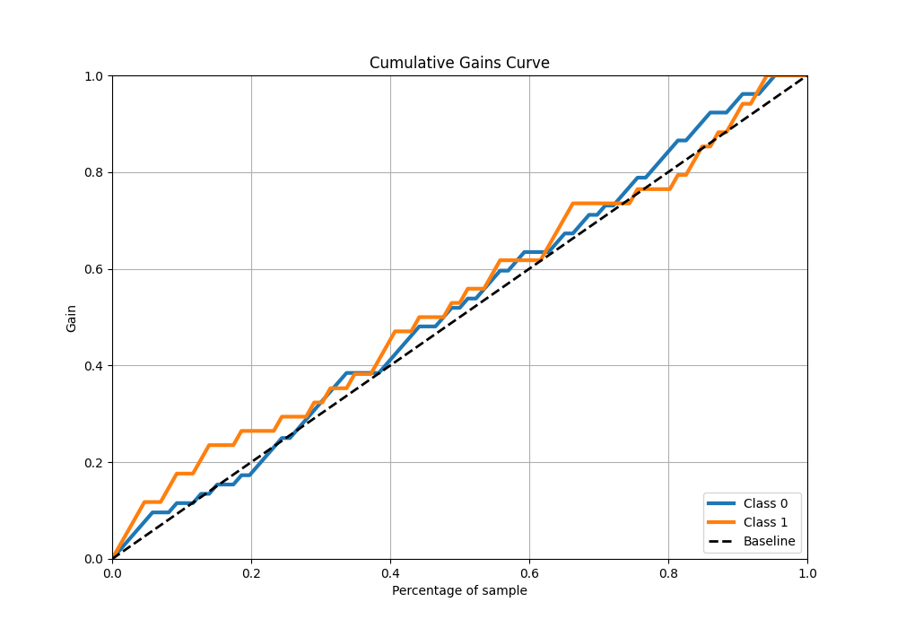
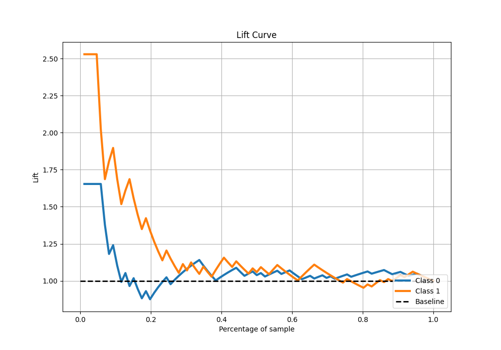

# Summary of 3_Linear

[<< Go back](../README.md)

## Logistic Regression (Linear)
- **n_jobs**: -1
- **explain_level**: 2

## Validation
 - **validation_type**: split
 - **train_ratio**: 0.75
 - **shuffle**: True
 - **stratify**: True

## Optimized metric
logloss

## Training time

2.0 seconds

## Metric details
|           |    score |     threshold |
|:----------|---------:|--------------:|
| logloss   | 1.68027  | nan           |
| auc       | 0.55543  | nan           |
| f1        | 0.576271 |   2.54434e-05 |
| accuracy  | 0.639535 |   0.975811    |
| precision | 0.666667 |   0.992589    |
| recall    | 1        |   2.70922e-07 |
| mcc       | 0.188785 |   0.975811    |

## Confusion matrix (at threshold=0.975811)
|              |   Predicted as 0 |   Predicted as 1 |
|:-------------|-----------------:|-----------------:|
| Labeled as 0 |               48 |                4 |
| Labeled as 1 |               27 |                7 |

## Learning curves

## Permutation-based Importance

## Confusion Matrix

## Normalized Confusion Matrix

## ROC Curve

## Kolmogorov-Smirnov Statistic

## Precision-Recall Curve

## Calibration Curve

## Cumulative Gains Curve

## Lift Curve

[<< Go back](../README.md)
