# Exploratory Data Analysis

[<< Go back](../README.md)
## Feature : target
- **Feature type** : discrete
- **Missing** : 0.0%
- **Unique** : 2
- **Count** :344.0
- **Mean** :0.39244186046511625
- **Std** :0.4890055024737347
- **Min** :0.0
- **25%th Percentile** : 0.0
- **50%th Percentile** : 0.0
- **75%th Percentile** : 1.0
- **Max** :1.0

## Feature : feature_1
- **Feature type** : continous
- **Missing** : 0.0%
- **Unique** : 344
- **Count** :344.0
- **Mean** :-0.0690167115235721
- **Std** :1.0032171437194601
- **Min** :-3.5788025915210353
- **25%th Percentile** : -0.7022058715053876
- **50%th Percentile** : 0.023941643523857213
- **75%th Percentile** : 0.6106232077029916
- **Max** :3.192726175709518

## Feature : feature_2
- **Feature type** : continous
- **Missing** : 0.0%
- **Unique** : 344
- **Count** :344.0
- **Mean** :-0.037064551994890796
- **Std** :1.020207983287256
- **Min** :-2.74222479897413
- **25%th Percentile** : -0.6670517958049218
- **50%th Percentile** : -0.06512069049000213
- **75%th Percentile** : 0.6758216776264169
- **Max** :2.8863446845628973

## Feature : feature_3
- **Feature type** : continous
- **Missing** : 0.0%
- **Unique** : 344
- **Count** :344.0
- **Mean** :-0.09042106234641391
- **Std** :0.9637857091488184
- **Min** :-4.433680365636048
- **25%th Percentile** : -0.5647381440397512
- **50%th Percentile** : -0.02136917416857647
- **75%th Percentile** : 0.5276287527857784
- **Max** :2.670408331782442

## Feature : feature_4
- **Feature type** : continous
- **Missing** : 0.0%
- **Unique** : 344
- **Count** :344.0
- **Mean** :-0.06006727982846917
- **Std** :1.0816570152270286
- **Min** :-7.682015411849338
- **25%th Percentile** : -0.588599201198023
- **50%th Percentile** : -0.0019696156620580296
- **75%th Percentile** : 0.5800926912915134
- **Max** :2.4467234680150165

## Feature : feature_5
- **Feature type** : continous
- **Missing** : 0.0%
- **Unique** : 344
- **Count** :344.0
- **Mean** :-0.10850787096981777
- **Std** :1.0087005104605977
- **Min** :-2.2718654763252535
- **25%th Percentile** : -0.5667068717839753
- **50%th Percentile** : 0.003957420165400827
- **75%th Percentile** : 0.6021548845523041
- **Max** :1.955008080351815

## Feature : feature_6
- **Feature type** : continous
- **Missing** : 0.0%
- **Unique** : 344
- **Count** :344.0
- **Mean** :0.19262291580524174
- **Std** :0.8853443530850986
- **Min** :-1.9987681913704078
- **25%th Percentile** : -0.3634934669662721
- **50%th Percentile** : 0.049439059901988686
- **75%th Percentile** : 0.5493989143367988
- **Max** :4.200760924493344

## Feature : feature_7
- **Feature type** : continous
- **Missing** : 0.0%
- **Unique** : 344
- **Count** :344.0
- **Mean** :-0.032519729230605594
- **Std** :0.9945354020851914
- **Min** :-3.5586190694515767
- **25%th Percentile** : -0.6132765405183055
- **50%th Percentile** : -0.07821675665445649
- **75%th Percentile** : 0.5583065300300908
- **Max** :3.0261992598871514

## Feature : feature_8
- **Feature type** : continous
- **Missing** : 0.0%
- **Unique** : 344
- **Count** :344.0
- **Mean** :-0.14463752933643986
- **Std** :0.9887777647199874
- **Min** :-3.101871657506322
- **25%th Percentile** : -0.7341147291607102
- **50%th Percentile** : -0.05715167728177384
- **75%th Percentile** : 0.56352103573648
- **Max** :2.264747301147569

## Feature : feature_9
- **Feature type** : continous
- **Missing** : 0.0%
- **Unique** : 344
- **Count** :344.0
- **Mean** :0.03008034752265423
- **Std** :1.024773840209935
- **Min** :-3.270938393511572
- **25%th Percentile** : -0.6122508503762574
- **50%th Percentile** : -0.005119933250783956
- **75%th Percentile** : 0.6687108280071291
- **Max** :3.400750605959294

## Feature : feature_10
- **Feature type** : continous
- **Missing** : 0.0%
- **Unique** : 344
- **Count** :344.0
- **Mean** :-0.05908477085499862
- **Std** :0.988064310159124
- **Min** :-3.2577461146902276
- **25%th Percentile** : -0.6852834789009088
- **50%th Percentile** : -0.014298802106812444
- **75%th Percentile** : 0.6464961924827676
- **Max** :1.9293072909560312

## Feature : feature_11
- **Feature type** : continous
- **Missing** : 0.0%
- **Unique** : 344
- **Count** :344.0
- **Mean** :-0.016755005456035112
- **Std** :0.9334885090322492
- **Min** :-2.7771196643603218
- **25%th Percentile** : -0.6234377763714671
- **50%th Percentile** : -0.047214245460138735
- **75%th Percentile** : 0.4644440770598889
- **Max** :3.4338648672275895

## Feature : feature_12
- **Feature type** : continous
- **Missing** : 0.0%
- **Unique** : 344
- **Count** :344.0
- **Mean** :0.02783322642875775
- **Std** :1.0155538259525037
- **Min** :-5.473731852000579
- **25%th Percentile** : -0.5625568105370833
- **50%th Percentile** : -0.0760433923178022
- **75%th Percentile** : 0.6847031958756407
- **Max** :4.5418217543450154

## Feature : feature_13
- **Feature type** : continous
- **Missing** : 0.0%
- **Unique** : 344
- **Count** :344.0
- **Mean** :-0.05640305295511947
- **Std** :1.0350807333268361
- **Min** :-2.7861013866685216
- **25%th Percentile** : -0.7124644689836763
- **50%th Percentile** : -0.09667571786592
- **75%th Percentile** : 0.44699372692012984
- **Max** :6.553702045531538

## Feature : feature_14
- **Feature type** : continous
- **Missing** : 0.0%
- **Unique** : 344
- **Count** :344.0
- **Mean** :0.03623129773915058
- **Std** :0.9440077992890308
- **Min** :-3.8558091101480505
- **25%th Percentile** : -0.371507973366048
- **50%th Percentile** : -0.027390539964677107
- **75%th Percentile** : 0.381927110853182
- **Max** :3.7837421310476764

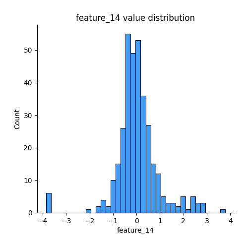
## Feature : feature_15
- **Feature type** : continous
- **Missing** : 0.0%
- **Unique** : 344
- **Count** :344.0
- **Mean** :0.004459315024030672
- **Std** :0.9853219913428803
- **Min** :-1.2119416256304916
- **25%th Percentile** : -1.1530873181250156
- **50%th Percentile** : 0.011256098050581647
- **75%th Percentile** : 0.6633196787503631
- **Max** :2.8849901157827658

## Feature : feature_16
- **Feature type** : continous
- **Missing** : 0.0%
- **Unique** : 344
- **Count** :344.0
- **Mean** :-0.0723266478841324
- **Std** :0.9767009279882523
- **Min** :-3.4432885242210496
- **25%th Percentile** : -0.5232961394848773
- **50%th Percentile** : -0.022750913649776792
- **75%th Percentile** : 0.5414357280864436
- **Max** :2.1324834255649674

## Feature : feature_17
- **Feature type** : continous
- **Missing** : 0.0%
- **Unique** : 344
- **Count** :344.0
- **Mean** :-0.13910965931586647
- **Std** :0.9526249293495923
- **Min** :-4.960511815505358
- **25%th Percentile** : -0.6167910802751343
- **50%th Percentile** : -0.0529292187754066
- **75%th Percentile** : 0.5173506350052782
- **Max** :2.3560089321308535

## Feature : feature_18
- **Feature type** : continous
- **Missing** : 0.0%
- **Unique** : 344
- **Count** :344.0
- **Mean** :-0.143097872228478
- **Std** :0.8684699785520215
- **Min** :-2.912676073398911
- **25%th Percentile** : -0.5555637558632035
- **50%th Percentile** : -0.0691805812298616
- **75%th Percentile** : 0.4294232294965932
- **Max** :3.0001255066824366

## Feature : feature_19
- **Feature type** : continous
- **Missing** : 0.0%
- **Unique** : 344
- **Count** :344.0
- **Mean** :-0.08948261843117387
- **Std** :1.0127596576007196
- **Min** :-2.6533448125191748
- **25%th Percentile** : -0.8153522581285335
- **50%th Percentile** : -0.037778289877278465
- **75%th Percentile** : 0.6095279787625977
- **Max** :2.508683816211868

## Feature : feature_20
- **Feature type** : continous
- **Missing** : 0.0%
- **Unique** : 344
- **Count** :344.0
- **Mean** :-0.07986094054547255
- **Std** :0.9747150064280184
- **Min** :-5.424912720636842
- **25%th Percentile** : -0.5872312434284662
- **50%th Percentile** : -0.08409404934127725
- **75%th Percentile** : 0.38251464819874414
- **Max** :4.572147510951028

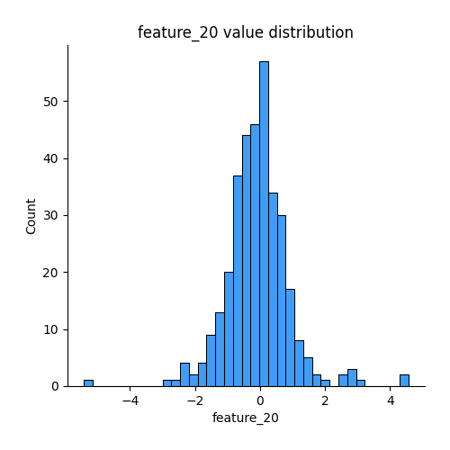
## Feature : feature_21
- **Feature type** : continous
- **Missing** : 0.0%
- **Unique** : 344
- **Count** :344.0
- **Mean** :-0.07896644605879924
- **Std** :0.9768244735928824
- **Min** :-4.414955658439755
- **25%th Percentile** : -0.6638008366869486
- **50%th Percentile** : -0.05778044649930117
- **75%th Percentile** : 0.5686950743927697
- **Max** :2.859195989646459

## Feature : feature_22
- **Feature type** : continous
- **Missing** : 0.0%
- **Unique** : 344
- **Count** :344.0
- **Mean** :-0.17376085532563784
- **Std** :0.9424178866987168
- **Min** :-4.8729160052686336
- **25%th Percentile** : -0.6375676695596171
- **50%th Percentile** : -0.0682711329422491
- **75%th Percentile** : 0.4048388643897308
- **Max** :2.1358009243242586

## Feature : feature_23
- **Feature type** : continous
- **Missing** : 0.0%
- **Unique** : 344
- **Count** :344.0
- **Mean** :-0.020849394342261306
- **Std** :0.9826710304409865
- **Min** :-2.7110364600084167
- **25%th Percentile** : -0.5635918600388614
- **50%th Percentile** : 0.012469135654623226
- **75%th Percentile** : 0.5047346193296641
- **Max** :2.9397189815306777

## Feature : feature_24
- **Feature type** : continous
- **Missing** : 0.0%
- **Unique** : 344
- **Count** :344.0
- **Mean** :-0.09409812333802398
- **Std** :0.9458907691539764
- **Min** :-5.0719469490269695
- **25%th Percentile** : -0.5707355006688426
- **50%th Percentile** : -0.0059341003647803885
- **75%th Percentile** : 0.5386758011325288
- **Max** :2.4501512701741652

## Feature : feature_25
- **Feature type** : continous
- **Missing** : 0.0%
- **Unique** : 344
- **Count** :344.0
- **Mean** :0.12000786162672551
- **Std** :0.8188749859002205
- **Min** :-1.7875397725188562
- **25%th Percentile** : -0.39538021349744545
- **50%th Percentile** : -0.015558730327160757
- **75%th Percentile** : 0.49283696411851063
- **Max** :5.712437109931769

## Feature : feature_26
- **Feature type** : continous
- **Missing** : 0.0%
- **Unique** : 344
- **Count** :344.0
- **Mean** :0.23649687858578813
- **Std** :1.026223115206075
- **Min** :-2.415628257032359
- **25%th Percentile** : -0.3575898043344242
- **50%th Percentile** : -0.01295704417253929
- **75%th Percentile** : 0.6622977891262614
- **Max** :5.49356167172601

## Feature : feature_27
- **Feature type** : continous
- **Missing** : 0.0%
- **Unique** : 344
- **Count** :344.0
- **Mean** :-0.19057623267518095
- **Std** :0.9797059011985312
- **Min** :-2.8861602214954476
- **25%th Percentile** : -0.7121663902354654
- **50%th Percentile** : 0.05378679510393645
- **75%th Percentile** : 0.5317490242831819
- **Max** :1.6746269819462491

## Feature : feature_28
- **Feature type** : continous
- **Missing** : 0.0%
- **Unique** : 344
- **Count** :344.0
- **Mean** :0.035254601104491794
- **Std** :1.063243030558299
- **Min** :-2.4201926934007907
- **25%th Percentile** : -0.7347543330778423
- **50%th Percentile** : 4.401860820291148e-16
- **75%th Percentile** : 0.6982222114540466
- **Max** :4.0138267570724455

## Feature : feature_29
- **Feature type** : continous
- **Missing** : 0.0%
- **Unique** : 344
- **Count** :344.0
- **Mean** :0.028960269519120254
- **Std** :0.9446233470043653
- **Min** :-2.3948227687176007
- **25%th Percentile** : -0.5862152865150823
- **50%th Percentile** : 0.012014127288888912
- **75%th Percentile** : 0.5666980028699505
- **Max** :4.833199558247077

## Feature : feature_30
- **Feature type** : continous
- **Missing** : 0.0%
- **Unique** : 344
- **Count** :344.0
- **Mean** :0.044501413390624814
- **Std** :1.008448411371949
- **Min** :-2.0878803428788877
- **25%th Percentile** : -0.6455777497379733
- **50%th Percentile** : -0.033144633802123624
- **75%th Percentile** : 0.6790682089117404
- **Max** :3.006647957076159

## Feature : feature_31
- **Feature type** : continous
- **Missing** : 0.0%
- **Unique** : 344
- **Count** :344.0
- **Mean** :0.17164864408170213
- **Std** :1.0256672473680222
- **Min** :-5.919302668465431
- **25%th Percentile** : -0.32733723873739123
- **50%th Percentile** : -0.038772127762024405
- **75%th Percentile** : 0.7662273245845475
- **Max** :2.730962154779028

## Feature : feature_32
- **Feature type** : continous
- **Missing** : 0.0%
- **Unique** : 344
- **Count** :344.0
- **Mean** :-0.107651402374528
- **Std** :0.9239429541755593
- **Min** :-3.6037351659410173
- **25%th Percentile** : -0.6907632100815932
- **50%th Percentile** : -0.07458837265719095
- **75%th Percentile** : 0.5203240749928776
- **Max** :2.169838588163791

## Feature : feature_33
- **Feature type** : continous
- **Missing** : 0.0%
- **Unique** : 344
- **Count** :344.0
- **Mean** :-0.26092772830620325
- **Std** :0.9923818685317738
- **Min** :-5.207522752414915
- **25%th Percentile** : -0.4343665092411755
- **50%th Percentile** : -0.0631003476820073
- **75%th Percentile** : 0.2204817583167027
- **Max** :1.2364493884682433

## Feature : feature_34
- **Feature type** : continous
- **Missing** : 0.0%
- **Unique** : 344
- **Count** :344.0
- **Mean** :0.04956482016416967
- **Std** :0.963035769155244
- **Min** :-3.294372160328986
- **25%th Percentile** : -0.5849780003128208
- **50%th Percentile** : -0.012318694995018743
- **75%th Percentile** : 0.6549147532761967
- **Max** :2.8944369559905847

## Feature : feature_35
- **Feature type** : continous
- **Missing** : 0.0%
- **Unique** : 344
- **Count** :344.0
- **Mean** :-0.11359397279901201
- **Std** :1.0091979811524374
- **Min** :-4.027564777809041
- **25%th Percentile** : -0.555353014763339
- **50%th Percentile** : -0.027798094230330507
- **75%th Percentile** : 0.48993277905733784
- **Max** :2.3764109761288497

## Feature : feature_36
- **Feature type** : continous
- **Missing** : 0.0%
- **Unique** : 344
- **Count** :344.0
- **Mean** :-0.01026799726608393
- **Std** :0.9625337160065403
- **Min** :-3.1527111518289117
- **25%th Percentile** : -0.6473613154364248
- **50%th Percentile** : -0.008570463403665804
- **75%th Percentile** : 0.6721586014922378
- **Max** :2.6080017055112776

## Feature : feature_37
- **Feature type** : continous
- **Missing** : 0.0%
- **Unique** : 344
- **Count** :344.0
- **Mean** :0.14399901232917436
- **Std** :0.9327592347408797
- **Min** :-2.3575386132278626
- **25%th Percentile** : -0.4800380504277551
- **50%th Percentile** : -0.10516236701901943
- **75%th Percentile** : 0.6493587437071517
- **Max** :3.562802367538525

## Feature : feature_38
- **Feature type** : continous
- **Missing** : 0.0%
- **Unique** : 344
- **Count** :344.0
- **Mean** :0.009762075750901097
- **Std** :0.9959507673903273
- **Min** :-2.752815569143568
- **25%th Percentile** : -0.6084077583522346
- **50%th Percentile** : 0.014385837480036969
- **75%th Percentile** : 0.6284466039664072
- **Max** :3.4325765387211606

## Feature : feature_39
- **Feature type** : continous
- **Missing** : 0.0%
- **Unique** : 344
- **Count** :344.0
- **Mean** :-0.127498013786087
- **Std** :1.0035136899158745
- **Min** :-4.5548778205679055
- **25%th Percentile** : -0.5583715511139652
- **50%th Percentile** : -0.027367113022933313
- **75%th Percentile** : 0.47363790158827906
- **Max** :3.2584016422524438

## Feature : feature_40
- **Feature type** : continous
- **Missing** : 0.0%
- **Unique** : 344
- **Count** :344.0
- **Mean** :-0.12016431484824744
- **Std** :1.03258688892541
- **Min** :-5.5471270675923225
- **25%th Percentile** : -0.5083958453065269
- **50%th Percentile** : 0.011037103050205405
- **75%th Percentile** : 0.4492102535354462
- **Max** :2.9043057990865457

## Feature : feature_41
- **Feature type** : continous
- **Missing** : 0.0%
- **Unique** : 344
- **Count** :344.0
- **Mean** :-0.15506967251176848
- **Std** :0.9497261569789319
- **Min** :-4.357591750451888
- **25%th Percentile** : -0.5483702587025883
- **50%th Percentile** : 0.006119392707506664
- **75%th Percentile** : 0.3810425525480553
- **Max** :2.56000983991549

## Feature : feature_42
- **Feature type** : continous
- **Missing** : 0.0%
- **Unique** : 344
- **Count** :344.0
- **Mean** :0.09586866045415898
- **Std** :1.0321583980034663
- **Min** :-3.3662428176666856
- **25%th Percentile** : -0.6707422789580482
- **50%th Percentile** : -0.05224856245199579
- **75%th Percentile** : 0.8579770315425292
- **Max** :2.8835363046442803

## Feature : feature_43
- **Feature type** : continous
- **Missing** : 0.0%
- **Unique** : 344
- **Count** :344.0
- **Mean** :-0.07856954739000464
- **Std** :0.9873796827044526
- **Min** :-3.5817389714623853
- **25%th Percentile** : -0.6691813721976572
- **50%th Percentile** : -0.005450275042002654
- **75%th Percentile** : 0.6131457939698239
- **Max** :1.8205057009818488

## Feature : feature_44
- **Feature type** : continous
- **Missing** : 0.0%
- **Unique** : 344
- **Count** :344.0
- **Mean** :-0.14331375402238428
- **Std** :0.9522588871515028
- **Min** :-3.808054310168112
- **25%th Percentile** : -0.6437053558757921
- **50%th Percentile** : -0.07793420825393796
- **75%th Percentile** : 0.5378075561578135
- **Max** :2.3452761006112532

## Feature : feature_45
- **Feature type** : continous
- **Missing** : 0.0%
- **Unique** : 344
- **Count** :344.0
- **Mean** :0.007845687852239904
- **Std** :0.9695917750614158
- **Min** :-2.4418116890212396
- **25%th Percentile** : -0.7176266011964109
- **50%th Percentile** : -0.15932878302909012
- **75%th Percentile** : 0.8384245070046141
- **Max** :2.4681986997128043

## Feature : feature_46
- **Feature type** : continous
- **Missing** : 0.0%
- **Unique** : 344
- **Count** :344.0
- **Mean** :0.024646982267725853
- **Std** :0.9879512447462775
- **Min** :-2.1000596853463875
- **25%th Percentile** : -0.781417014989397
- **50%th Percentile** : -0.09220080656825588
- **75%th Percentile** : 0.6728822474928178
- **Max** :3.2723427486156944

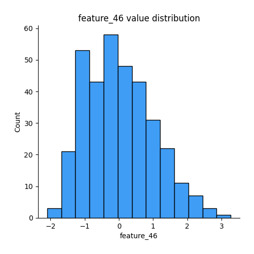
## Feature : feature_47
- **Feature type** : continous
- **Missing** : 0.0%
- **Unique** : 344
- **Count** :344.0
- **Mean** :0.0634354470229044
- **Std** :0.9809579892567191
- **Min** :-3.205733985403054
- **25%th Percentile** : -0.5458410349528464
- **50%th Percentile** : -0.03584087438049956
- **75%th Percentile** : 0.651295775563168
- **Max** :3.5510303914708046

## Feature : feature_48
- **Feature type** : continous
- **Missing** : 0.0%
- **Unique** : 344
- **Count** :344.0
- **Mean** :0.20355308839147548
- **Std** :1.0348614292464284
- **Min** :-1.7745123733776889
- **25%th Percentile** : -0.5836325281999409
- **50%th Percentile** : 0.003843390894280444
- **75%th Percentile** : 0.761236734883085
- **Max** :3.9668859932618084

## Feature : feature_49
- **Feature type** : continous
- **Missing** : 0.0%
- **Unique** : 344
- **Count** :344.0
- **Mean** :-0.04317424489891539
- **Std** :1.0138590051701473
- **Min** :-3.4489449166415467
- **25%th Percentile** : -0.6899904414539054
- **50%th Percentile** : 0.08894767011183238
- **75%th Percentile** : 0.6525762471406671
- **Max** :3.1690769597872195

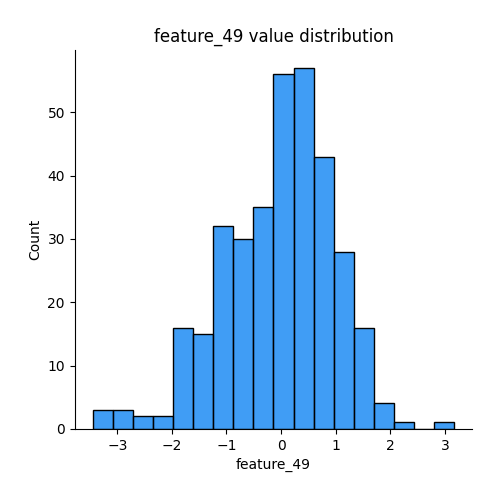
## Feature : feature_50
- **Feature type** : continous
- **Missing** : 0.0%
- **Unique** : 344
- **Count** :344.0
- **Mean** :-0.12061277786433937
- **Std** :0.9771793086223547
- **Min** :-5.245325902745767
- **25%th Percentile** : -0.6451238648380511
- **50%th Percentile** : -0.06517034151300849
- **75%th Percentile** : 0.5553162711973398
- **Max** :2.45498159054483

## Feature : feature_51
- **Feature type** : continous
- **Missing** : 0.0%
- **Unique** : 344
- **Count** :344.0
- **Mean** :-0.0011703618847877866
- **Std** :0.9785289613900658
- **Min** :-4.202124855273046
- **25%th Percentile** : -0.6899172499377916
- **50%th Percentile** : -0.0018840123239719183
- **75%th Percentile** : 0.676906158564724
- **Max** :2.8329721377669443

## Feature : feature_52
- **Feature type** : continous
- **Missing** : 0.0%
- **Unique** : 344
- **Count** :344.0
- **Mean** :-0.010627963603636737
- **Std** :0.9178990845602474
- **Min** :-4.982424199466543
- **25%th Percentile** : -0.4896576544342777
- **50%th Percentile** : -0.05907682684732389
- **75%th Percentile** : 0.5282111885474696
- **Max** :3.2368535976387767

## Feature : feature_53
- **Feature type** : continous
- **Missing** : 0.0%
- **Unique** : 344
- **Count** :344.0
- **Mean** :-0.04856181088133971
- **Std** :0.9793331818689124
- **Min** :-4.834476360581268
- **25%th Percentile** : -0.5168476196471568
- **50%th Percentile** : 0.00034440355527580913
- **75%th Percentile** : 0.5569013191870571
- **Max** :2.274721393188057

## Feature : feature_54
- **Feature type** : continous
- **Missing** : 0.0%
- **Unique** : 344
- **Count** :344.0
- **Mean** :-0.007708493759094799
- **Std** :1.0391514364713899
- **Min** :-2.6045279779697252
- **25%th Percentile** : -0.7081921466651736
- **50%th Percentile** : -0.010596434973330914
- **75%th Percentile** : 0.5517820996192768
- **Max** :3.48384107944476

## Feature : feature_55
- **Feature type** : continous
- **Missing** : 0.0%
- **Unique** : 344
- **Count** :344.0
- **Mean** :0.20876870792034072
- **Std** :1.027905522444942
- **Min** :-1.7952937676305485
- **25%th Percentile** : -0.4614729876919083
- **50%th Percentile** : -0.02274345026695245
- **75%th Percentile** : 0.7342905208964681
- **Max** :4.637187920044121

## Feature : feature_56
- **Feature type** : continous
- **Missing** : 0.0%
- **Unique** : 344
- **Count** :344.0
- **Mean** :-0.09326077983257759
- **Std** :0.9792270207963475
- **Min** :-3.368794859587845
- **25%th Percentile** : -0.6887826528843886
- **50%th Percentile** : -0.0985893691921002
- **75%th Percentile** : 0.588465174192143
- **Max** :3.0301254917148057

## Feature : feature_57
- **Feature type** : continous
- **Missing** : 0.0%
- **Unique** : 344
- **Count** :344.0
- **Mean** :-0.18817089248471344
- **Std** :0.9913477013479477
- **Min** :-2.7264058593153657
- **25%th Percentile** : -0.8235132871107721
- **50%th Percentile** : -0.0895696091682507
- **75%th Percentile** : 0.5504030252271308
- **Max** :2.0185784048578324

## Feature : feature_58
- **Feature type** : continous
- **Missing** : 0.0%
- **Unique** : 344
- **Count** :344.0
- **Mean** :0.0234129751163605
- **Std** :0.980437720735844
- **Min** :-2.7549392569985467
- **25%th Percentile** : -0.5927091472033231
- **50%th Percentile** : 0.005079630133895862
- **75%th Percentile** : 0.620702729328081
- **Max** :2.806699575735187

## Feature : feature_59
- **Feature type** : continous
- **Missing** : 0.0%
- **Unique** : 344
- **Count** :344.0
- **Mean** :0.08824464543969525
- **Std** :0.916035245072423
- **Min** :-2.882355190975834
- **25%th Percentile** : -0.5062352330108242
- **50%th Percentile** : 0.014586585197659962
- **75%th Percentile** : 0.5760419689971381
- **Max** :5.1224537782324795

## Feature : feature_60
- **Feature type** : continous
- **Missing** : 0.0%
- **Unique** : 344
- **Count** :344.0
- **Mean** :-0.11374646215305369
- **Std** :0.960324644940155
- **Min** :-4.456678070729315
- **25%th Percentile** : -0.6215606112570752
- **50%th Percentile** : 0.025962340005076606
- **75%th Percentile** : 0.5086472678520466
- **Max** :2.462625147236131

## Feature : feature_61
- **Feature type** : continous
- **Missing** : 0.0%
- **Unique** : 344
- **Count** :344.0
- **Mean** :-0.08458522254762087
- **Std** :1.0145160347114415
- **Min** :-3.736066873864952
- **25%th Percentile** : -0.4356109933547212
- **50%th Percentile** : -0.04059370205303531
- **75%th Percentile** : 0.39560631918684697
- **Max** :4.068314121630391

## Feature : feature_62
- **Feature type** : continous
- **Missing** : 0.0%
- **Unique** : 344
- **Count** :344.0
- **Mean** :0.15892944180832416
- **Std** :1.0004790647032764
- **Min** :-1.3732615425763246
- **25%th Percentile** : -0.5243750146190288
- **50%th Percentile** : -0.1254252181216575
- **75%th Percentile** : 0.5856984296133112
- **Max** :3.5111843301988723

## Feature : feature_63
- **Feature type** : continous
- **Missing** : 0.0%
- **Unique** : 344
- **Count** :344.0
- **Mean** :0.062163897706202335
- **Std** :0.9749584559771016
- **Min** :-2.503198832816132
- **25%th Percentile** : -0.5395831734387471
- **50%th Percentile** : 0.06785861452884173
- **75%th Percentile** : 0.646683074868875
- **Max** :4.48417359851783

## Feature : feature_64
- **Feature type** : continous
- **Missing** : 0.0%
- **Unique** : 344
- **Count** :344.0
- **Mean** :0.030152289240013556
- **Std** :1.0246812462636294
- **Min** :-3.8362279601246425
- **25%th Percentile** : -0.6377059635844681
- **50%th Percentile** : 0.006044651262642329
- **75%th Percentile** : 0.623823193102137
- **Max** :4.0920201413424895

## Feature : feature_65
- **Feature type** : continous
- **Missing** : 0.0%
- **Unique** : 344
- **Count** :344.0
- **Mean** :0.23047789468592508
- **Std** :0.9943500097288797
- **Min** :-1.3503931484971479
- **25%th Percentile** : -0.4302902111300134
- **50%th Percentile** : -0.02713605784738321
- **75%th Percentile** : 0.6500297951506344
- **Max** :5.460913203584246

## Feature : feature_66
- **Feature type** : continous
- **Missing** : 0.0%
- **Unique** : 344
- **Count** :344.0
- **Mean** :-0.06578093391091576
- **Std** :1.0022569031311752
- **Min** :-3.379525908203092
- **25%th Percentile** : -0.5947565924285064
- **50%th Percentile** : -0.05447394032574533
- **75%th Percentile** : 0.5277347711894089
- **Max** :3.030655622392786

## Feature : feature_67
- **Feature type** : continous
- **Missing** : 0.0%
- **Unique** : 344
- **Count** :344.0
- **Mean** :-0.018757101446835112
- **Std** :0.871187264218643
- **Min** :-4.275978980019047
- **25%th Percentile** : -0.5080654393860918
- **50%th Percentile** : -0.03581613782950604
- **75%th Percentile** : 0.4237422367787692
- **Max** :3.324306389286133

## Feature : feature_68
- **Feature type** : continous
- **Missing** : 0.0%
- **Unique** : 344
- **Count** :344.0
- **Mean** :-0.07092991552097212
- **Std** :0.9571615689545314
- **Min** :-4.951591087951974
- **25%th Percentile** : -0.5338660725221351
- **50%th Percentile** : -0.0009715586389309962
- **75%th Percentile** : 0.5049231359777772
- **Max** :2.28586504148656

## Feature : feature_69
- **Feature type** : continous
- **Missing** : 0.0%
- **Unique** : 344
- **Count** :344.0
- **Mean** :-0.2808507147126369
- **Std** :1.0395924893666364
- **Min** :-3.859510898154483
- **25%th Percentile** : -0.5703303586861631
- **50%th Percentile** : -0.027528377702828885
- **75%th Percentile** : 0.380887196247715
- **Max** :1.1376710672727837

## Feature : feature_70
- **Feature type** : continous
- **Missing** : 0.0%
- **Unique** : 344
- **Count** :344.0
- **Mean** :-0.1440572067905479
- **Std** :0.9854141634349823
- **Min** :-3.2695907987131383
- **25%th Percentile** : -0.7796237170063356
- **50%th Percentile** : -0.08193537190315768
- **75%th Percentile** : 0.5552478712334474
- **Max** :2.936088708090549

## Feature : feature_71
- **Feature type** : continous
- **Missing** : 0.0%
- **Unique** : 344
- **Count** :344.0
- **Mean** :-0.14100957762193084
- **Std** :1.022635147526416
- **Min** :-2.9451847847053276
- **25%th Percentile** : -0.9128690499073998
- **50%th Percentile** : -0.06261134237174736
- **75%th Percentile** : 0.6939187248761144
- **Max** :2.398917529508653

## Feature : feature_72
- **Feature type** : continous
- **Missing** : 0.0%
- **Unique** : 344
- **Count** :344.0
- **Mean** :0.03552452925733001
- **Std** :0.9647998135465231
- **Min** :-2.040426693156791
- **25%th Percentile** : -0.7260178094652775
- **50%th Percentile** : -0.12389439482527513
- **75%th Percentile** : 0.7231676615312166
- **Max** :2.9680064475170105

## Feature : feature_73
- **Feature type** : continous
- **Missing** : 0.0%
- **Unique** : 344
- **Count** :344.0
- **Mean** :-0.14826995290940223
- **Std** :0.9671017493186184
- **Min** :-6.308529783956709
- **25%th Percentile** : -0.5721781232398786
- **50%th Percentile** : -0.023021208480961026
- **75%th Percentile** : 0.4736321499868319
- **Max** :1.4932578500015319

## Feature : feature_74
- **Feature type** : continous
- **Missing** : 0.0%
- **Unique** : 344
- **Count** :344.0
- **Mean** :0.069014082785993
- **Std** :1.014830155505794
- **Min** :-2.6720797199349775
- **25%th Percentile** : -0.5795740714613418
- **50%th Percentile** : 0.05361558038020341
- **75%th Percentile** : 0.7292743997544437
- **Max** :4.297895211351576

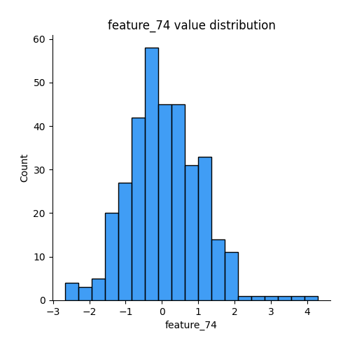
## Feature : feature_75
- **Feature type** : continous
- **Missing** : 0.0%
- **Unique** : 344
- **Count** :344.0
- **Mean** :-0.07267685645944973
- **Std** :0.9951483839147858
- **Min** :-4.463099020184957
- **25%th Percentile** : -0.6561422160791486
- **50%th Percentile** : -0.022634561071523604
- **75%th Percentile** : 0.6684615882311129
- **Max** :2.436296869114897

## Feature : feature_76
- **Feature type** : continous
- **Missing** : 0.0%
- **Unique** : 344
- **Count** :344.0
- **Mean** :-0.24268379249671404
- **Std** :0.9875541131367703
- **Min** :-4.708459096630318
- **25%th Percentile** : -0.6002493158263886
- **50%th Percentile** : -0.04419517817484945
- **75%th Percentile** : 0.32562171541067814
- **Max** :2.0855149641682256

## Feature : feature_77
- **Feature type** : continous
- **Missing** : 0.0%
- **Unique** : 344
- **Count** :344.0
- **Mean** :0.020665142079496743
- **Std** :0.9969217543068286
- **Min** :-2.6149611822484675
- **25%th Percentile** : -0.705009571555093
- **50%th Percentile** : 0.003997995353484039
- **75%th Percentile** : 0.8025930441942687
- **Max** :2.6495243084566793

## Feature : feature_78
- **Feature type** : continous
- **Missing** : 0.0%
- **Unique** : 344
- **Count** :344.0
- **Mean** :0.02761434677045533
- **Std** :0.9333869201671524
- **Min** :-2.429043904434034
- **25%th Percentile** : -0.5311070355497933
- **50%th Percentile** : -0.03276860858538436
- **75%th Percentile** : 0.5705253459658435
- **Max** :4.140777006691498

## Feature : feature_79
- **Feature type** : continous
- **Missing** : 0.0%
- **Unique** : 344
- **Count** :344.0
- **Mean** :0.23253308503042613
- **Std** :0.974671820902001
- **Min** :-1.7162166367602605
- **25%th Percentile** : -0.5044885015408408
- **50%th Percentile** : -0.06671168466672948
- **75%th Percentile** : 0.773462284333827
- **Max** :3.896563777919991

## Feature : feature_80
- **Feature type** : continous
- **Missing** : 0.0%
- **Unique** : 344
- **Count** :344.0
- **Mean** :0.03930325235562194
- **Std** :1.0076717735691776
- **Min** :-2.1996395567293905
- **25%th Percentile** : -0.6225982897013957
- **50%th Percentile** : -0.08971311417724118
- **75%th Percentile** : 0.5081546628503646
- **Max** :4.636221830449918

## Feature : feature_81
- **Feature type** : continous
- **Missing** : 0.0%
- **Unique** : 344
- **Count** :344.0
- **Mean** :0.023790339464734005
- **Std** :1.0231730529197256
- **Min** :-3.2783259738507815
- **25%th Percentile** : -0.5604737422728805
- **50%th Percentile** : 0.0040406546759642415
- **75%th Percentile** : 0.6176970067702613
- **Max** :4.192086123584404

## Feature : feature_82
- **Feature type** : continous
- **Missing** : 0.0%
- **Unique** : 344
- **Count** :344.0
- **Mean** :0.05286125575427055
- **Std** :0.9547623198377403
- **Min** :-1.9920919255451173
- **25%th Percentile** : -0.5545816367383261
- **50%th Percentile** : -0.03346390550973326
- **75%th Percentile** : 0.5139265021618512
- **Max** :4.326247414667898

## Feature : feature_83
- **Feature type** : continous
- **Missing** : 0.0%
- **Unique** : 344
- **Count** :344.0
- **Mean** :-0.022688384705507488
- **Std** :0.9695496041757766
- **Min** :-2.6033671018307016
- **25%th Percentile** : -0.7410871242801101
- **50%th Percentile** : -0.018877957348513975
- **75%th Percentile** : 0.5750171824956192
- **Max** :2.6722713056999408

## Feature : feature_84
- **Feature type** : continous
- **Missing** : 0.0%
- **Unique** : 344
- **Count** :344.0
- **Mean** :-0.20224842799207177
- **Std** :1.0125886907083765
- **Min** :-7.972466501902106
- **25%th Percentile** : -0.5101082875323584
- **50%th Percentile** : -0.017395550241067096
- **75%th Percentile** : 0.34578976644456866
- **Max** :1.7263433374534822

## Feature : feature_85
- **Feature type** : continous
- **Missing** : 0.0%
- **Unique** : 344
- **Count** :344.0
- **Mean** :0.1455575558581072
- **Std** :1.0310325436647017
- **Min** :-1.6161544415906486
- **25%th Percentile** : -0.4800714316226399
- **50%th Percentile** : -0.03017372410305471
- **75%th Percentile** : 0.4844521064288303
- **Max** :5.384778505661046

## Feature : feature_86
- **Feature type** : continous
- **Missing** : 0.0%
- **Unique** : 344
- **Count** :344.0
- **Mean** :-0.0053020441356383475
- **Std** :0.99917337899907
- **Min** :-2.1857832271772137
- **25%th Percentile** : -0.8194034277488293
- **50%th Percentile** : -0.07231672194850457
- **75%th Percentile** : 0.7667773127263027
- **Max** :2.325402452620048

## Feature : feature_87
- **Feature type** : continous
- **Missing** : 0.0%
- **Unique** : 344
- **Count** :344.0
- **Mean** :0.013541001914291678
- **Std** :0.896974777283555
- **Min** :-2.2607664653833854
- **25%th Percentile** : -0.6620624891823631
- **50%th Percentile** : -0.09323806236915763
- **75%th Percentile** : 0.6203574478927041
- **Max** :2.8037530564964968

## Feature : feature_88
- **Feature type** : continous
- **Missing** : 0.0%
- **Unique** : 344
- **Count** :344.0
- **Mean** :0.06930392096798413
- **Std** :0.9979303352675868
- **Min** :-4.058285195018649
- **25%th Percentile** : -0.508909515593497
- **50%th Percentile** : 0.022076508087297
- **75%th Percentile** : 0.6046110802706901
- **Max** :2.8154710738219566

## Feature : feature_89
- **Feature type** : continous
- **Missing** : 0.0%
- **Unique** : 344
- **Count** :344.0
- **Mean** :0.032157338602614396
- **Std** :0.9292510912561066
- **Min** :-2.3268111141378403
- **25%th Percentile** : -0.6074238476677863
- **50%th Percentile** : -0.016719938730539063
- **75%th Percentile** : 0.5956096066572425
- **Max** :3.4181434119152665

## Feature : feature_90
- **Feature type** : continous
- **Missing** : 0.0%
- **Unique** : 344
- **Count** :344.0
- **Mean** :0.14116271339795566
- **Std** :0.9599694693728811
- **Min** :-3.9727150304613
- **25%th Percentile** : -0.4390427221714705
- **50%th Percentile** : 0.0077200341814034675
- **75%th Percentile** : 0.5433003572297224
- **Max** :3.1308732933135786

## Feature : feature_91
- **Feature type** : continous
- **Missing** : 0.0%
- **Unique** : 344
- **Count** :344.0
- **Mean** :0.0024421029922208175
- **Std** :0.9973645848987548
- **Min** :-3.27433622311561
- **25%th Percentile** : -0.5601473077436667
- **50%th Percentile** : 0.054415736921882965
- **75%th Percentile** : 0.6203249238261513
- **Max** :2.6552889018922823

## Feature : feature_92
- **Feature type** : continous
- **Missing** : 0.0%
- **Unique** : 344
- **Count** :344.0
- **Mean** :-0.031163701265773745
- **Std** :0.9675510391103059
- **Min** :-2.912388262065141
- **25%th Percentile** : -0.7105910942920222
- **50%th Percentile** : -0.023161648303721027
- **75%th Percentile** : 0.583908269882692
- **Max** :2.330384161658674

## Feature : feature_93
- **Feature type** : continous
- **Missing** : 0.0%
- **Unique** : 344
- **Count** :344.0
- **Mean** :0.04313953400933002
- **Std** :1.0077325247314661
- **Min** :-4.369636750446385
- **25%th Percentile** : -0.5638756210650493
- **50%th Percentile** : 0.02681233578546441
- **75%th Percentile** : 0.5347841039525556
- **Max** :5.217187874627948

## Feature : feature_94
- **Feature type** : continous
- **Missing** : 0.0%
- **Unique** : 344
- **Count** :344.0
- **Mean** :-0.08931385644598827
- **Std** :0.9903710864343995
- **Min** :-5.327330384760416
- **25%th Percentile** : -0.7175750727722174
- **50%th Percentile** : -0.07517774915902882
- **75%th Percentile** : 0.48957904081218917
- **Max** :3.169722011696048

## Feature : feature_95
- **Feature type** : continous
- **Missing** : 0.0%
- **Unique** : 344
- **Count** :344.0
- **Mean** :0.1383364958572821
- **Std** :1.0078250300511151
- **Min** :-4.850919415673948
- **25%th Percentile** : -0.5062930384175015
- **50%th Percentile** : 0.03065086016720376
- **75%th Percentile** : 0.6812440231499304
- **Max** :4.846899808110044

## Feature : feature_96
- **Feature type** : continous
- **Missing** : 0.0%
- **Unique** : 344
- **Count** :344.0
- **Mean** :-0.056337166577553256
- **Std** :0.9682514477424388
- **Min** :-5.4589359154336865
- **25%th Percentile** : -0.5806472432956407
- **50%th Percentile** : -0.050841788552727335
- **75%th Percentile** : 0.5894357430152051
- **Max** :3.0629708923322707

## Feature : feature_97
- **Feature type** : continous
- **Missing** : 0.0%
- **Unique** : 344
- **Count** :344.0
- **Mean** :0.24792796458925445
- **Std** :1.0147101947966175
- **Min** :-1.8643949787618472
- **25%th Percentile** : -0.5301779386806045
- **50%th Percentile** : -0.01121815307949875
- **75%th Percentile** : 0.727585218797605
- **Max** :3.1496944110585336

## Feature : feature_98
- **Feature type** : continous
- **Missing** : 0.0%
- **Unique** : 344
- **Count** :344.0
- **Mean** :0.012540241383978072
- **Std** :0.9718061825096406
- **Min** :-6.4761488064964405
- **25%th Percentile** : -0.4374732071384302
- **50%th Percentile** : 0.02308927228458292
- **75%th Percentile** : 0.5497578709737799
- **Max** :2.8889159072455666

## Feature : feature_99
- **Feature type** : continous
- **Missing** : 0.0%
- **Unique** : 344
- **Count** :344.0
- **Mean** :0.03703913403575331
- **Std** :0.9317723966413456
- **Min** :-7.05764889731156
- **25%th Percentile** : -0.41490791661566984
- **50%th Percentile** : -0.009590094717724446
- **75%th Percentile** : 0.5260781517758246
- **Max** :4.5602284278976315

## Feature : feature_100
- **Feature type** : continous
- **Missing** : 0.0%
- **Unique** : 343
- **Count** :344.0
- **Mean** :-0.36486419587088936
- **Std** :0.9836408947116726
- **Min** :-1.3990335889687129
- **25%th Percentile** : -1.3572778005668877
- **50%th Percentile** : -0.01469114324140477
- **75%th Percentile** : 0.3664120683613366
- **Max** :2.872744159245026

## Feature : feature_101
- **Feature type** : continous
- **Missing** : 0.0%
- **Unique** : 344
- **Count** :344.0
- **Mean** :0.08485865621001078
- **Std** :1.0075451628389072
- **Min** :-3.3447552532537617
- **25%th Percentile** : -0.5820422082612431
- **50%th Percentile** : -0.03828247685186491
- **75%th Percentile** : 0.6128341473933349
- **Max** :4.329997316073612

## Feature : feature_102
- **Feature type** : continous
- **Missing** : 0.0%
- **Unique** : 344
- **Count** :344.0
- **Mean** :0.06162662028862451
- **Std** :1.0098385102104876
- **Min** :-4.531027557617693
- **25%th Percentile** : -0.6003538910418467
- **50%th Percentile** : 0.025640163267397174
- **75%th Percentile** : 0.6956972059563804
- **Max** :3.0121508042606324

## Feature : feature_103
- **Feature type** : continous
- **Missing** : 0.0%
- **Unique** : 344
- **Count** :344.0
- **Mean** :-0.05942157118215889
- **Std** :1.010376905828049
- **Min** :-4.081901678923308
- **25%th Percentile** : -0.8891665022241093
- **50%th Percentile** : -0.12677693918769395
- **75%th Percentile** : 0.6701545405900933
- **Max** :3.637080313251935

## Feature : feature_104
- **Feature type** : continous
- **Missing** : 0.0%
- **Unique** : 344
- **Count** :344.0
- **Mean** :0.05482691110974203
- **Std** :0.9567199367543979
- **Min** :-3.769660557212886
- **25%th Percentile** : -0.5670653006988866
- **50%th Percentile** : 0.01674175088329046
- **75%th Percentile** : 0.5722598982193963
- **Max** :3.869769948483748

## Feature : feature_105
- **Feature type** : continous
- **Missing** : 0.0%
- **Unique** : 344
- **Count** :344.0
- **Mean** :0.3168018465565092
- **Std** :1.0086384577600578
- **Min** :-1.044782692743481
- **25%th Percentile** : -0.4344534065534273
- **50%th Percentile** : -0.040615990913855204
- **75%th Percentile** : 0.850132416346653
- **Max** :4.155680376644981

## Feature : feature_106
- **Feature type** : continous
- **Missing** : 0.0%
- **Unique** : 344
- **Count** :344.0
- **Mean** :0.12129232116520547
- **Std** :1.0561424450346526
- **Min** :-2.0185225289583184
- **25%th Percentile** : -0.6028649780539777
- **50%th Percentile** : 0.003689217044368871
- **75%th Percentile** : 0.6592514973719316
- **Max** :4.877394441193801

## Feature : feature_107
- **Feature type** : continous
- **Missing** : 0.0%
- **Unique** : 344
- **Count** :344.0
- **Mean** :-0.5860720159241842
- **Std** :1.0153824874951622
- **Min** :-1.9849335611922911
- **25%th Percentile** : -1.9493619640045705
- **50%th Percentile** : -0.0279129545246809
- **75%th Percentile** : 0.2236059413153778
- **Max** :0.9732470769853202

## Feature : feature_108
- **Feature type** : continous
- **Missing** : 0.0%
- **Unique** : 344
- **Count** :344.0
- **Mean** :0.022140033503010078
- **Std** :0.9588675243930784
- **Min** :-2.5883564392198455
- **25%th Percentile** : -0.5572667917771403
- **50%th Percentile** : -0.024073953768019372
- **75%th Percentile** : 0.5123909713690253
- **Max** :4.685521546208083

## Feature : feature_109
- **Feature type** : continous
- **Missing** : 0.0%
- **Unique** : 344
- **Count** :344.0
- **Mean** :0.09409442944635292
- **Std** :0.959710704263009
- **Min** :-3.1295567907185666
- **25%th Percentile** : -0.576952344299895
- **50%th Percentile** : 0.10245372689781436
- **75%th Percentile** : 0.7858032362186718
- **Max** :2.6256345302691

## Feature : feature_110
- **Feature type** : continous
- **Missing** : 0.0%
- **Unique** : 344
- **Count** :344.0
- **Mean** :-0.0667403199243485
- **Std** :0.9550680583988526
- **Min** :-3.102827915399494
- **25%th Percentile** : -0.7656312947204675
- **50%th Percentile** : 0.025789772917637836
- **75%th Percentile** : 0.5880310239414442
- **Max** :2.4600564429453406

## Feature : feature_111
- **Feature type** : continous
- **Missing** : 0.0%
- **Unique** : 344
- **Count** :344.0
- **Mean** :0.07696427578755181
- **Std** :0.997127796202334
- **Min** :-2.6791272117680296
- **25%th Percentile** : -0.5672944241540618
- **50%th Percentile** : 0.08899076053418534
- **75%th Percentile** : 0.7851502925291283
- **Max** :2.6427864692673433

## Feature : feature_112
- **Feature type** : continous
- **Missing** : 0.0%
- **Unique** : 344
- **Count** :344.0
- **Mean** :-0.07470544867910822
- **Std** :0.9494915396830164
- **Min** :-4.924838507938844
- **25%th Percentile** : -0.5223216455101374
- **50%th Percentile** : -7.28583859910259e-17
- **75%th Percentile** : 0.48474177534495727
- **Max** :2.1782452777735437

## Feature : feature_113
- **Feature type** : continous
- **Missing** : 0.0%
- **Unique** : 344
- **Count** :344.0
- **Mean** :0.04305008685445282
- **Std** :1.0629899579676796
- **Min** :-2.7552042206132343
- **25%th Percentile** : -0.5615364533572564
- **50%th Percentile** : 0.0015796303575252918
- **75%th Percentile** : 0.6124194695931128
- **Max** :3.6362248021000294

## Feature : feature_114
- **Feature type** : continous
- **Missing** : 0.0%
- **Unique** : 344
- **Count** :344.0
- **Mean** :-0.26671657890443634
- **Std** :1.0090055429402098
- **Min** :-2.046851992141111
- **25%th Percentile** : -0.8015067127126743
- **50%th Percentile** : 0.004764547698757591
- **75%th Percentile** : 0.4814440229345611
- **Max** :1.5597998029134599

## Feature : feature_115
- **Feature type** : continous
- **Missing** : 0.0%
- **Unique** : 344
- **Count** :344.0
- **Mean** :0.10933692619297945
- **Std** :1.0128210067736232
- **Min** :-3.5641198181136073
- **25%th Percentile** : -0.4833251094410778
- **50%th Percentile** : -0.010829389595100086
- **75%th Percentile** : 0.6579379582284279
- **Max** :5.407955859579301

## Feature : feature_116
- **Feature type** : continous
- **Missing** : 0.0%
- **Unique** : 344
- **Count** :344.0
- **Mean** :0.15303939447578693
- **Std** :1.0009023846274825
- **Min** :-3.2617052419769355
- **25%th Percentile** : -0.4100697658641189
- **50%th Percentile** : 0.021019638250249217
- **75%th Percentile** : 0.6998399098921619
- **Max** :3.230640942462155

## Feature : feature_117
- **Feature type** : continous
- **Missing** : 0.0%
- **Unique** : 344
- **Count** :344.0
- **Mean** :-0.21308781400093252
- **Std** :1.0987611779640747
- **Min** :-5.317378641794347
- **25%th Percentile** : -0.23815956203158403
- **50%th Percentile** : -0.008746667624338877
- **75%th Percentile** : 0.1981052453695189
- **Max** :1.6366995896113956

## Feature : feature_118
- **Feature type** : continous
- **Missing** : 0.0%
- **Unique** : 344
- **Count** :344.0
- **Mean** :-0.022105504497724117
- **Std** :0.9820662144253369
- **Min** :-4.050910901004809
- **25%th Percentile** : -0.6332498970504752
- **50%th Percentile** : -0.08442548834728092
- **75%th Percentile** : 0.7762486520291055
- **Max** :2.462524977828808

## Feature : feature_119
- **Feature type** : continous
- **Missing** : 0.0%
- **Unique** : 343
- **Count** :344.0
- **Mean** :-0.00558009738895561
- **Std** :0.9638025564708291
- **Min** :-2.8919060519941517
- **25%th Percentile** : -0.6303494164326193
- **50%th Percentile** : -0.03031369009773259
- **75%th Percentile** : 0.5251135507655434
- **Max** :5.276801462100906

## Feature : feature_120
- **Feature type** : continous
- **Missing** : 0.0%
- **Unique** : 344
- **Count** :344.0
- **Mean** :-0.08795764469625543
- **Std** :0.91981110051683
- **Min** :-6.176150849979402
- **25%th Percentile** : -0.5835591012691606
- **50%th Percentile** : 0.015289387144320349
- **75%th Percentile** : 0.5130194492160635
- **Max** :2.0840332743882803

## Feature : feature_121
- **Feature type** : continous
- **Missing** : 0.0%
- **Unique** : 344
- **Count** :344.0
- **Mean** :0.3383074313053756
- **Std** :1.0066931860809136
- **Min** :-2.2025710679281034
- **25%th Percentile** : -0.27861961095741805
- **50%th Percentile** : 0.005087848381253322
- **75%th Percentile** : 1.0269221194244569
- **Max** :3.3409256634034383

## Feature : feature_122
- **Feature type** : continous
- **Missing** : 0.0%
- **Unique** : 344
- **Count** :344.0
- **Mean** :0.0982134540637978
- **Std** :0.9624936700267143
- **Min** :-2.473145438331791
- **25%th Percentile** : -0.3205746679310612
- **50%th Percentile** : 0.026094502165237763
- **75%th Percentile** : 0.4574827756799093
- **Max** :3.6242724926190557

## Feature : feature_123
- **Feature type** : continous
- **Missing** : 0.0%
- **Unique** : 344
- **Count** :344.0
- **Mean** :-0.03946606351501014
- **Std** :0.9775251253069739
- **Min** :-3.098124811741755
- **25%th Percentile** : -0.637852492840756
- **50%th Percentile** : 0.01637350001695829
- **75%th Percentile** : 0.5637014729939959
- **Max** :2.6687706383772567

## Feature : feature_124
- **Feature type** : continous
- **Missing** : 0.0%
- **Unique** : 344
- **Count** :344.0
- **Mean** :0.057571821325062195
- **Std** :1.0310948337285777
- **Min** :-4.0521149061597495
- **25%th Percentile** : -0.6008273020434076
- **50%th Percentile** : -0.007153958173189065
- **75%th Percentile** : 0.6264809084858083
- **Max** :4.786619006469698

## Feature : feature_125
- **Feature type** : continous
- **Missing** : 0.0%
- **Unique** : 344
- **Count** :344.0
- **Mean** :0.07700774683524023
- **Std** :1.0040068945392726
- **Min** :-2.876183443330159
- **25%th Percentile** : -0.5441092917732729
- **50%th Percentile** : 0.11161024407539707
- **75%th Percentile** : 0.6658014280201119
- **Max** :5.480962989995729

## Feature : feature_126
- **Feature type** : continous
- **Missing** : 0.0%
- **Unique** : 344
- **Count** :344.0
- **Mean** :0.06357575611172338
- **Std** :0.9974766518765337
- **Min** :-3.962765707244524
- **25%th Percentile** : -0.6745948623746678
- **50%th Percentile** : 0.026657479546009402
- **75%th Percentile** : 0.6928149141036261
- **Max** :3.3981382243910727

## Feature : feature_127
- **Feature type** : continous
- **Missing** : 0.0%
- **Unique** : 344
- **Count** :344.0
- **Mean** :-0.09219257058223258
- **Std** :0.8858940450757322
- **Min** :-4.926379758558302
- **25%th Percentile** : -0.5199018479293224
- **50%th Percentile** : 0.03153247477700115
- **75%th Percentile** : 0.48768781033153624
- **Max** :1.4906021612369962

## Feature : feature_128
- **Feature type** : continous
- **Missing** : 0.0%
- **Unique** : 344
- **Count** :344.0
- **Mean** :-0.014073219911718466
- **Std** :0.997166801411396
- **Min** :-2.13002659158013
- **25%th Percentile** : -0.793111238622827
- **50%th Percentile** : -0.03378764642987157
- **75%th Percentile** : 0.6984118346719933
- **Max** :2.4447179771559844

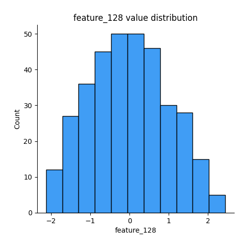
## Feature : feature_129
- **Feature type** : continous
- **Missing** : 0.0%
- **Unique** : 344
- **Count** :344.0
- **Mean** :-0.06552802812819203
- **Std** :0.9686179293497622
- **Min** :-2.8462481524275782
- **25%th Percentile** : -0.4448335133599146
- **50%th Percentile** : 0.03868719300021618
- **75%th Percentile** : 0.40426870974660684
- **Max** :5.2825891445527535

## Feature : feature_130
- **Feature type** : continous
- **Missing** : 0.0%
- **Unique** : 343
- **Count** :344.0
- **Mean** :-0.057269085136149686
- **Std** :0.8718182642572799
- **Min** :-5.277856384815769
- **25%th Percentile** : -0.3433018876936217
- **50%th Percentile** : 0.03831267918051474
- **75%th Percentile** : 0.43838157702820746
- **Max** :1.6652789064618068

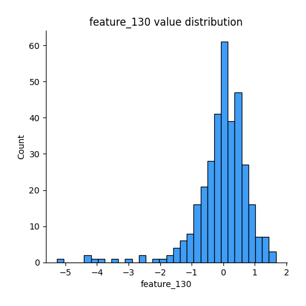
## Feature : feature_131
- **Feature type** : continous
- **Missing** : 0.0%
- **Unique** : 344
- **Count** :344.0
- **Mean** :0.0837745529804034
- **Std** :0.652415657026331
- **Min** :-1.1734669727828069
- **25%th Percentile** : -0.3143250381718357
- **50%th Percentile** : -0.0007398337274742226
- **75%th Percentile** : 0.31366779352192503
- **Max** :5.572604116504977

## Feature : feature_132
- **Feature type** : continous
- **Missing** : 0.0%
- **Unique** : 344
- **Count** :344.0
- **Mean** :-0.01607246878480707
- **Std** :1.0083807411959036
- **Min** :-5.666655461002863
- **25%th Percentile** : -0.5415496576910866
- **50%th Percentile** : 0.11700502545345644
- **75%th Percentile** : 0.5699719777382319
- **Max** :2.8673376387263554

## Feature : feature_133
- **Feature type** : continous
- **Missing** : 0.0%
- **Unique** : 344
- **Count** :344.0
- **Mean** :0.11603593046574244
- **Std** :0.8839634997120435
- **Min** :-1.829847742380224
- **25%th Percentile** : -0.2734241024617107
- **50%th Percentile** : 0.02465000095232136
- **75%th Percentile** : 0.2767866127391957
- **Max** :5.189215958604509

## Feature : feature_134
- **Feature type** : continous
- **Missing** : 0.0%
- **Unique** : 344
- **Count** :344.0
- **Mean** :-0.14303788846000634
- **Std** :0.6857429256681441
- **Min** :-6.248721242363206
- **25%th Percentile** : -0.47754785715576087
- **50%th Percentile** : 0.0123237782044069
- **75%th Percentile** : 0.3069636745424239
- **Max** :1.0426578352077325

## Feature : feature_135
- **Feature type** : continous
- **Missing** : 0.0%
- **Unique** : 344
- **Count** :344.0
- **Mean** :-0.14718512972952558
- **Std** :0.9927468674334887
- **Min** :-6.7220348337464175
- **25%th Percentile** : -0.5245736227301534
- **50%th Percentile** : -0.0009739922134030067
- **75%th Percentile** : 0.36579073286714875
- **Max** :1.5135059651430922

## Feature : feature_136
- **Feature type** : continous
- **Missing** : 0.0%
- **Unique** : 344
- **Count** :344.0
- **Mean** :-0.16411087555715584
- **Std** :1.0700542797407515
- **Min** :-7.594340194021117
- **25%th Percentile** : -0.5244486139500643
- **50%th Percentile** : -0.01604626091700248
- **75%th Percentile** : 0.4037622159765682
- **Max** :3.110995950585834

## Feature : feature_137
- **Feature type** : continous
- **Missing** : 0.0%
- **Unique** : 344
- **Count** :344.0
- **Mean** :-0.040588879381975695
- **Std** :0.9531974315133341
- **Min** :-4.636564021247099
- **25%th Percentile** : -0.5432780295506051
- **50%th Percentile** : -0.03319796459529083
- **75%th Percentile** : 0.5157767889149965
- **Max** :2.980455647317271

## Feature : feature_138
- **Feature type** : continous
- **Missing** : 0.0%
- **Unique** : 344
- **Count** :344.0
- **Mean** :-0.026349448038933035
- **Std** :0.9514828297949706
- **Min** :-2.5825247697331655
- **25%th Percentile** : -0.6353709817974093
- **50%th Percentile** : -0.11496601400682607
- **75%th Percentile** : 0.5295760208911888
- **Max** :3.650237404160595

## Feature : feature_139
- **Feature type** : continous
- **Missing** : 0.0%
- **Unique** : 344
- **Count** :344.0
- **Mean** :-0.08014735330546348
- **Std** :1.0103137857067221
- **Min** :-7.4420563419797965
- **25%th Percentile** : -0.549182250030468
- **50%th Percentile** : -0.07152747267178894
- **75%th Percentile** : 0.38181932811325947
- **Max** :4.846231760357867

## Feature : feature_140
- **Feature type** : continous
- **Missing** : 0.0%
- **Unique** : 344
- **Count** :344.0
- **Mean** :-0.12915188764313998
- **Std** :1.0396170745655662
- **Min** :-7.5044016823842385
- **25%th Percentile** : -0.6023786945937797
- **50%th Percentile** : -0.09640091771585965
- **75%th Percentile** : 0.46507349713994733
- **Max** :2.67760560401538

## Feature : feature_141
- **Feature type** : continous
- **Missing** : 0.0%
- **Unique** : 344
- **Count** :344.0
- **Mean** :0.8375919115115807
- **Std** :0.9939405722229899
- **Min** :-0.049587793791080026
- **25%th Percentile** : -0.01692083204849889
- **50%th Percentile** : 0.002541878531326513
- **75%th Percentile** : 1.60434904753829
- **Max** :3.4690198235925136

## Feature : feature_142
- **Feature type** : continous
- **Missing** : 0.0%
- **Unique** : 344
- **Count** :344.0
- **Mean** :0.0517794246910261
- **Std** :1.0275031958872298
- **Min** :-3.0564613109601675
- **25%th Percentile** : -0.49367725916630767
- **50%th Percentile** : -0.04801063467185748
- **75%th Percentile** : 0.31994499546221167
- **Max** :4.973998243519142

## Feature : feature_143
- **Feature type** : continous
- **Missing** : 0.0%
- **Unique** : 344
- **Count** :344.0
- **Mean** :0.00043934879936727354
- **Std** :0.9839743516799392
- **Min** :-2.6421547443503597
- **25%th Percentile** : -0.6092449425603554
- **50%th Percentile** : -0.013270355443969019
- **75%th Percentile** : 0.5695689240552859
- **Max** :3.739598165654527

## Feature : feature_144
- **Feature type** : continous
- **Missing** : 0.0%
- **Unique** : 344
- **Count** :344.0
- **Mean** :-0.2947492922925627
- **Std** :0.9651180535922709
- **Min** :-4.117118609493236
- **25%th Percentile** : -0.270002709527337
- **50%th Percentile** : 0.005889761382404983
- **75%th Percentile** : 0.1303710781819566
- **Max** :0.4009681566785995

## Feature : feature_145
- **Feature type** : continous
- **Missing** : 0.0%
- **Unique** : 344
- **Count** :344.0
- **Mean** :-0.1052672147708853
- **Std** :1.0122038467126997
- **Min** :-4.302243579783812
- **25%th Percentile** : -0.5756114868181739
- **50%th Percentile** : -0.04912579204014063
- **75%th Percentile** : 0.45403303608113116
- **Max** :4.5184294655301525

## Feature : feature_146
- **Feature type** : continous
- **Missing** : 0.0%
- **Unique** : 344
- **Count** :344.0
- **Mean** :-0.13590590340799988
- **Std** :0.9691124569209077
- **Min** :-2.716719459889566
- **25%th Percentile** : -0.4605127832908068
- **50%th Percentile** : 0.05476874064313738
- **75%th Percentile** : 0.4978384620311966
- **Max** :1.5835112023493343

## Feature : feature_147
- **Feature type** : continous
- **Missing** : 0.0%
- **Unique** : 344
- **Count** :344.0
- **Mean** :-0.056003414136516216
- **Std** :0.9654536400293388
- **Min** :-2.6596541628583457
- **25%th Percentile** : -0.7243762447279549
- **50%th Percentile** : -0.029137108498649825
- **75%th Percentile** : 0.6267493269959723
- **Max** :2.5624075652903584

## Feature : feature_148
- **Feature type** : continous
- **Missing** : 0.0%
- **Unique** : 344
- **Count** :344.0
- **Mean** :-0.18300668817421117
- **Std** :1.072117337098447
- **Min** :-8.12243562271845
- **25%th Percentile** : -0.607120476180985
- **50%th Percentile** : -0.01561273379532346
- **75%th Percentile** : 0.4944438420388412
- **Max** :1.9632043348059787

## Feature : feature_149
- **Feature type** : continous
- **Missing** : 0.0%
- **Unique** : 344
- **Count** :344.0
- **Mean** :-0.15401379414746608
- **Std** :0.921934102988412
- **Min** :-4.092172527099027
- **25%th Percentile** : -0.6740197828758663
- **50%th Percentile** : -0.0711262314626476
- **75%th Percentile** : 0.4475690174288195
- **Max** :2.3823967751994455

## Feature : feature_150
- **Feature type** : continous
- **Missing** : 0.0%
- **Unique** : 344
- **Count** :344.0
- **Mean** :-0.1066233410193925
- **Std** :0.9445184342751808
- **Min** :-3.244263479186005
- **25%th Percentile** : -0.638197495864361
- **50%th Percentile** : -0.04321525540722411
- **75%th Percentile** : 0.514216203105573
- **Max** :2.34140836156324

## Feature : feature_151
- **Feature type** : continous
- **Missing** : 0.0%
- **Unique** : 344
- **Count** :344.0
- **Mean** :-0.0933586920767193
- **Std** :1.0220085933985448
- **Min** :-2.8567412553284406
- **25%th Percentile** : -0.7094849996357668
- **50%th Percentile** : -0.10583335608032476
- **75%th Percentile** : 0.5824805555714436
- **Max** :2.0815079282925892

## Feature : feature_152
- **Feature type** : continous
- **Missing** : 0.0%
- **Unique** : 344
- **Count** :344.0
- **Mean** :0.08944232667972635
- **Std** :0.9386727012460793
- **Min** :-3.481916112694256
- **25%th Percentile** : -0.5375026840215417
- **50%th Percentile** : -0.019305214758350456
- **75%th Percentile** : 0.668787796985701
- **Max** :3.014983641221864

## Feature : feature_153
- **Feature type** : continous
- **Missing** : 0.0%
- **Unique** : 344
- **Count** :344.0
- **Mean** :-0.11127366327522618
- **Std** :1.000550289716545
- **Min** :-5.767626744107431
- **25%th Percentile** : -0.4968528988945057
- **50%th Percentile** : -0.0006336277097369963
- **75%th Percentile** : 0.44715418186795036
- **Max** :1.9060420350317389

## Feature : feature_154
- **Feature type** : continous
- **Missing** : 0.0%
- **Unique** : 344
- **Count** :344.0
- **Mean** :-0.1328881410085829
- **Std** :1.00714539407357
- **Min** :-7.041606019046212
- **25%th Percentile** : -0.6129020841580324
- **50%th Percentile** : 0.030829816338177777
- **75%th Percentile** : 0.48038749413263915
- **Max** :1.8711620769825033

## Feature : feature_155
- **Feature type** : continous
- **Missing** : 0.0%
- **Unique** : 344
- **Count** :344.0
- **Mean** :0.06572237218369809
- **Std** :0.9670927883251403
- **Min** :-2.92409688304235
- **25%th Percentile** : -0.6204547680970751
- **50%th Percentile** : -0.0032213123167951947
- **75%th Percentile** : 0.5500044192312435
- **Max** :4.006267524716862

## Feature : feature_156
- **Feature type** : continous
- **Missing** : 0.0%
- **Unique** : 344
- **Count** :344.0
- **Mean** :0.1175929321755092
- **Std** :0.907708425470547
- **Min** :-2.292763550771308
- **25%th Percentile** : -0.4457139543127359
- **50%th Percentile** : 0.024669872507860426
- **75%th Percentile** : 0.6162072381213208
- **Max** :4.057474189734775

## Feature : feature_157
- **Feature type** : continous
- **Missing** : 0.0%
- **Unique** : 344
- **Count** :344.0
- **Mean** :-0.09186668792083798
- **Std** :1.0020250553500891
- **Min** :-5.960995371870956
- **25%th Percentile** : -0.6767494009203189
- **50%th Percentile** : -0.08769535254207947
- **75%th Percentile** : 0.5837109463942975
- **Max** :2.4985054600364496

## Feature : feature_158
- **Feature type** : continous
- **Missing** : 0.0%
- **Unique** : 344
- **Count** :344.0
- **Mean** :-0.32686355959816704
- **Std** :1.011619227333884
- **Min** :-1.7810600999539388
- **25%th Percentile** : -1.7036602372325271
- **50%th Percentile** : -0.08944960767222998
- **75%th Percentile** : 0.49631471341073274
- **Max** :1.764146610720454

## Feature : feature_159
- **Feature type** : continous
- **Missing** : 0.0%
- **Unique** : 344
- **Count** :344.0
- **Mean** :-0.000477905839638801
- **Std** :0.9371133480931777
- **Min** :-2.759866903200504
- **25%th Percentile** : -0.5759384964901257
- **50%th Percentile** : -0.0162541225448003
- **75%th Percentile** : 0.5098270062965264
- **Max** :3.9473515828029346

## Feature : feature_160
- **Feature type** : continous
- **Missing** : 0.0%
- **Unique** : 344
- **Count** :344.0
- **Mean** :0.2007380743545123
- **Std** :0.9620747145052894
- **Min** :-1.316731157766852
- **25%th Percentile** : -0.41699198242821756
- **50%th Percentile** : -0.02581516967176537
- **75%th Percentile** : 0.6599702176694597
- **Max** :5.364496355277724

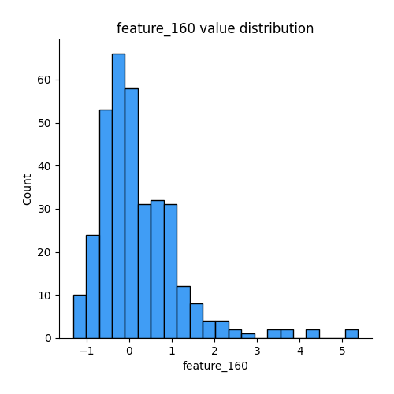
## Feature : feature_161
- **Feature type** : continous
- **Missing** : 0.0%
- **Unique** : 344
- **Count** :344.0
- **Mean** :0.0760113459823763
- **Std** :0.9661497848781083
- **Min** :-2.8087199992451897
- **25%th Percentile** : -0.5407725838605317
- **50%th Percentile** : -0.005048212979690895
- **75%th Percentile** : 0.6611486078978063
- **Max** :4.780481987973211

## Feature : feature_162
- **Feature type** : continous
- **Missing** : 0.0%
- **Unique** : 344
- **Count** :344.0
- **Mean** :0.20437854229282915
- **Std** :0.9993196984299264
- **Min** :-1.5316345307144659
- **25%th Percentile** : -0.5638090203088559
- **50%th Percentile** : -0.04301171882055861
- **75%th Percentile** : 0.8487180454379483
- **Max** :3.0665678283060065

## Feature : feature_163
- **Feature type** : continous
- **Missing** : 0.0%
- **Unique** : 344
- **Count** :344.0
- **Mean** :-0.07409382548200116
- **Std** :0.9674068366030579
- **Min** :-5.788542920552563
- **25%th Percentile** : -0.5067392009199035
- **50%th Percentile** : -0.03954370078277351
- **75%th Percentile** : 0.4974289259302819
- **Max** :2.2391694029678337

## Feature : feature_164
- **Feature type** : continous
- **Missing** : 0.0%
- **Unique** : 344
- **Count** :344.0
- **Mean** :0.10944239437703365
- **Std** :0.98429620585436
- **Min** :-6.211899839240343
- **25%th Percentile** : -0.5097508284015753
- **50%th Percentile** : -0.03666153606488826
- **75%th Percentile** : 0.7633646775519021
- **Max** :2.5997093180231015

## Feature : feature_165
- **Feature type** : continous
- **Missing** : 0.0%
- **Unique** : 344
- **Count** :344.0
- **Mean** :0.0223671660700829
- **Std** :0.9947861694545959
- **Min** :-3.5053014251612233
- **25%th Percentile** : -0.5761479342858417
- **50%th Percentile** : 0.014694445142328288
- **75%th Percentile** : 0.6215697187827687
- **Max** :3.841516538817978

## Feature : feature_166
- **Feature type** : continous
- **Missing** : 0.0%
- **Unique** : 344
- **Count** :344.0
- **Mean** :-0.09143873840393203
- **Std** :1.000025399131396
- **Min** :-7.747762579225789
- **25%th Percentile** : -0.5465892357756538
- **50%th Percentile** : -0.10090205069844435
- **75%th Percentile** : 0.45295136984785983
- **Max** :3.0539698563547253

## Feature : feature_167
- **Feature type** : continous
- **Missing** : 0.0%
- **Unique** : 344
- **Count** :344.0
- **Mean** :-0.08838768912922736
- **Std** :1.049319833555408
- **Min** :-6.143458634218168
- **25%th Percentile** : -0.5149896885394304
- **50%th Percentile** : -0.05956715583287671
- **75%th Percentile** : 0.4071867616376921
- **Max** :2.386058794674421

## Feature : feature_168
- **Feature type** : continous
- **Missing** : 0.0%
- **Unique** : 344
- **Count** :344.0
- **Mean** :0.11896206210112498
- **Std** :0.9785727014895244
- **Min** :-3.579724512857872
- **25%th Percentile** : -0.5599065179280422
- **50%th Percentile** : 0.18202674628441556
- **75%th Percentile** : 0.7810613188053842
- **Max** :2.6211935515284734

## Feature : feature_169
- **Feature type** : continous
- **Missing** : 0.0%
- **Unique** : 344
- **Count** :344.0
- **Mean** :0.08325002844587502
- **Std** :1.009550178836975
- **Min** :-2.759722986079715
- **25%th Percentile** : -0.6016560299257446
- **50%th Percentile** : 0.12705294083344354
- **75%th Percentile** : 0.7115434888636449
- **Max** :2.655847907779453

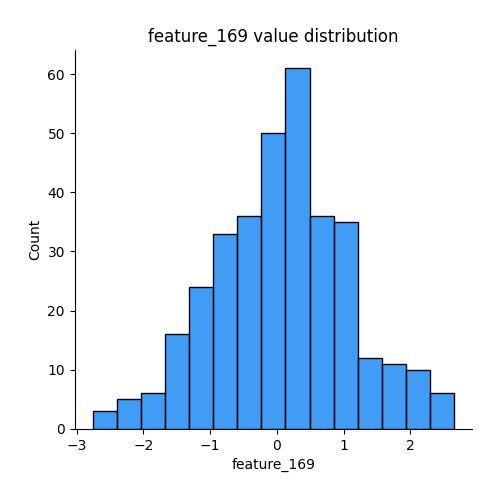
## Feature : feature_170
- **Feature type** : continous
- **Missing** : 0.0%
- **Unique** : 343
- **Count** :344.0
- **Mean** :-0.15405953984310386
- **Std** :1.0538371569178715
- **Min** :-6.9749077456433
- **25%th Percentile** : -0.44572769880003743
- **50%th Percentile** : -0.001631778826957989
- **75%th Percentile** : 0.36142938883378767
- **Max** :2.919075288819394

## Feature : feature_171
- **Feature type** : continous
- **Missing** : 0.0%
- **Unique** : 344
- **Count** :344.0
- **Mean** :0.10593498850580525
- **Std** :1.005010427834133
- **Min** :-6.935903783965719
- **25%th Percentile** : -0.5716613512340889
- **50%th Percentile** : 0.008116347896485823
- **75%th Percentile** : 0.7044197947409864
- **Max** :2.8575362245871987

## Feature : feature_172
- **Feature type** : continous
- **Missing** : 0.0%
- **Unique** : 344
- **Count** :344.0
- **Mean** :-0.13513487222113435
- **Std** :0.8581572777866382
- **Min** :-3.984210616865336
- **25%th Percentile** : -0.5782815922268891
- **50%th Percentile** : -0.034335537573676064
- **75%th Percentile** : 0.4238722714056874
- **Max** :2.300177721188673

## Feature : feature_173
- **Feature type** : continous
- **Missing** : 0.0%
- **Unique** : 344
- **Count** :344.0
- **Mean** :0.0442608241023891
- **Std** :0.9869109062650024
- **Min** :-2.2591866802925114
- **25%th Percentile** : -0.6647945287628048
- **50%th Percentile** : -0.0034703970008433385
- **75%th Percentile** : 0.6881311169837838
- **Max** :3.165073487401507

## Feature : feature_174
- **Feature type** : continous
- **Missing** : 0.0%
- **Unique** : 344
- **Count** :344.0
- **Mean** :-0.0559987202266561
- **Std** :0.9761525497901158
- **Min** :-4.2678423270399355
- **25%th Percentile** : -0.6297908390988114
- **50%th Percentile** : -0.02952409413547076
- **75%th Percentile** : 0.49469739086113707
- **Max** :3.750187837323839

## Feature : feature_175
- **Feature type** : continous
- **Missing** : 0.0%
- **Unique** : 344
- **Count** :344.0
- **Mean** :-0.004643649283990224
- **Std** :0.9850232673012054
- **Min** :-3.482621323274952
- **25%th Percentile** : -0.4690953228947034
- **50%th Percentile** : -0.011243746273355601
- **75%th Percentile** : 0.4501400467999395
- **Max** :3.1747726637256046

## Feature : feature_176
- **Feature type** : continous
- **Missing** : 0.0%
- **Unique** : 344
- **Count** :344.0
- **Mean** :0.11540482960854584
- **Std** :0.9950416952440282
- **Min** :-2.5346664411546316
- **25%th Percentile** : -0.5198813411395858
- **50%th Percentile** : 0.04279347995025346
- **75%th Percentile** : 0.6044154054041411
- **Max** :3.7234226395828247

## Feature : feature_177
- **Feature type** : continous
- **Missing** : 0.0%
- **Unique** : 344
- **Count** :344.0
- **Mean** :0.018014835814832864
- **Std** :1.0151536149408067
- **Min** :-3.599906384739326
- **25%th Percentile** : -0.35999146957349853
- **50%th Percentile** : -0.030412957071869803
- **75%th Percentile** : 0.2941978528680975
- **Max** :7.002436630877593

## Feature : feature_178
- **Feature type** : continous
- **Missing** : 0.0%
- **Unique** : 344
- **Count** :344.0
- **Mean** :0.10792182656146836
- **Std** :1.0147231411330833
- **Min** :-3.034668919714943
- **25%th Percentile** : -0.5330688260883875
- **50%th Percentile** : 0.04687439499751568
- **75%th Percentile** : 0.6107505196299308
- **Max** :5.905621420094157

## Feature : feature_179
- **Feature type** : continous
- **Missing** : 0.0%
- **Unique** : 344
- **Count** :344.0
- **Mean** :0.03576079933938882
- **Std** :0.9854906653174249
- **Min** :-2.4728650680517026
- **25%th Percentile** : -0.5587048761328973
- **50%th Percentile** : 0.0472041955287622
- **75%th Percentile** : 0.6563630527961501
- **Max** :3.3361863358028896

## Feature : feature_180
- **Feature type** : continous
- **Missing** : 0.0%
- **Unique** : 344
- **Count** :344.0
- **Mean** :0.030477745888453745
- **Std** :0.8464956115275967
- **Min** :-2.7709219376224725
- **25%th Percentile** : -0.46190733428544767
- **50%th Percentile** : 0.03342697837942941
- **75%th Percentile** : 0.5608387875162657
- **Max** :2.262979151987791

## Feature : feature_181
- **Feature type** : continous
- **Missing** : 0.0%
- **Unique** : 344
- **Count** :344.0
- **Mean** :0.012688612065669097
- **Std** :0.9794994776900839
- **Min** :-3.3651071484550372
- **25%th Percentile** : -0.6044927519333068
- **50%th Percentile** : 0.001432073831929666
- **75%th Percentile** : 0.7375207008582093
- **Max** :2.3630984792831486

## Feature : feature_182
- **Feature type** : continous
- **Missing** : 0.0%
- **Unique** : 344
- **Count** :344.0
- **Mean** :-0.006350475203264078
- **Std** :0.9787767392145567
- **Min** :-3.0052248711192684
- **25%th Percentile** : -0.6266762509187357
- **50%th Percentile** : 0.02962625584178637
- **75%th Percentile** : 0.643796905559925
- **Max** :2.9390955203179665

## Feature : feature_183
- **Feature type** : continous
- **Missing** : 0.0%
- **Unique** : 344
- **Count** :344.0
- **Mean** :-0.11770502981241512
- **Std** :1.0057898828480094
- **Min** :-5.044071241235658
- **25%th Percentile** : -0.5398452228184838
- **50%th Percentile** : -0.030316979639211934
- **75%th Percentile** : 0.46754314116153456
- **Max** :3.291884200529363

## Feature : feature_184
- **Feature type** : continous
- **Missing** : 0.0%
- **Unique** : 344
- **Count** :344.0
- **Mean** :-0.09300881334851677
- **Std** :0.9952946167160764
- **Min** :-3.018708428367585
- **25%th Percentile** : -0.76159377011272
- **50%th Percentile** : 0.00848774554602526
- **75%th Percentile** : 0.5403882206636865
- **Max** :3.014148343052875

## Feature : feature_185
- **Feature type** : continous
- **Missing** : 0.0%
- **Unique** : 344
- **Count** :344.0
- **Mean** :-0.1243393274043261
- **Std** :0.9731726359221973
- **Min** :-3.4184675980498245
- **25%th Percentile** : -0.7198252753224625
- **50%th Percentile** : -0.14071301277861747
- **75%th Percentile** : 0.5172954686512136
- **Max** :2.8294631430499804

## Feature : feature_186
- **Feature type** : continous
- **Missing** : 0.0%
- **Unique** : 344
- **Count** :344.0
- **Mean** :0.06450545144750663
- **Std** :0.852148496891221
- **Min** :-1.7384745358393217
- **25%th Percentile** : -0.4968854738949122
- **50%th Percentile** : -0.02102956262892978
- **75%th Percentile** : 0.5423343389881079
- **Max** :3.782137818633182

## Feature : feature_187
- **Feature type** : continous
- **Missing** : 0.0%
- **Unique** : 344
- **Count** :344.0
- **Mean** :0.15066446156102745
- **Std** :0.9995558375285231
- **Min** :-2.74612722142172
- **25%th Percentile** : -0.5137669467956227
- **50%th Percentile** : -0.008268543570344192
- **75%th Percentile** : 0.682187038151071
- **Max** :4.696023804114124

## Feature : feature_188
- **Feature type** : continous
- **Missing** : 0.0%
- **Unique** : 344
- **Count** :344.0
- **Mean** :0.03796582244763683
- **Std** :0.5453914787607488
- **Min** :-1.9820997446534356
- **25%th Percentile** : -0.2609107388381624
- **50%th Percentile** : -0.024198617568789577
- **75%th Percentile** : 0.3796010955722034
- **Max** :2.7007774246049183

## Feature : feature_189
- **Feature type** : continous
- **Missing** : 0.0%
- **Unique** : 344
- **Count** :344.0
- **Mean** :-0.11382563330583781
- **Std** :0.9682763075237287
- **Min** :-5.259743376993664
- **25%th Percentile** : -0.7196815612919852
- **50%th Percentile** : -0.0816991433656627
- **75%th Percentile** : 0.46797911441307527
- **Max** :3.3300594590757733

## Feature : feature_190
- **Feature type** : continous
- **Missing** : 0.0%
- **Unique** : 344
- **Count** :344.0
- **Mean** :-0.228462277990843
- **Std** :1.0228319630107126
- **Min** :-4.2567073163161036
- **25%th Percentile** : -0.6385843013027468
- **50%th Percentile** : -0.052106004732839696
- **75%th Percentile** : 0.4220217012209368
- **Max** :1.578632606190276

## Feature : feature_191
- **Feature type** : continous
- **Missing** : 0.0%
- **Unique** : 344
- **Count** :344.0
- **Mean** :-0.19232300790957987
- **Std** :0.9864084159590973
- **Min** :-5.7064115984011
- **25%th Percentile** : -0.561779535388628
- **50%th Percentile** : -0.012827129772297031
- **75%th Percentile** : 0.3700316195620101
- **Max** :1.1726126765635376

## Feature : feature_192
- **Feature type** : continous
- **Missing** : 0.0%
- **Unique** : 344
- **Count** :344.0
- **Mean** :0.44280180435840977
- **Std** :0.99924552952988
- **Min** :-1.020206397894014
- **25%th Percentile** : -0.2598974616920895
- **50%th Percentile** : -0.0018220083974255985
- **75%th Percentile** : 0.848905664931626
- **Max** :2.879463444063944

## Feature : feature_193
- **Feature type** : continous
- **Missing** : 0.0%
- **Unique** : 344
- **Count** :344.0
- **Mean** :0.11264837044489101
- **Std** :1.0213874613390908
- **Min** :-2.199023462434195
- **25%th Percentile** : -0.5822581748095901
- **50%th Percentile** : 0.005023582210427835
- **75%th Percentile** : 0.7850908320948667
- **Max** :3.0091785342702955

## Feature : feature_194
- **Feature type** : continous
- **Missing** : 0.0%
- **Unique** : 344
- **Count** :344.0
- **Mean** :0.013268781866916808
- **Std** :0.9482978116606893
- **Min** :-2.8060499030001766
- **25%th Percentile** : -0.5982017636704979
- **50%th Percentile** : 0.05251419538381105
- **75%th Percentile** : 0.5715172623613719
- **Max** :4.760203754687322

## Feature : feature_195
- **Feature type** : continous
- **Missing** : 0.0%
- **Unique** : 344
- **Count** :344.0
- **Mean** :-0.47462056021997195
- **Std** :1.0189968692106894
- **Min** :-1.9132152979733432
- **25%th Percentile** : -1.8661001262376724
- **50%th Percentile** : -0.03738541744806842
- **75%th Percentile** : 0.31233998507796346
- **Max** :1.2960011604902875

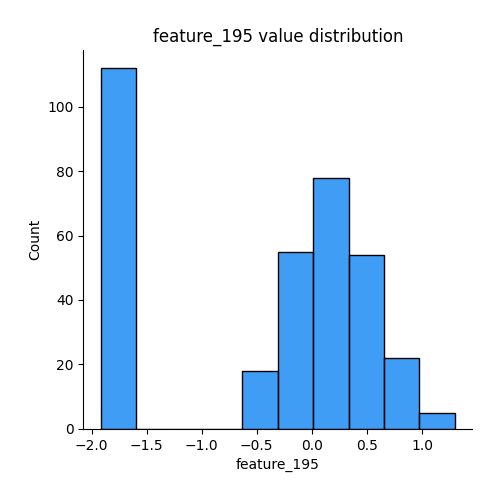
## Feature : feature_196
- **Feature type** : continous
- **Missing** : 0.0%
- **Unique** : 344
- **Count** :344.0
- **Mean** :0.1810707931545293
- **Std** :1.0203711994106426
- **Min** :-2.5619344204077836
- **25%th Percentile** : -0.5270942239547869
- **50%th Percentile** : 0.03776381639567153
- **75%th Percentile** : 0.8363769742847948
- **Max** :2.637320105700141

## Feature : feature_197
- **Feature type** : continous
- **Missing** : 0.0%
- **Unique** : 344
- **Count** :344.0
- **Mean** :-0.12072965103762316
- **Std** :1.0070683775842495
- **Min** :-5.933379700883925
- **25%th Percentile** : -0.42803459580569236
- **50%th Percentile** : -0.011774582575076482
- **75%th Percentile** : 0.3264281307005747
- **Max** :2.547381784485164

## Feature : feature_198
- **Feature type** : continous
- **Missing** : 0.0%
- **Unique** : 344
- **Count** :344.0
- **Mean** :-0.0875679749459667
- **Std** :1.0100892589290835
- **Min** :-4.417144569407492
- **25%th Percentile** : -0.3168071466116098
- **50%th Percentile** : 0.0214918235750114
- **75%th Percentile** : 0.7562338946047364
- **Max** :1.0391188243136928

## Feature : feature_199
- **Feature type** : continous
- **Missing** : 0.0%
- **Unique** : 344
- **Count** :344.0
- **Mean** :-0.1477613997314866
- **Std** :0.9633983063905682
- **Min** :-1.1803197478380192
- **25%th Percentile** : -1.1196791406358768
- **50%th Percentile** : -0.22332536587242913
- **75%th Percentile** : 0.7136488329494468
- **Max** :1.7261749654099348

## Feature : feature_200
- **Feature type** : continous
- **Missing** : 0.0%
- **Unique** : 344
- **Count** :344.0
- **Mean** :-0.04003586819650853
- **Std** :1.0130025065916417
- **Min** :-3.2893016012162137
- **25%th Percentile** : -0.707255137405526
- **50%th Percentile** : -0.025299797319560002
- **75%th Percentile** : 0.642845383955555
- **Max** :3.1463086345152838

## Feature : feature_201
- **Feature type** : continous
- **Missing** : 0.0%
- **Unique** : 344
- **Count** :344.0
- **Mean** :-0.21488625719675056
- **Std** :1.0090464315916796
- **Min** :-3.3543197072480244
- **25%th Percentile** : -0.665053426460343
- **50%th Percentile** : -0.006526560644205696
- **75%th Percentile** : 0.43821792375581314
- **Max** :2.1578836433259716

## Feature : feature_202
- **Feature type** : continous
- **Missing** : 0.0%
- **Unique** : 344
- **Count** :344.0
- **Mean** :0.13662501064296642
- **Std** :0.9729106703430194
- **Min** :-3.0605584682685283
- **25%th Percentile** : -0.4767198294303576
- **50%th Percentile** : 0.03341445998950647
- **75%th Percentile** : 0.5868189122298264
- **Max** :4.91903792012084

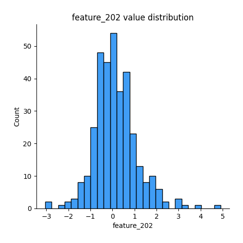
## Feature : feature_203
- **Feature type** : continous
- **Missing** : 0.0%
- **Unique** : 344
- **Count** :344.0
- **Mean** :0.02785688830156779
- **Std** :0.979814315544307
- **Min** :-2.2456096786916495
- **25%th Percentile** : -0.6940253215617456
- **50%th Percentile** : -0.03222069641957077
- **75%th Percentile** : 0.5449795721076405
- **Max** :3.1822189534086283

## Feature : feature_204
- **Feature type** : continous
- **Missing** : 0.0%
- **Unique** : 344
- **Count** :344.0
- **Mean** :-0.14299642257635234
- **Std** :0.9795581219732401
- **Min** :-2.8324723134626666
- **25%th Percentile** : -0.7285628573110275
- **50%th Percentile** : -0.13982342416983387
- **75%th Percentile** : 0.5493516152889066
- **Max** :2.26644648934129

## Feature : feature_205
- **Feature type** : continous
- **Missing** : 0.0%
- **Unique** : 344
- **Count** :344.0
- **Mean** :-0.013550259654886489
- **Std** :0.9857293781214558
- **Min** :-3.223741230665986
- **25%th Percentile** : -0.6460544304466168
- **50%th Percentile** : 0.07541253876041379
- **75%th Percentile** : 0.638481891859643
- **Max** :3.0380350341528652

## Feature : feature_206
- **Feature type** : continous
- **Missing** : 0.0%
- **Unique** : 344
- **Count** :344.0
- **Mean** :-0.12388743605270913
- **Std** :0.9922769222278173
- **Min** :-3.2854456479677547
- **25%th Percentile** : -0.6732039360533159
- **50%th Percentile** : -0.05280560418715143
- **75%th Percentile** : 0.5423714475904456
- **Max** :3.22685434486429

## Feature : feature_207
- **Feature type** : continous
- **Missing** : 0.0%
- **Unique** : 344
- **Count** :344.0
- **Mean** :-0.11212224947738494
- **Std** :1.0488858079818222
- **Min** :-6.515946793618771
- **25%th Percentile** : -0.47042634737730277
- **50%th Percentile** : 0.00945077166631227
- **75%th Percentile** : 0.40932516925528417
- **Max** :2.3600300940064463

## Feature : feature_208
- **Feature type** : continous
- **Missing** : 0.0%
- **Unique** : 344
- **Count** :344.0
- **Mean** :-0.06313923560252256
- **Std** :0.914842640636476
- **Min** :-6.797228673702969
- **25%th Percentile** : -0.46000849077914957
- **50%th Percentile** : 0.05228491799139161
- **75%th Percentile** : 0.538094081888868
- **Max** :1.5636899831294886

## Feature : feature_209
- **Feature type** : continous
- **Missing** : 0.0%
- **Unique** : 344
- **Count** :344.0
- **Mean** :-0.20128353822547926
- **Std** :0.9991517118861427
- **Min** :-4.658413078832313
- **25%th Percentile** : -0.5914493353768175
- **50%th Percentile** : -0.04430127189135908
- **75%th Percentile** : 0.43528210349642266
- **Max** :1.4510866657846169

## Feature : feature_210
- **Feature type** : continous
- **Missing** : 0.0%
- **Unique** : 344
- **Count** :344.0
- **Mean** :-0.03110022542911419
- **Std** :0.9658576496416363
- **Min** :-3.34914041821393
- **25%th Percentile** : -0.6015852168236536
- **50%th Percentile** : 0.05287303072894917
- **75%th Percentile** : 0.6239569160995615
- **Max** :2.5361285259765327

## Feature : feature_211
- **Feature type** : continous
- **Missing** : 0.0%
- **Unique** : 344
- **Count** :344.0
- **Mean** :-0.20883690705557778
- **Std** :1.0061098270965216
- **Min** :-4.905597867580399
- **25%th Percentile** : -0.2892275745587209
- **50%th Percentile** : 0.01571837053994909
- **75%th Percentile** : 0.2360786395925617
- **Max** :1.002255912565016

## Feature : feature_212
- **Feature type** : continous
- **Missing** : 0.0%
- **Unique** : 344
- **Count** :344.0
- **Mean** :-0.038076941030121325
- **Std** :0.9772549251299832
- **Min** :-2.524344074087719
- **25%th Percentile** : -0.6400022964822922
- **50%th Percentile** : -0.11130327706288619
- **75%th Percentile** : 0.4991024707184603
- **Max** :5.1461489609771185

## Feature : feature_213
- **Feature type** : continous
- **Missing** : 0.0%
- **Unique** : 344
- **Count** :344.0
- **Mean** :0.021116228352121756
- **Std** :0.9914446691823823
- **Min** :-1.0463549385075144
- **25%th Percentile** : -1.0059230470511342
- **50%th Percentile** : -0.019868264253915434
- **75%th Percentile** : 0.9940797576673316
- **Max** :2.0135198745751772

## Feature : feature_214
- **Feature type** : continous
- **Missing** : 0.0%
- **Unique** : 344
- **Count** :344.0
- **Mean** :-0.02737955993750768
- **Std** :0.9217980720457478
- **Min** :-3.720090482428191
- **25%th Percentile** : -0.566823308010011
- **50%th Percentile** : 0.06317217539370236
- **75%th Percentile** : 0.5422561294834964
- **Max** :2.6586839143793233

## Feature : feature_215
- **Feature type** : continous
- **Missing** : 0.0%
- **Unique** : 344
- **Count** :344.0
- **Mean** :-0.06955575664060722
- **Std** :0.7704540185467885
- **Min** :-5.454465447935506
- **25%th Percentile** : -0.37434629399477043
- **50%th Percentile** : -0.015108726610568866
- **75%th Percentile** : 0.34073055376500844
- **Max** :1.8619977103506669

## Feature : feature_216
- **Feature type** : continous
- **Missing** : 0.0%
- **Unique** : 344
- **Count** :344.0
- **Mean** :-0.00879379428231754
- **Std** :0.9870638165160334
- **Min** :-2.5190975719312525
- **25%th Percentile** : -0.6692046829989834
- **50%th Percentile** : -0.045759023873224884
- **75%th Percentile** : 0.5359626896602476
- **Max** :3.0600151902730617

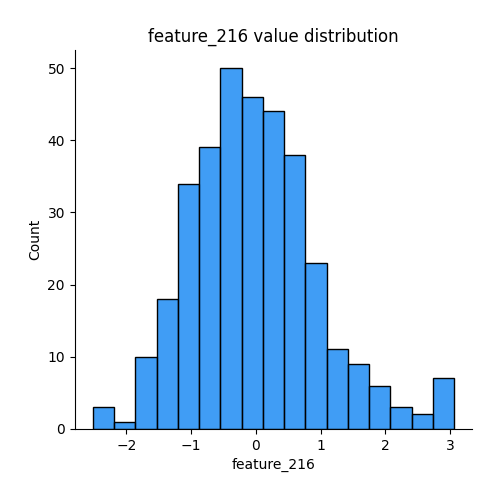
## Feature : feature_217
- **Feature type** : continous
- **Missing** : 0.0%
- **Unique** : 344
- **Count** :344.0
- **Mean** :-0.03524670198303669
- **Std** :1.0121672847387186
- **Min** :-4.865597517087176
- **25%th Percentile** : -0.4570605531835578
- **50%th Percentile** : 0.022645118074160774
- **75%th Percentile** : 0.5527798167284749
- **Max** :3.195547968587811

## Feature : feature_218
- **Feature type** : continous
- **Missing** : 0.0%
- **Unique** : 344
- **Count** :344.0
- **Mean** :-0.08438573442634786
- **Std** :0.9366000957821288
- **Min** :-4.000790306800294
- **25%th Percentile** : -0.6532963419338387
- **50%th Percentile** : 0.011588860559086226
- **75%th Percentile** : 0.5621656831465172
- **Max** :2.886313425302263

## Feature : feature_219
- **Feature type** : continous
- **Missing** : 0.0%
- **Unique** : 344
- **Count** :344.0
- **Mean** :-0.04167271582954062
- **Std** :0.979672105585824
- **Min** :-4.374526939743365
- **25%th Percentile** : -0.36923109080641575
- **50%th Percentile** : -0.021303155868938058
- **75%th Percentile** : 0.4172870658255362
- **Max** :3.6762077216753792

## Feature : feature_220
- **Feature type** : continous
- **Missing** : 0.0%
- **Unique** : 344
- **Count** :344.0
- **Mean** :-0.17925573450304025
- **Std** :1.1070752421059806
- **Min** :-6.600481793478816
- **25%th Percentile** : -0.36567434569323853
- **50%th Percentile** : 0.025367746509204633
- **75%th Percentile** : 0.29867364165265
- **Max** :1.6611606142697728

## Feature : feature_221
- **Feature type** : continous
- **Missing** : 0.0%
- **Unique** : 344
- **Count** :344.0
- **Mean** :0.14602187278986165
- **Std** :0.954842258501827
- **Min** :-1.8082461839563961
- **25%th Percentile** : -0.6843999054071547
- **50%th Percentile** : 0.13826553075612913
- **75%th Percentile** : 0.9166803172410762
- **Max** :2.9153318826048706

## Feature : feature_222
- **Feature type** : continous
- **Missing** : 0.0%
- **Unique** : 344
- **Count** :344.0
- **Mean** :-0.050731359100683396
- **Std** :0.9986566355600258
- **Min** :-2.4725746220939535
- **25%th Percentile** : -0.4359698786193469
- **50%th Percentile** : 0.012685266179195489
- **75%th Percentile** : 0.4485164720954522
- **Max** :2.6049649134584767

## Feature : feature_223
- **Feature type** : continous
- **Missing** : 0.0%
- **Unique** : 344
- **Count** :344.0
- **Mean** :-0.273514437972473
- **Std** :1.0053564147857648
- **Min** :-2.00683565786997
- **25%th Percentile** : -0.5085855221611173
- **50%th Percentile** : -0.004903607715559572
- **75%th Percentile** : 0.3990279868477985
- **Max** :2.049433086235825

## Feature : feature_224
- **Feature type** : continous
- **Missing** : 0.0%
- **Unique** : 344
- **Count** :344.0
- **Mean** :0.023090920905792546
- **Std** :1.0164887621240424
- **Min** :-4.13018874452785
- **25%th Percentile** : -0.5708600044192779
- **50%th Percentile** : -0.0662710098204867
- **75%th Percentile** : 0.5069262044380383
- **Max** :3.8783606139500653

## Feature : feature_225
- **Feature type** : continous
- **Missing** : 0.0%
- **Unique** : 344
- **Count** :344.0
- **Mean** :0.04739118143612768
- **Std** :0.9556710993232065
- **Min** :-2.5869443830760765
- **25%th Percentile** : -0.5656877462388542
- **50%th Percentile** : -0.016475430987610767
- **75%th Percentile** : 0.508770679362895
- **Max** :4.6264372341691224

## Feature : feature_226
- **Feature type** : continous
- **Missing** : 0.0%
- **Unique** : 344
- **Count** :344.0
- **Mean** :-0.05226465331535504
- **Std** :0.9822617223930503
- **Min** :-3.6162999555544015
- **25%th Percentile** : -0.7407736520756247
- **50%th Percentile** : -0.037412282702547234
- **75%th Percentile** : 0.5894114243459374
- **Max** :2.4402068381752264

## Feature : feature_227
- **Feature type** : continous
- **Missing** : 0.0%
- **Unique** : 344
- **Count** :344.0
- **Mean** :0.004730374288887263
- **Std** :0.9798082672755155
- **Min** :-2.384741727908951
- **25%th Percentile** : -0.6502236773123139
- **50%th Percentile** : -0.07168110377311654
- **75%th Percentile** : 0.567537152637803
- **Max** :3.3091469694962057

## Feature : feature_228
- **Feature type** : continous
- **Missing** : 0.0%
- **Unique** : 344
- **Count** :344.0
- **Mean** :0.1495267167640537
- **Std** :0.9314710216869259
- **Min** :-2.821351109533006
- **25%th Percentile** : -0.38455957426415227
- **50%th Percentile** : 0.06508643768499484
- **75%th Percentile** : 0.4786076127604177
- **Max** :3.926368002350877

## Feature : feature_229
- **Feature type** : continous
- **Missing** : 0.0%
- **Unique** : 344
- **Count** :344.0
- **Mean** :-0.15892494037910948
- **Std** :0.9901759467957093
- **Min** :-3.5546069255116843
- **25%th Percentile** : -0.6951073921100672
- **50%th Percentile** : -0.06524119711863018
- **75%th Percentile** : 0.4933611934026031
- **Max** :2.2957726463794677

## Feature : feature_230
- **Feature type** : continous
- **Missing** : 0.0%
- **Unique** : 344
- **Count** :344.0
- **Mean** :0.3416712699849497
- **Std** :1.0431374138502862
- **Min** :-0.6332658921029286
- **25%th Percentile** : -0.5672062170063171
- **50%th Percentile** : 0.19500377435510408
- **75%th Percentile** : 1.0563195831136418
- **Max** :5.3365052393175985

## Feature : feature_231
- **Feature type** : continous
- **Missing** : 0.0%
- **Unique** : 344
- **Count** :344.0
- **Mean** :-0.11165808254587084
- **Std** :0.9772234796582674
- **Min** :-5.340165753824455
- **25%th Percentile** : -0.7048561472455346
- **50%th Percentile** : -0.08853266650199458
- **75%th Percentile** : 0.4685186664556935
- **Max** :3.337099995033856

## Feature : feature_232
- **Feature type** : continous
- **Missing** : 0.0%
- **Unique** : 344
- **Count** :344.0
- **Mean** :-0.04457894870731724
- **Std** :0.9655649746401603
- **Min** :-2.949159663781889
- **25%th Percentile** : -0.5995514712077237
- **50%th Percentile** : -0.03955360400056211
- **75%th Percentile** : 0.6142664179885654
- **Max** :2.5387935136020308

## Feature : feature_233
- **Feature type** : continous
- **Missing** : 0.0%
- **Unique** : 344
- **Count** :344.0
- **Mean** :-0.14348402630146592
- **Std** :1.0416005213843171
- **Min** :-7.461127888976003
- **25%th Percentile** : -0.4824175514544824
- **50%th Percentile** : 0.03809265979381156
- **75%th Percentile** : 0.49078576186624046
- **Max** :1.8082028556813465

## Feature : feature_234
- **Feature type** : continous
- **Missing** : 0.0%
- **Unique** : 344
- **Count** :344.0
- **Mean** :-0.15106447056463582
- **Std** :0.9185240467366124
- **Min** :-5.068921753910517
- **25%th Percentile** : -0.1570286364111054
- **50%th Percentile** : 0.01671852993296718
- **75%th Percentile** : 0.2231180693945646
- **Max** :0.7070215839647187

## Feature : feature_235
- **Feature type** : continous
- **Missing** : 0.0%
- **Unique** : 344
- **Count** :344.0
- **Mean** :0.18281081583295616
- **Std** :0.9724093885593276
- **Min** :-1.7491315617355627
- **25%th Percentile** : -0.5490262193767498
- **50%th Percentile** : -0.06548378334160178
- **75%th Percentile** : 0.8670116538432858
- **Max** :3.7323994609197237

## Feature : feature_236
- **Feature type** : continous
- **Missing** : 0.0%
- **Unique** : 344
- **Count** :344.0
- **Mean** :-0.01601508116823503
- **Std** :0.9272863426399366
- **Min** :-7.159847837858572
- **25%th Percentile** : -0.5170188319299116
- **50%th Percentile** : 0.0033257475734359576
- **75%th Percentile** : 0.5231195436948141
- **Max** :2.8225234069551273

## Feature : feature_237
- **Feature type** : continous
- **Missing** : 0.0%
- **Unique** : 344
- **Count** :344.0
- **Mean** :-0.24365418391247995
- **Std** :0.9920051180295119
- **Min** :-4.802941019068396
- **25%th Percentile** : -0.1443467346063798
- **50%th Percentile** : 0.004009457277956509
- **75%th Percentile** : 0.12096789062622054
- **Max** :0.5601760128622545

## Feature : feature_238
- **Feature type** : continous
- **Missing** : 0.0%
- **Unique** : 344
- **Count** :344.0
- **Mean** :-0.06167646583414906
- **Std** :0.9885433304872567
- **Min** :-6.08488610306454
- **25%th Percentile** : -0.46214909404527527
- **50%th Percentile** : -0.05314267047469985
- **75%th Percentile** : 0.5063179618409943
- **Max** :2.6325621391228227

## Feature : feature_239
- **Feature type** : continous
- **Missing** : 0.0%
- **Unique** : 344
- **Count** :344.0
- **Mean** :0.015969337461577058
- **Std** :1.0833281675248632
- **Min** :-5.253188852417962
- **25%th Percentile** : -0.581829431962391
- **50%th Percentile** : 0.0035030841213860246
- **75%th Percentile** : 0.5303618835778383
- **Max** :6.878938133852275

## Feature : feature_240
- **Feature type** : continous
- **Missing** : 0.0%
- **Unique** : 344
- **Count** :344.0
- **Mean** :-0.05044189453821003
- **Std** :1.0164049897110603
- **Min** :-2.90282784585243
- **25%th Percentile** : -0.6970950594692286
- **50%th Percentile** : -0.027610444631533403
- **75%th Percentile** : 0.7502610234928556
- **Max** :2.5477918344343644

## Feature : feature_241
- **Feature type** : continous
- **Missing** : 0.0%
- **Unique** : 344
- **Count** :344.0
- **Mean** :0.027914858994539684
- **Std** :1.0137883961851109
- **Min** :-5.016719188269729
- **25%th Percentile** : -0.4742776117131802
- **50%th Percentile** : 0.01807793251681465
- **75%th Percentile** : 0.5852054734164107
- **Max** :3.198627060217051

## Feature : feature_242
- **Feature type** : continous
- **Missing** : 0.0%
- **Unique** : 344
- **Count** :344.0
- **Mean** :-0.054661152830112206
- **Std** :0.9814292151934821
- **Min** :-4.8955268063261075
- **25%th Percentile** : -0.7207717001413834
- **50%th Percentile** : 0.021473797446843686
- **75%th Percentile** : 0.6443442908667795
- **Max** :2.4170758555996894

## Feature : feature_243
- **Feature type** : continous
- **Missing** : 0.0%
- **Unique** : 344
- **Count** :344.0
- **Mean** :-0.023005741587388523
- **Std** :0.9706786467342559
- **Min** :-5.011850709314257
- **25%th Percentile** : -0.6086788911804274
- **50%th Percentile** : 0.016819521276270955
- **75%th Percentile** : 0.6224961100342192
- **Max** :2.400938311276999

## Feature : feature_244
- **Feature type** : continous
- **Missing** : 0.0%
- **Unique** : 344
- **Count** :344.0
- **Mean** :0.12985357958645596
- **Std** :0.9416714094055355
- **Min** :-2.256674153596255
- **25%th Percentile** : -0.5209324708102158
- **50%th Percentile** : 0.054536897252958905
- **75%th Percentile** : 0.7341211550430017
- **Max** :5.089572838420007

## Feature : feature_245
- **Feature type** : continous
- **Missing** : 0.0%
- **Unique** : 344
- **Count** :344.0
- **Mean** :-0.10350219539010945
- **Std** :0.9632742335760287
- **Min** :-2.8419458280948064
- **25%th Percentile** : -0.7671847698089724
- **50%th Percentile** : -0.09938777400450088
- **75%th Percentile** : 0.5677605057174917
- **Max** :3.2392342746202156

## Feature : feature_246
- **Feature type** : continous
- **Missing** : 0.0%
- **Unique** : 344
- **Count** :344.0
- **Mean** :-0.14762638552430896
- **Std** :1.0716761916288926
- **Min** :-6.543794042689921
- **25%th Percentile** : -0.540838342914063
- **50%th Percentile** : -0.07078894323648952
- **75%th Percentile** : 0.4316144245548989
- **Max** :2.3302496052650223

## Feature : feature_247
- **Feature type** : continous
- **Missing** : 0.0%
- **Unique** : 344
- **Count** :344.0
- **Mean** :-0.1596612710383699
- **Std** :0.9838937537812125
- **Min** :-5.189417263977514
- **25%th Percentile** : -0.5692277802200818
- **50%th Percentile** : -0.0875990643134166
- **75%th Percentile** : 0.36927563781664596
- **Max** :3.19864779144968

## Feature : feature_248
- **Feature type** : continous
- **Missing** : 0.0%
- **Unique** : 344
- **Count** :344.0
- **Mean** :0.10335896247798491
- **Std** :1.0668372253162361
- **Min** :-4.952579107570308
- **25%th Percentile** : -0.5486232878327544
- **50%th Percentile** : 0.04619970293706066
- **75%th Percentile** : 0.7249736974437798
- **Max** :2.9949955929288015

## Feature : feature_249
- **Feature type** : continous
- **Missing** : 0.0%
- **Unique** : 344
- **Count** :344.0
- **Mean** :-0.18000154701890386
- **Std** :0.9966509029746476
- **Min** :-6.430441805207673
- **25%th Percentile** : -0.702506911233701
- **50%th Percentile** : -0.09094179321095686
- **75%th Percentile** : 0.564878571387211
- **Max** :1.7508833586697707

## Feature : feature_250
- **Feature type** : continous
- **Missing** : 0.0%
- **Unique** : 344
- **Count** :344.0
- **Mean** :-0.04447316711322874
- **Std** :0.9756658878320349
- **Min** :-2.871355082643869
- **25%th Percentile** : -0.7476772654847516
- **50%th Percentile** : -0.02349569430172132
- **75%th Percentile** : 0.5520338510698652
- **Max** :2.4637702714864145

## Feature : feature_251
- **Feature type** : continous
- **Missing** : 0.0%
- **Unique** : 344
- **Count** :344.0
- **Mean** :-0.09339847092185334
- **Std** :1.0640047633105592
- **Min** :-5.363976018472228
- **25%th Percentile** : -0.6002583885302417
- **50%th Percentile** : -0.030620898622002832
- **75%th Percentile** : 0.5679737119440935
- **Max** :2.5876145867835176

## Feature : feature_252
- **Feature type** : continous
- **Missing** : 0.0%
- **Unique** : 344
- **Count** :344.0
- **Mean** :0.3534978000625845
- **Std** :1.027592146339192
- **Min** :-2.190484932370321
- **25%th Percentile** : -0.1961473318349907
- **50%th Percentile** : -0.002258028269714719
- **75%th Percentile** : 0.7798004066532003
- **Max** :4.516834190333975

## Feature : feature_253
- **Feature type** : continous
- **Missing** : 0.0%
- **Unique** : 344
- **Count** :344.0
- **Mean** :-0.003533763793201632
- **Std** :1.001731954198961
- **Min** :-4.192886150176416
- **25%th Percentile** : -0.576723955861943
- **50%th Percentile** : 0.01275959120750831
- **75%th Percentile** : 0.6522624807564202
- **Max** :3.8652008868014405

## Feature : feature_254
- **Feature type** : continous
- **Missing** : 0.0%
- **Unique** : 344
- **Count** :344.0
- **Mean** :-0.09984334145483933
- **Std** :0.9810230463240871
- **Min** :-6.218071984394193
- **25%th Percentile** : -0.4999137526855304
- **50%th Percentile** : -0.025450729558683195
- **75%th Percentile** : 0.45030774842710225
- **Max** :2.0339545006971336

## Feature : feature_255
- **Feature type** : continous
- **Missing** : 0.0%
- **Unique** : 344
- **Count** :344.0
- **Mean** :-0.046105523097444055
- **Std** :0.9938220932453108
- **Min** :-2.950881483151064
- **25%th Percentile** : -0.708050434961373
- **50%th Percentile** : -0.09844885509699916
- **75%th Percentile** : 0.6821555368046612
- **Max** :2.8920190487952184

## Feature : feature_256
- **Feature type** : continous
- **Missing** : 0.0%
- **Unique** : 344
- **Count** :344.0
- **Mean** :-0.05805827963763318
- **Std** :0.967703796322826
- **Min** :-2.5991787644053845
- **25%th Percentile** : -0.7308267126242238
- **50%th Percentile** : -0.07577827381862379
- **75%th Percentile** : 0.6280961405862404
- **Max** :2.531610428690201

## Feature : feature_257
- **Feature type** : continous
- **Missing** : 0.0%
- **Unique** : 344
- **Count** :344.0
- **Mean** :-0.15052832815764974
- **Std** :0.9988812268145808
- **Min** :-1.9335965832148874
- **25%th Percentile** : -0.773087374840319
- **50%th Percentile** : -0.030619245679747102
- **75%th Percentile** : 0.5720544940414342
- **Max** :2.525541386849841

## Feature : feature_258
- **Feature type** : continous
- **Missing** : 0.0%
- **Unique** : 344
- **Count** :344.0
- **Mean** :-0.1436547605705604
- **Std** :0.945987768540867
- **Min** :-4.298613821543103
- **25%th Percentile** : -0.6762640366457975
- **50%th Percentile** : -0.054066370186005325
- **75%th Percentile** : 0.42942748426802424
- **Max** :2.857088405250553

## Feature : feature_259
- **Feature type** : continous
- **Missing** : 0.0%
- **Unique** : 344
- **Count** :344.0
- **Mean** :-0.16996649625799784
- **Std** :1.028766215179105
- **Min** :-6.422406406446704
- **25%th Percentile** : -0.3837668689963799
- **50%th Percentile** : -0.002310485853041585
- **75%th Percentile** : 0.28395799318843645
- **Max** :1.6928986644412005

## Feature : feature_260
- **Feature type** : continous
- **Missing** : 0.0%
- **Unique** : 344
- **Count** :344.0
- **Mean** :-0.010255119076343374
- **Std** :1.006272293721072
- **Min** :-2.9358126023988933
- **25%th Percentile** : -0.5873223325861838
- **50%th Percentile** : -0.1265031839134945
- **75%th Percentile** : 0.6060817837349761
- **Max** :3.0331872522377954

## Feature : feature_261
- **Feature type** : continous
- **Missing** : 0.0%
- **Unique** : 344
- **Count** :344.0
- **Mean** :-0.19025335249777986
- **Std** :1.0104218500519313
- **Min** :-4.7417829366475805
- **25%th Percentile** : -0.6889962287828117
- **50%th Percentile** : -0.09126964990514214
- **75%th Percentile** : 0.48302584996081027
- **Max** :1.9670966775432694

## Feature : feature_262
- **Feature type** : continous
- **Missing** : 0.0%
- **Unique** : 344
- **Count** :344.0
- **Mean** :-0.046695167532775576
- **Std** :1.0030876717572523
- **Min** :-5.229857336997867
- **25%th Percentile** : -0.625518962014348
- **50%th Percentile** : 0.018373865766756654
- **75%th Percentile** : 0.6002347973586912
- **Max** :2.546637280196014

## Feature : feature_263
- **Feature type** : continous
- **Missing** : 0.0%
- **Unique** : 344
- **Count** :344.0
- **Mean** :-0.3436306513827814
- **Std** :1.007455712257386
- **Min** :-3.8877645034266006
- **25%th Percentile** : -0.4472313565991073
- **50%th Percentile** : -0.001209874677833333
- **75%th Percentile** : 0.239675068490068
- **Max** :1.050103374050451

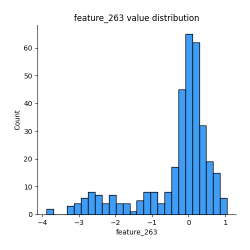
## Feature : feature_264
- **Feature type** : continous
- **Missing** : 0.0%
- **Unique** : 344
- **Count** :344.0
- **Mean** :-0.2181590558770303
- **Std** :1.0314059828571085
- **Min** :-5.923726344816157
- **25%th Percentile** : -0.4007306731154432
- **50%th Percentile** : 0.017688999999049288
- **75%th Percentile** : 0.31135889046337395
- **Max** :1.1874390649407067

## Feature : feature_265
- **Feature type** : continous
- **Missing** : 0.0%
- **Unique** : 344
- **Count** :344.0
- **Mean** :-0.044939251825257404
- **Std** :1.0247920062866744
- **Min** :-4.89106807474681
- **25%th Percentile** : -0.7048414746527388
- **50%th Percentile** : 0.005790961703188823
- **75%th Percentile** : 0.6534981086359488
- **Max** :3.350163568003625

## Feature : feature_266
- **Feature type** : continous
- **Missing** : 0.0%
- **Unique** : 344
- **Count** :344.0
- **Mean** :-0.2011482495165847
- **Std** :1.013496664101711
- **Min** :-5.51661221838025
- **25%th Percentile** : -0.7590066439963422
- **50%th Percentile** : -0.018267886623306234
- **75%th Percentile** : 0.4871554993168837
- **Max** :2.1747277329740022

## Feature : feature_267
- **Feature type** : continous
- **Missing** : 0.0%
- **Unique** : 344
- **Count** :344.0
- **Mean** :-0.19780653206127588
- **Std** :0.9314625365938793
- **Min** :-6.298724025848571
- **25%th Percentile** : -0.2382569653803932
- **50%th Percentile** : 0.002342886322487109
- **75%th Percentile** : 0.226077459786751
- **Max** :1.4519900511404231

## Feature : feature_268
- **Feature type** : continous
- **Missing** : 0.0%
- **Unique** : 344
- **Count** :344.0
- **Mean** :0.03502133578142518
- **Std** :0.9364353540346494
- **Min** :-2.183405854441678
- **25%th Percentile** : -0.6885270746467341
- **50%th Percentile** : 0.056897724877902005
- **75%th Percentile** : 0.5816808392490296
- **Max** :3.7279264432458947

## Feature : feature_269
- **Feature type** : continous
- **Missing** : 0.0%
- **Unique** : 344
- **Count** :344.0
- **Mean** :0.0946881698278222
- **Std** :0.9257798703397155
- **Min** :-2.4217104752936596
- **25%th Percentile** : -0.5811803006250899
- **50%th Percentile** : 0.07483643562398476
- **75%th Percentile** : 0.6646207409582914
- **Max** :4.9135325520445825

## Feature : feature_270
- **Feature type** : continous
- **Missing** : 0.0%
- **Unique** : 344
- **Count** :344.0
- **Mean** :-0.070004094830331
- **Std** :0.9706273079464509
- **Min** :-4.890788699188864
- **25%th Percentile** : -0.5099035471288501
- **50%th Percentile** : -0.045201484347442165
- **75%th Percentile** : 0.5103032446930181
- **Max** :3.1557955284215744

## Feature : feature_271
- **Feature type** : continous
- **Missing** : 0.0%
- **Unique** : 344
- **Count** :344.0
- **Mean** :0.025161733725979178
- **Std** :0.994582664661352
- **Min** :-4.250666798327337
- **25%th Percentile** : -0.5608532870603994
- **50%th Percentile** : 0.05511326540267292
- **75%th Percentile** : 0.6626551425948459
- **Max** :2.893763093003189

## Feature : feature_272
- **Feature type** : continous
- **Missing** : 0.0%
- **Unique** : 344
- **Count** :344.0
- **Mean** :0.28179202721892826
- **Std** :1.0031638892676664
- **Min** :-1.1888209673168557
- **25%th Percentile** : -0.5421202148581785
- **50%th Percentile** : -0.14470599487424018
- **75%th Percentile** : 1.1146425753264801
- **Max** :2.791035805526079

## Feature : feature_273
- **Feature type** : continous
- **Missing** : 0.0%
- **Unique** : 344
- **Count** :344.0
- **Mean** :0.206766283809526
- **Std** :0.9951042370107686
- **Min** :-5.682565609739248
- **25%th Percentile** : -0.3689381330376944
- **50%th Percentile** : 0.0840362322249414
- **75%th Percentile** : 0.6458439782999905
- **Max** :3.1919834845874675

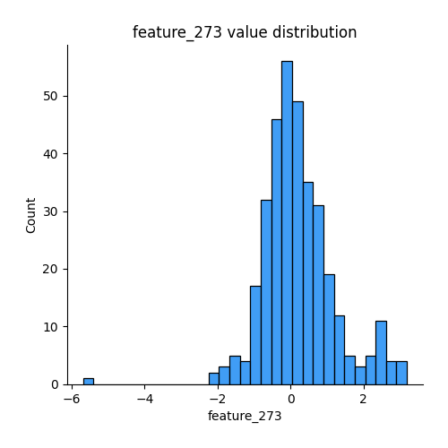
## Feature : feature_274
- **Feature type** : continous
- **Missing** : 0.0%
- **Unique** : 344
- **Count** :344.0
- **Mean** :-0.037119318302456045
- **Std** :0.8990204816371183
- **Min** :-4.794398631970331
- **25%th Percentile** : -0.5916065594789424
- **50%th Percentile** : 0.016175863148891065
- **75%th Percentile** : 0.5793119443071122
- **Max** :1.970174684736347

## Feature : feature_275
- **Feature type** : continous
- **Missing** : 0.0%
- **Unique** : 344
- **Count** :344.0
- **Mean** :0.020553719963653905
- **Std** :1.0492477720711655
- **Min** :-2.832179993725282
- **25%th Percentile** : -0.6911708553158171
- **50%th Percentile** : -0.0382416605368997
- **75%th Percentile** : 0.5594089449111761
- **Max** :3.63916319002567

## Feature : feature_276
- **Feature type** : continous
- **Missing** : 0.0%
- **Unique** : 343
- **Count** :344.0
- **Mean** :-0.007832525283029109
- **Std** :1.0337308142633574
- **Min** :-2.4308444329232515
- **25%th Percentile** : -0.3736269166677775
- **50%th Percentile** : 0.032057535292276194
- **75%th Percentile** : 0.37106441985493865
- **Max** :3.5149706688273574

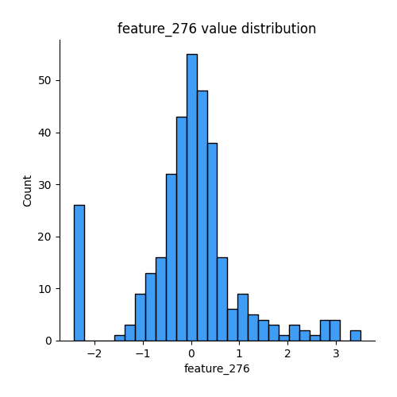
## Feature : feature_277
- **Feature type** : continous
- **Missing** : 0.0%
- **Unique** : 344
- **Count** :344.0
- **Mean** :-0.08583803786195547
- **Std** :0.9883017413805683
- **Min** :-5.596803495772671
- **25%th Percentile** : -0.5154418856573435
- **50%th Percentile** : 0.0027570251129815297
- **75%th Percentile** : 0.4050024456787011
- **Max** :2.787306639081363

## Feature : feature_278
- **Feature type** : continous
- **Missing** : 0.0%
- **Unique** : 344
- **Count** :344.0
- **Mean** :-0.1073279561997731
- **Std** :1.0168995029724508
- **Min** :-2.5601087129473328
- **25%th Percentile** : -0.8396073532967377
- **50%th Percentile** : 0.06380330740572575
- **75%th Percentile** : 0.6932403713854397
- **Max** :1.89536654594686

## Feature : feature_279
- **Feature type** : continous
- **Missing** : 0.0%
- **Unique** : 344
- **Count** :344.0
- **Mean** :0.006399378851715825
- **Std** :1.009523287688552
- **Min** :-2.8002830189232477
- **25%th Percentile** : -0.6260243413101174
- **50%th Percentile** : -0.07383467167693072
- **75%th Percentile** : 0.6395277543933495
- **Max** :2.9139114308447467

## Feature : feature_280
- **Feature type** : continous
- **Missing** : 0.0%
- **Unique** : 344
- **Count** :344.0
- **Mean** :-0.022575177390189365
- **Std** :0.9679983560389238
- **Min** :-2.0740924898441815
- **25%th Percentile** : -0.7326802640024618
- **50%th Percentile** : -0.0006642621456862314
- **75%th Percentile** : 0.6839185448311376
- **Max** :2.550114669561814

## Feature : feature_281
- **Feature type** : continous
- **Missing** : 0.0%
- **Unique** : 344
- **Count** :344.0
- **Mean** :0.07200545684668809
- **Std** :0.9625756077403886
- **Min** :-2.8342466439938496
- **25%th Percentile** : -0.5193456157329276
- **50%th Percentile** : -0.028303440046887333
- **75%th Percentile** : 0.6914101949755835
- **Max** :2.879410004863708

## Feature : feature_282
- **Feature type** : continous
- **Missing** : 0.0%
- **Unique** : 344
- **Count** :344.0
- **Mean** :-0.021656733580204552
- **Std** :0.98207207235629
- **Min** :-2.0270172706558407
- **25%th Percentile** : -0.8154850823591997
- **50%th Percentile** : -0.03890786484428046
- **75%th Percentile** : 0.7742418951879109
- **Max** :1.9608199670994015

## Feature : feature_283
- **Feature type** : continous
- **Missing** : 0.0%
- **Unique** : 344
- **Count** :344.0
- **Mean** :0.059979415637189185
- **Std** :1.0195546746173496
- **Min** :-6.205564965307851
- **25%th Percentile** : -0.3899750513361336
- **50%th Percentile** : 0.008026444066156364
- **75%th Percentile** : 0.3572271595462187
- **Max** :2.590126033688946

## Feature : feature_284
- **Feature type** : continous
- **Missing** : 0.0%
- **Unique** : 344
- **Count** :344.0
- **Mean** :-0.037863774107601694
- **Std** :1.0600772008534733
- **Min** :-7.169274857177356
- **25%th Percentile** : -0.4459180964051036
- **50%th Percentile** : -0.03672749269568959
- **75%th Percentile** : 0.37570999901068
- **Max** :4.133764178333

## Feature : feature_285
- **Feature type** : continous
- **Missing** : 0.0%
- **Unique** : 344
- **Count** :344.0
- **Mean** :0.028420260673174273
- **Std** :1.0069947661908638
- **Min** :-2.997004601901239
- **25%th Percentile** : -0.6953069133668105
- **50%th Percentile** : -0.0011184017379686905
- **75%th Percentile** : 0.7378540561963689
- **Max** :3.09981571768741

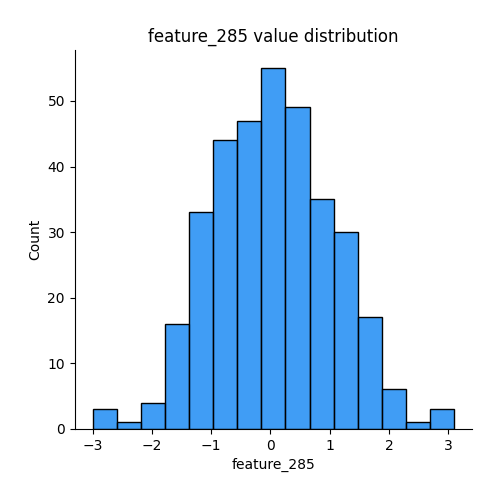
## Feature : feature_286
- **Feature type** : continous
- **Missing** : 0.0%
- **Unique** : 344
- **Count** :344.0
- **Mean** :-0.09073413249038119
- **Std** :0.9513460037511309
- **Min** :-2.687291488788679
- **25%th Percentile** : -0.6615306476079842
- **50%th Percentile** : -0.07214653738913698
- **75%th Percentile** : 0.48230733065182896
- **Max** :3.7289688233395015

## Feature : feature_287
- **Feature type** : continous
- **Missing** : 0.0%
- **Unique** : 344
- **Count** :344.0
- **Mean** :0.006000803795951766
- **Std** :0.9960318060323469
- **Min** :-3.392075780922481
- **25%th Percentile** : -0.6337937624252761
- **50%th Percentile** : 0.04396613355553712
- **75%th Percentile** : 0.7080640754202572
- **Max** :2.8917518737999095

## Feature : feature_288
- **Feature type** : continous
- **Missing** : 0.0%
- **Unique** : 344
- **Count** :344.0
- **Mean** :0.029998183775978415
- **Std** :1.0092194097297433
- **Min** :-2.816244076960892
- **25%th Percentile** : -0.4856885770573828
- **50%th Percentile** : 0.016204914095338113
- **75%th Percentile** : 0.46868415763544047
- **Max** :4.678900267098306

## Feature : feature_289
- **Feature type** : continous
- **Missing** : 0.0%
- **Unique** : 344
- **Count** :344.0
- **Mean** :-0.12470409686597103
- **Std** :0.9715515470666152
- **Min** :-3.416326654115046
- **25%th Percentile** : -0.7226296779517424
- **50%th Percentile** : -0.1221776652003075
- **75%th Percentile** : 0.5395364244092584
- **Max** :2.899988523195056

## Feature : feature_290
- **Feature type** : continous
- **Missing** : 0.0%
- **Unique** : 344
- **Count** :344.0
- **Mean** :-0.21361897014467576
- **Std** :1.0285522312918896
- **Min** :-2.9268364648277356
- **25%th Percentile** : -0.6130571133234207
- **50%th Percentile** : -0.030746292148060336
- **75%th Percentile** : 0.443160108652906
- **Max** :2.5689872504431115

## Feature : feature_291
- **Feature type** : continous
- **Missing** : 0.0%
- **Unique** : 344
- **Count** :344.0
- **Mean** :-0.03728804399634527
- **Std** :0.8964256327445357
- **Min** :-3.2928053608232823
- **25%th Percentile** : -0.5804684529400967
- **50%th Percentile** : 0.0012521735362724202
- **75%th Percentile** : 0.5972840546856844
- **Max** :2.195925297672588

## Feature : feature_292
- **Feature type** : continous
- **Missing** : 0.0%
- **Unique** : 344
- **Count** :344.0
- **Mean** :0.0012167557576196824
- **Std** :0.8804948791559168
- **Min** :-5.119470829336766
- **25%th Percentile** : -0.41629987500737026
- **50%th Percentile** : -0.0024667935621241442
- **75%th Percentile** : 0.4315400712286789
- **Max** :3.012473925778

## Feature : feature_293
- **Feature type** : continous
- **Missing** : 0.0%
- **Unique** : 344
- **Count** :344.0
- **Mean** :-0.0033863571661085054
- **Std** :0.9694598613460227
- **Min** :-4.2071883400819035
- **25%th Percentile** : -0.6197347691388629
- **50%th Percentile** : -0.1196516586976404
- **75%th Percentile** : 0.46228902674824696
- **Max** :4.842520249344578

## Feature : feature_294
- **Feature type** : continous
- **Missing** : 0.0%
- **Unique** : 344
- **Count** :344.0
- **Mean** :-0.0580986227902103
- **Std** :0.9811542796034006
- **Min** :-3.1178417767028352
- **25%th Percentile** : -0.7442856408442545
- **50%th Percentile** : 0.02366035389676656
- **75%th Percentile** : 0.5605007043781761
- **Max** :2.5398224523938655

## Feature : feature_295
- **Feature type** : continous
- **Missing** : 0.0%
- **Unique** : 344
- **Count** :344.0
- **Mean** :-0.13606427158633266
- **Std** :0.9886166812673026
- **Min** :-3.6453366219594456
- **25%th Percentile** : -0.5323100806014672
- **50%th Percentile** : 0.019120898101730698
- **75%th Percentile** : 0.5268790029989646
- **Max** :1.9189757092615833

## Feature : feature_296
- **Feature type** : continous
- **Missing** : 0.0%
- **Unique** : 344
- **Count** :344.0
- **Mean** :0.1655676545830401
- **Std** :0.9822550608795406
- **Min** :-2.087718241126804
- **25%th Percentile** : -0.5226595544308761
- **50%th Percentile** : 0.061545230748836555
- **75%th Percentile** : 0.7019308289709775
- **Max** :3.3269350995441886

## Feature : feature_297
- **Feature type** : continous
- **Missing** : 0.0%
- **Unique** : 344
- **Count** :344.0
- **Mean** :0.039047724931079365
- **Std** :0.9685744380650708
- **Min** :-3.0823583024955843
- **25%th Percentile** : -0.5245751598819496
- **50%th Percentile** : 0.011011059678319153
- **75%th Percentile** : 0.6840829302418271
- **Max** :2.391333511928624

## Feature : feature_298
- **Feature type** : continous
- **Missing** : 0.0%
- **Unique** : 344
- **Count** :344.0
- **Mean** :-0.15118348109519897
- **Std** :0.9640047519880187
- **Min** :-3.0093004884483547
- **25%th Percentile** : -0.6870096704882189
- **50%th Percentile** : -0.08898194716398479
- **75%th Percentile** : 0.5498411381460773
- **Max** :1.910822596053254

## Feature : feature_299
- **Feature type** : continous
- **Missing** : 0.0%
- **Unique** : 344
- **Count** :344.0
- **Mean** :-0.2866262607464955
- **Std** :1.0454970582327838
- **Min** :-5.703200414703524
- **25%th Percentile** : -0.5439715654678375
- **50%th Percentile** : -0.0230801451516972
- **75%th Percentile** : 0.3358062269316576
- **Max** :1.4866105774491105

## Feature : feature_300
- **Feature type** : continous
- **Missing** : 0.0%
- **Unique** : 343
- **Count** :344.0
- **Mean** :-0.09516816054584076
- **Std** :0.9572876196549611
- **Min** :-3.6880637816895487
- **25%th Percentile** : -0.788571025983263
- **50%th Percentile** : -0.000918584894418397
- **75%th Percentile** : 0.5229681154471933
- **Max** :2.718720250679747

## Feature : feature_301
- **Feature type** : continous
- **Missing** : 0.0%
- **Unique** : 344
- **Count** :344.0
- **Mean** :-0.1770256482969868
- **Std** :0.9746499072800494
- **Min** :-4.124294492084707
- **25%th Percentile** : -0.7183433336323294
- **50%th Percentile** : -0.008691462641329837
- **75%th Percentile** : 0.4902164713106798
- **Max** :2.1704095444817764

## Feature : feature_302
- **Feature type** : continous
- **Missing** : 0.0%
- **Unique** : 344
- **Count** :344.0
- **Mean** :0.06277838479880184
- **Std** :0.9985618463450067
- **Min** :-2.467792386114962
- **25%th Percentile** : -0.5012753912988905
- **50%th Percentile** : 0.023436097499784224
- **75%th Percentile** : 0.5445535733382851
- **Max** :4.393275814269718

## Feature : feature_303
- **Feature type** : continous
- **Missing** : 0.0%
- **Unique** : 344
- **Count** :344.0
- **Mean** :0.013209598901491976
- **Std** :0.9741040735962766
- **Min** :-3.681391349263628
- **25%th Percentile** : -0.4602028004087798
- **50%th Percentile** : -0.04082056030952161
- **75%th Percentile** : 0.4987722220603315
- **Max** :3.614568259321789

## Feature : feature_304
- **Feature type** : continous
- **Missing** : 0.0%
- **Unique** : 344
- **Count** :344.0
- **Mean** :-0.22387093383698672
- **Std** :1.179600072716034
- **Min** :-6.587534563053359
- **25%th Percentile** : -0.10847844248512108
- **50%th Percentile** : 0.008459565107581089
- **75%th Percentile** : 0.11784190464038713
- **Max** :0.7088957722808704

## Feature : feature_305
- **Feature type** : continous
- **Missing** : 0.0%
- **Unique** : 344
- **Count** :344.0
- **Mean** :-0.20301571344301886
- **Std** :0.9962036762929988
- **Min** :-7.651548297617935
- **25%th Percentile** : -0.28783150408563907
- **50%th Percentile** : 0.021780050328900236
- **75%th Percentile** : 0.341350791898074
- **Max** :0.842933844573832

## Feature : feature_306
- **Feature type** : continous
- **Missing** : 0.0%
- **Unique** : 344
- **Count** :344.0
- **Mean** :-0.027759789698215187
- **Std** :0.9966559831742522
- **Min** :-2.9483683481828535
- **25%th Percentile** : -0.643336857562897
- **50%th Percentile** : -0.03594075425669416
- **75%th Percentile** : 0.5739866824122919
- **Max** :3.7171679191625615

## Feature : feature_307
- **Feature type** : continous
- **Missing** : 0.0%
- **Unique** : 344
- **Count** :344.0
- **Mean** :-0.06381155895899318
- **Std** :1.006461158203124
- **Min** :-3.7304458327706866
- **25%th Percentile** : -0.7046246212561676
- **50%th Percentile** : 0.040369779923390456
- **75%th Percentile** : 0.6711864383037149
- **Max** :2.5279654878338325

## Feature : feature_308
- **Feature type** : continous
- **Missing** : 0.0%
- **Unique** : 344
- **Count** :344.0
- **Mean** :-0.08718136022749508
- **Std** :0.9820716720340465
- **Min** :-3.7710950050508387
- **25%th Percentile** : -0.627909495874105
- **50%th Percentile** : -0.02951895581636927
- **75%th Percentile** : 0.5614638494924953
- **Max** :2.6940127925405015

## Feature : feature_309
- **Feature type** : continous
- **Missing** : 0.0%
- **Unique** : 344
- **Count** :344.0
- **Mean** :0.06155001591210651
- **Std** :1.0226308558027695
- **Min** :-2.912305461208157
- **25%th Percentile** : -0.5631294672168294
- **50%th Percentile** : 0.05327592826754228
- **75%th Percentile** : 0.6322494463932334
- **Max** :3.717883399108281

## Feature : feature_310
- **Feature type** : continous
- **Missing** : 0.0%
- **Unique** : 344
- **Count** :344.0
- **Mean** :-0.28229682130291445
- **Std** :0.9943245987388473
- **Min** :-1.7325097869664166
- **25%th Percentile** : -1.668868680137701
- **50%th Percentile** : -0.06350361685181165
- **75%th Percentile** : 0.5608523206875977
- **Max** :1.7167749984451623

## Feature : feature_311
- **Feature type** : continous
- **Missing** : 0.0%
- **Unique** : 344
- **Count** :344.0
- **Mean** :0.03576346073473018
- **Std** :0.9649033931957873
- **Min** :-3.4452309001668957
- **25%th Percentile** : -0.5888224520486709
- **50%th Percentile** : 0.001493141109652183
- **75%th Percentile** : 0.6272398408157884
- **Max** :3.0413150939594757

## Feature : feature_312
- **Feature type** : continous
- **Missing** : 0.0%
- **Unique** : 344
- **Count** :344.0
- **Mean** :0.06385680678952867
- **Std** :0.9971118509948143
- **Min** :-2.85458516595452
- **25%th Percentile** : -0.48986201747869335
- **50%th Percentile** : 0.03773339115585475
- **75%th Percentile** : 0.6763980989757367
- **Max** :4.373786609666284

## Feature : feature_313
- **Feature type** : continous
- **Missing** : 0.0%
- **Unique** : 344
- **Count** :344.0
- **Mean** :-0.055302350204765136
- **Std** :1.0079430959187576
- **Min** :-3.7157865783777577
- **25%th Percentile** : -0.7497068321999247
- **50%th Percentile** : 0.05308197885283003
- **75%th Percentile** : 0.6430997641631068
- **Max** :3.211478007870639

## Feature : feature_314
- **Feature type** : continous
- **Missing** : 0.0%
- **Unique** : 344
- **Count** :344.0
- **Mean** :0.041572421405286546
- **Std** :0.9732733117166257
- **Min** :-2.880793829787064
- **25%th Percentile** : -0.6436082312952472
- **50%th Percentile** : -0.03330292432469334
- **75%th Percentile** : 0.624779007962448
- **Max** :3.3291779934203416

## Feature : feature_315
- **Feature type** : continous
- **Missing** : 0.0%
- **Unique** : 344
- **Count** :344.0
- **Mean** :0.045579394958213684
- **Std** :1.0226756796142669
- **Min** :-3.5018736152854
- **25%th Percentile** : -0.6204854268607329
- **50%th Percentile** : 0.020049685363532334
- **75%th Percentile** : 0.6744136186952876
- **Max** :3.344679482630382

## Feature : feature_316
- **Feature type** : continous
- **Missing** : 0.0%
- **Unique** : 344
- **Count** :344.0
- **Mean** :-0.026293008416963734
- **Std** :0.9637994921941649
- **Min** :-2.9963699283490475
- **25%th Percentile** : -0.6831516280034906
- **50%th Percentile** : -0.019283083481169756
- **75%th Percentile** : 0.5968241498631923
- **Max** :2.9852175530370024

## Feature : feature_317
- **Feature type** : continous
- **Missing** : 0.0%
- **Unique** : 344
- **Count** :344.0
- **Mean** :0.050760521801267715
- **Std** :0.9796592367182174
- **Min** :-2.926494686428887
- **25%th Percentile** : -0.611932336659084
- **50%th Percentile** : -0.014765542764902249
- **75%th Percentile** : 0.6154455978382154
- **Max** :5.403016153308595

## Feature : feature_318
- **Feature type** : continous
- **Missing** : 0.0%
- **Unique** : 344
- **Count** :344.0
- **Mean** :-0.018689872226251177
- **Std** :1.0034145402867856
- **Min** :-3.200664870696685
- **25%th Percentile** : -0.6456409111362409
- **50%th Percentile** : -0.009647188065674602
- **75%th Percentile** : 0.5943089520972101
- **Max** :4.146693571361827

## Feature : feature_319
- **Feature type** : continous
- **Missing** : 0.0%
- **Unique** : 344
- **Count** :344.0
- **Mean** :0.08759411439175381
- **Std** :0.999096585832615
- **Min** :-3.221817642106725
- **25%th Percentile** : -0.5153398036322558
- **50%th Percentile** : 0.07391340871656775
- **75%th Percentile** : 0.7752330019514856
- **Max** :3.5419993779823966

## Feature : feature_320
- **Feature type** : continous
- **Missing** : 0.0%
- **Unique** : 344
- **Count** :344.0
- **Mean** :0.03400305647686633
- **Std** :0.9531792771900157
- **Min** :-2.221656636085597
- **25%th Percentile** : -0.5420588640835129
- **50%th Percentile** : -0.009946745889849194
- **75%th Percentile** : 0.5109900449987359
- **Max** :4.1895081064088515

## Feature : feature_321
- **Feature type** : continous
- **Missing** : 0.0%
- **Unique** : 344
- **Count** :344.0
- **Mean** :-0.0728016138506937
- **Std** :0.950364410288237
- **Min** :-4.9831267452438
- **25%th Percentile** : -0.5072825103000254
- **50%th Percentile** : -0.01535483296146279
- **75%th Percentile** : 0.5067710802807732
- **Max** :2.209518485295915

## Feature : feature_322
- **Feature type** : continous
- **Missing** : 0.0%
- **Unique** : 344
- **Count** :344.0
- **Mean** :-0.05897872157511962
- **Std** :0.9570383581691922
- **Min** :-4.175707250263469
- **25%th Percentile** : -0.556226548091896
- **50%th Percentile** : -0.0001344830326434586
- **75%th Percentile** : 0.4841296490903793
- **Max** :2.6322847391240227

## Feature : feature_323
- **Feature type** : continous
- **Missing** : 0.0%
- **Unique** : 344
- **Count** :344.0
- **Mean** :-0.07370893017328997
- **Std** :0.9476672941480948
- **Min** :-3.9316808136790624
- **25%th Percentile** : -0.6039126525040219
- **50%th Percentile** : -0.07040824853087257
- **75%th Percentile** : 0.5507742900660997
- **Max** :2.294733084915642

## Feature : feature_324
- **Feature type** : continous
- **Missing** : 0.0%
- **Unique** : 344
- **Count** :344.0
- **Mean** :-0.056667609897043954
- **Std** :0.9307884963977766
- **Min** :-3.3052707832045347
- **25%th Percentile** : -0.6923159125867556
- **50%th Percentile** : -0.011176909742141054
- **75%th Percentile** : 0.6030310752177551
- **Max** :1.9918462333017222

## Feature : feature_325
- **Feature type** : continous
- **Missing** : 0.0%
- **Unique** : 344
- **Count** :344.0
- **Mean** :-0.15592323831655117
- **Std** :1.1514419865298264
- **Min** :-7.001664105082211
- **25%th Percentile** : -0.43581792456882107
- **50%th Percentile** : 0.0010993849653897123
- **75%th Percentile** : 0.3365587835485885
- **Max** :1.6620661607293425

## Feature : feature_326
- **Feature type** : continous
- **Missing** : 0.0%
- **Unique** : 344
- **Count** :344.0
- **Mean** :-0.006270537180308019
- **Std** :0.9273352388464295
- **Min** :-3.2603596139690576
- **25%th Percentile** : -0.6230752685140117
- **50%th Percentile** : -0.003122856740764427
- **75%th Percentile** : 0.6667239887500552
- **Max** :2.976811129234725

## Feature : feature_327
- **Feature type** : continous
- **Missing** : 0.0%
- **Unique** : 344
- **Count** :344.0
- **Mean** :-0.08555514896856359
- **Std** :0.9909723434542166
- **Min** :-7.062615458618816
- **25%th Percentile** : -0.6590318797297716
- **50%th Percentile** : -0.11597259664154938
- **75%th Percentile** : 0.5686721291306372
- **Max** :2.733325326242104

## Feature : feature_328
- **Feature type** : continous
- **Missing** : 0.0%
- **Unique** : 344
- **Count** :344.0
- **Mean** :0.08429611308412857
- **Std** :0.9548218906656362
- **Min** :-4.181396268965016
- **25%th Percentile** : -0.5606220080984635
- **50%th Percentile** : 0.06928744648760146
- **75%th Percentile** : 0.6288275165177801
- **Max** :3.8522345326824565

## Feature : feature_329
- **Feature type** : continous
- **Missing** : 0.0%
- **Unique** : 344
- **Count** :344.0
- **Mean** :-0.006495385106262104
- **Std** :0.9204486695597592
- **Min** :-5.010787557373436
- **25%th Percentile** : -0.48770054703436483
- **50%th Percentile** : -0.026637213013237578
- **75%th Percentile** : 0.4428468954446818
- **Max** :3.4655990589569368

## Feature : feature_330
- **Feature type** : continous
- **Missing** : 0.0%
- **Unique** : 344
- **Count** :344.0
- **Mean** :0.013865126100084328
- **Std** :0.9675995527252892
- **Min** :-3.3917725098550755
- **25%th Percentile** : -0.5485505129616957
- **50%th Percentile** : -0.006484980223340595
- **75%th Percentile** : 0.5717064808675144
- **Max** :2.747264670595147

## Feature : feature_331
- **Feature type** : continous
- **Missing** : 0.0%
- **Unique** : 344
- **Count** :344.0
- **Mean** :-0.023527658177892666
- **Std** :0.8285697697899594
- **Min** :-2.7191057714468996
- **25%th Percentile** : -0.5467637351059799
- **50%th Percentile** : -0.017855732875322917
- **75%th Percentile** : 0.4936760126553976
- **Max** :2.2863417408111415

## Feature : feature_332
- **Feature type** : continous
- **Missing** : 0.0%
- **Unique** : 344
- **Count** :344.0
- **Mean** :-0.0424785132136754
- **Std** :0.9673829524373467
- **Min** :-4.017237027456754
- **25%th Percentile** : -0.7182461906791058
- **50%th Percentile** : 0.009630250275693374
- **75%th Percentile** : 0.6322429502723925
- **Max** :2.251502081182051

## Feature : feature_333
- **Feature type** : continous
- **Missing** : 0.0%
- **Unique** : 344
- **Count** :344.0
- **Mean** :-0.06953371112741943
- **Std** :0.88629132298388
- **Min** :-2.951872831404634
- **25%th Percentile** : -0.6255697487585196
- **50%th Percentile** : -0.01809857789551557
- **75%th Percentile** : 0.562269055904695
- **Max** :2.5751181508086303

## Feature : feature_334
- **Feature type** : continous
- **Missing** : 0.0%
- **Unique** : 344
- **Count** :344.0
- **Mean** :0.07852250558017679
- **Std** :0.9206613778431854
- **Min** :-2.544400126570168
- **25%th Percentile** : -0.5488291717098288
- **50%th Percentile** : 0.020868270733528087
- **75%th Percentile** : 0.6614966622837006
- **Max** :3.7852041138290797

## Feature : feature_335
- **Feature type** : continous
- **Missing** : 0.0%
- **Unique** : 344
- **Count** :344.0
- **Mean** :0.06291580489865896
- **Std** :0.9824251195307573
- **Min** :-6.089460756305425
- **25%th Percentile** : -0.5519741231150896
- **50%th Percentile** : -0.004755701815976734
- **75%th Percentile** : 0.7529231281501891
- **Max** :3.1448146196386473

## Feature : feature_336
- **Feature type** : continous
- **Missing** : 0.0%
- **Unique** : 344
- **Count** :344.0
- **Mean** :0.03484943472900778
- **Std** :0.9562949664816417
- **Min** :-3.5607110449741506
- **25%th Percentile** : -0.5396040779168898
- **50%th Percentile** : 0.00783209873360509
- **75%th Percentile** : 0.6640672764571662
- **Max** :2.678730597757348

## Feature : feature_337
- **Feature type** : continous
- **Missing** : 0.0%
- **Unique** : 344
- **Count** :344.0
- **Mean** :-0.029658596713065904
- **Std** :0.9277216454135273
- **Min** :-3.522226180539202
- **25%th Percentile** : -0.5714457483354003
- **50%th Percentile** : -0.0018919851435618379
- **75%th Percentile** : 0.5808822179839821
- **Max** :2.747424475111127

## Feature : feature_338
- **Feature type** : continous
- **Missing** : 0.0%
- **Unique** : 344
- **Count** :344.0
- **Mean** :-0.05464123906742919
- **Std** :0.9587772832688095
- **Min** :-2.813588052858985
- **25%th Percentile** : -0.6956001035819387
- **50%th Percentile** : -0.006330380963374003
- **75%th Percentile** : 0.622516393684122
- **Max** :2.9638542939376356

## Feature : feature_339
- **Feature type** : continous
- **Missing** : 0.0%
- **Unique** : 344
- **Count** :344.0
- **Mean** :-0.03657001481946828
- **Std** :0.9715141684691871
- **Min** :-6.281226593598717
- **25%th Percentile** : -0.6070204989305387
- **50%th Percentile** : 0.01893700071631777
- **75%th Percentile** : 0.6335187372782097
- **Max** :2.1745964294861633

## Feature : feature_340
- **Feature type** : continous
- **Missing** : 0.0%
- **Unique** : 344
- **Count** :344.0
- **Mean** :-0.03238579814089279
- **Std** :0.9682646960056301
- **Min** :-3.926090669597692
- **25%th Percentile** : -0.5774381971497955
- **50%th Percentile** : 0.006910039488367598
- **75%th Percentile** : 0.5164225743836871
- **Max** :2.7964912881895954

## Feature : feature_341
- **Feature type** : continous
- **Missing** : 0.0%
- **Unique** : 343
- **Count** :344.0
- **Mean** :-0.0036047841774905884
- **Std** :0.9976834482512764
- **Min** :-4.119617368229636
- **25%th Percentile** : -0.6427783944165144
- **50%th Percentile** : -0.020756179770960025
- **75%th Percentile** : 0.5772568503020383
- **Max** :3.5629460027441207

## Feature : feature_342
- **Feature type** : continous
- **Missing** : 0.0%
- **Unique** : 344
- **Count** :344.0
- **Mean** :-0.0483341307388949
- **Std** :0.9918424238466116
- **Min** :-5.0113692337021485
- **25%th Percentile** : -0.7057499448328686
- **50%th Percentile** : -0.012833736330041447
- **75%th Percentile** : 0.6177838492449554
- **Max** :3.12441461001918

## Feature : feature_343
- **Feature type** : continous
- **Missing** : 0.0%
- **Unique** : 344
- **Count** :344.0
- **Mean** :-0.027299999502901705
- **Std** :0.9964651709626494
- **Min** :-4.487504684150714
- **25%th Percentile** : -0.6824489847201389
- **50%th Percentile** : -0.020317505733702522
- **75%th Percentile** : 0.6812358714922785
- **Max** :2.7935824846097983

## Feature : feature_344
- **Feature type** : continous
- **Missing** : 0.0%
- **Unique** : 344
- **Count** :344.0
- **Mean** :0.010286330909516922
- **Std** :0.9753741684029105
- **Min** :-2.8615012799640605
- **25%th Percentile** : -0.6675572635337214
- **50%th Percentile** : -0.020072370580132462
- **75%th Percentile** : 0.6058571103671793
- **Max** :3.071366159655248

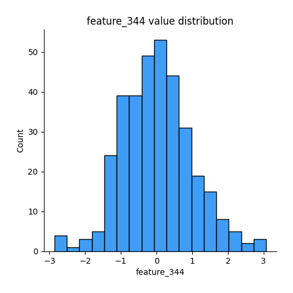
## Feature : feature_345
- **Feature type** : continous
- **Missing** : 0.0%
- **Unique** : 344
- **Count** :344.0
- **Mean** :0.0012704119443135793
- **Std** :0.9950100022423302
- **Min** :-2.8402788966801955
- **25%th Percentile** : -0.6619270876451506
- **50%th Percentile** : -0.01856319315589183
- **75%th Percentile** : 0.6845703489025763
- **Max** :2.3374551161270714

## Feature : feature_346
- **Feature type** : continous
- **Missing** : 0.0%
- **Unique** : 344
- **Count** :344.0
- **Mean** :0.10304305970759664
- **Std** :0.9682415506641712
- **Min** :-2.324023171275334
- **25%th Percentile** : -0.56133654547178
- **50%th Percentile** : 0.046772934415320086
- **75%th Percentile** : 0.6958475697852189
- **Max** :2.7869599930090705

## Feature : feature_347
- **Feature type** : continous
- **Missing** : 0.0%
- **Unique** : 344
- **Count** :344.0
- **Mean** :0.06565105344715737
- **Std** :0.9434171566228213
- **Min** :-1.6185017708886091
- **25%th Percentile** : -0.5743359461501629
- **50%th Percentile** : -0.07683060949602635
- **75%th Percentile** : 0.5309166340878417
- **Max** :3.7638323683679364

## Feature : feature_348
- **Feature type** : continous
- **Missing** : 0.0%
- **Unique** : 344
- **Count** :344.0
- **Mean** :-0.20581325277169446
- **Std** :1.0184954307110405
- **Min** :-2.7627032135793597
- **25%th Percentile** : -0.7418047423156168
- **50%th Percentile** : -0.045318841425135085
- **75%th Percentile** : 0.49748164027432606
- **Max** :2.3412025413558517

## Feature : feature_349
- **Feature type** : continous
- **Missing** : 0.0%
- **Unique** : 344
- **Count** :344.0
- **Mean** :-0.09993063885153346
- **Std** :1.0222533629907369
- **Min** :-6.101720672433109
- **25%th Percentile** : -0.6526765897174419
- **50%th Percentile** : -0.02878557039601474
- **75%th Percentile** : 0.3732375777625445
- **Max** :2.0794588930634017

## Feature : feature_350
- **Feature type** : continous
- **Missing** : 0.0%
- **Unique** : 343
- **Count** :344.0
- **Mean** :0.01041801908022361
- **Std** :0.9554112029651117
- **Min** :-2.2846483695250024
- **25%th Percentile** : -0.6287297023767694
- **50%th Percentile** : -0.021611437093590362
- **75%th Percentile** : 0.640954500314405
- **Max** :4.737691665493964

## Feature : feature_351
- **Feature type** : continous
- **Missing** : 0.0%
- **Unique** : 344
- **Count** :344.0
- **Mean** :-0.03798720701238059
- **Std** :0.9281904856608288
- **Min** :-3.5228311350728823
- **25%th Percentile** : -0.5885233964027959
- **50%th Percentile** : -0.0365255866563009
- **75%th Percentile** : 0.6116805660740401
- **Max** :2.167820933991864

## Feature : feature_352
- **Feature type** : continous
- **Missing** : 0.0%
- **Unique** : 344
- **Count** :344.0
- **Mean** :-0.17432201576854903
- **Std** :1.087496558077642
- **Min** :-6.770238456595609
- **25%th Percentile** : -0.4219180570438302
- **50%th Percentile** : -0.02735040859790793
- **75%th Percentile** : 0.3863979463354142
- **Max** :1.2692928501701153

## Feature : feature_353
- **Feature type** : continous
- **Missing** : 0.0%
- **Unique** : 344
- **Count** :344.0
- **Mean** :0.14215717664667193
- **Std** :1.0039992241327191
- **Min** :-1.9034343981047788
- **25%th Percentile** : -0.6010783645861578
- **50%th Percentile** : 0.010701323384901613
- **75%th Percentile** : 0.6845030049349909
- **Max** :3.35408800714248

## Feature : feature_354
- **Feature type** : continous
- **Missing** : 0.0%
- **Unique** : 344
- **Count** :344.0
- **Mean** :-0.15804060994355615
- **Std** :0.9765724283244683
- **Min** :-4.121248406900857
- **25%th Percentile** : -0.6316606928788064
- **50%th Percentile** : -0.0859164168107556
- **75%th Percentile** : 0.48104406387923915
- **Max** :2.7166428980863677

## Feature : feature_355
- **Feature type** : continous
- **Missing** : 0.0%
- **Unique** : 344
- **Count** :344.0
- **Mean** :-0.14870733005341544
- **Std** :0.9843599715482628
- **Min** :-3.7167978618089395
- **25%th Percentile** : -0.7115427963685851
- **50%th Percentile** : -0.036812152959678136
- **75%th Percentile** : 0.5310612196434814
- **Max** :1.6393927934676518

## Feature : feature_356
- **Feature type** : continous
- **Missing** : 0.0%
- **Unique** : 344
- **Count** :344.0
- **Mean** :0.09464452651491702
- **Std** :0.8483316713285914
- **Min** :-3.7714176047389865
- **25%th Percentile** : -0.41377754017875645
- **50%th Percentile** : 4.172552060810464e-16
- **75%th Percentile** : 0.5864766125243034
- **Max** :3.242854654130481

## Feature : feature_357
- **Feature type** : continous
- **Missing** : 0.0%
- **Unique** : 344
- **Count** :344.0
- **Mean** :-0.17186265752007387
- **Std** :0.98178852066971
- **Min** :-5.03974208687568
- **25%th Percentile** : -0.7251817368514264
- **50%th Percentile** : -0.07370108767423705
- **75%th Percentile** : 0.5257994225507042
- **Max** :2.9345451054236906

## Feature : feature_358
- **Feature type** : continous
- **Missing** : 0.0%
- **Unique** : 344
- **Count** :344.0
- **Mean** :-0.07359556740845312
- **Std** :1.041502814805113
- **Min** :-3.123672789300015
- **25%th Percentile** : -0.8581189380747062
- **50%th Percentile** : -0.04847830023330304
- **75%th Percentile** : 0.7151659955886646
- **Max** :2.066964761994136

## Feature : feature_359
- **Feature type** : continous
- **Missing** : 0.0%
- **Unique** : 344
- **Count** :344.0
- **Mean** :0.07644825688224732
- **Std** :1.0180874925823573
- **Min** :-2.0468561976070947
- **25%th Percentile** : -0.603907216763323
- **50%th Percentile** : -0.004096079694268501
- **75%th Percentile** : 0.5781219457294862
- **Max** :4.528806124693653

## Feature : feature_360
- **Feature type** : continous
- **Missing** : 0.0%
- **Unique** : 344
- **Count** :344.0
- **Mean** :-0.287919747272774
- **Std** :0.9698979337613329
- **Min** :-2.2921017059737823
- **25%th Percentile** : -0.43429128215923096
- **50%th Percentile** : 0.03617878062055076
- **75%th Percentile** : 0.3555242769582378
- **Max** :0.8656657656180465

## Feature : feature_361
- **Feature type** : continous
- **Missing** : 0.0%
- **Unique** : 344
- **Count** :344.0
- **Mean** :0.0291562436116153
- **Std** :0.9964926541391372
- **Min** :-0.974284797358496
- **25%th Percentile** : -0.9399277592430904
- **50%th Percentile** : 0.07457586529417824
- **75%th Percentile** : 1.0461154575231681
- **Max** :1.8931953430782167

## Feature : feature_362
- **Feature type** : continous
- **Missing** : 0.0%
- **Unique** : 344
- **Count** :344.0
- **Mean** :-0.04010282110722447
- **Std** :1.0134360821581143
- **Min** :-4.439561985477691
- **25%th Percentile** : -0.6172558562440761
- **50%th Percentile** : -0.010180616643565269
- **75%th Percentile** : 0.561985673481926
- **Max** :3.7995058130813626

## Feature : feature_363
- **Feature type** : continous
- **Missing** : 0.0%
- **Unique** : 344
- **Count** :344.0
- **Mean** :-0.04162298037878194
- **Std** :0.9849456077550937
- **Min** :-3.2793867816412603
- **25%th Percentile** : -0.6533329511783775
- **50%th Percentile** : 0.10124714074395504
- **75%th Percentile** : 0.6452702908347059
- **Max** :2.3289474972652844

## Feature : feature_364
- **Feature type** : continous
- **Missing** : 0.0%
- **Unique** : 344
- **Count** :344.0
- **Mean** :0.07116635391327729
- **Std** :0.973078273223767
- **Min** :-2.764216812786331
- **25%th Percentile** : -0.5678858965222123
- **50%th Percentile** : 0.010894500045333384
- **75%th Percentile** : 0.6358816753578189
- **Max** :3.5700831478530834

## Feature : feature_365
- **Feature type** : continous
- **Missing** : 0.0%
- **Unique** : 344
- **Count** :344.0
- **Mean** :-0.13563244218455492
- **Std** :0.9164108755924577
- **Min** :-3.6221573921584906
- **25%th Percentile** : -0.4586044980674079
- **50%th Percentile** : 0.0360747593119697
- **75%th Percentile** : 0.4166845339590993
- **Max** :1.8330713445503597

## Feature : feature_366
- **Feature type** : continous
- **Missing** : 0.0%
- **Unique** : 344
- **Count** :344.0
- **Mean** :-0.03913916467238398
- **Std** :0.9639440618278191
- **Min** :-3.733265567663483
- **25%th Percentile** : -0.6436010695107375
- **50%th Percentile** : -0.026218874611510075
- **75%th Percentile** : 0.529423546389279
- **Max** :4.340950474007552

## Feature : feature_367
- **Feature type** : continous
- **Missing** : 0.0%
- **Unique** : 344
- **Count** :344.0
- **Mean** :0.15464368358937716
- **Std** :1.026997728992733
- **Min** :-1.8008142704175087
- **25%th Percentile** : -0.4452731176035581
- **50%th Percentile** : 0.011832557846378709
- **75%th Percentile** : 0.5162502718558348
- **Max** :7.965527220980493

## Feature : feature_368
- **Feature type** : continous
- **Missing** : 0.0%
- **Unique** : 344
- **Count** :344.0
- **Mean** :0.14364218597373196
- **Std** :0.9921280288498001
- **Min** :-2.736762785392096
- **25%th Percentile** : -0.49435325446699274
- **50%th Percentile** : 0.008951421210170089
- **75%th Percentile** : 0.6609620601473323
- **Max** :4.089918436779058

## Feature : feature_369
- **Feature type** : continous
- **Missing** : 0.0%
- **Unique** : 344
- **Count** :344.0
- **Mean** :0.011458755963910482
- **Std** :0.9803490267491737
- **Min** :-5.294425521953824
- **25%th Percentile** : -0.4912027062278645
- **50%th Percentile** : -0.0017796831084438988
- **75%th Percentile** : 0.5638504522516326
- **Max** :3.452861392090345

## Feature : feature_370
- **Feature type** : continous
- **Missing** : 0.0%
- **Unique** : 344
- **Count** :344.0
- **Mean** :0.08511692975564215
- **Std** :0.9928327261995517
- **Min** :-3.9911077172958755
- **25%th Percentile** : -0.5153125695454637
- **50%th Percentile** : -0.0012785973536004133
- **75%th Percentile** : 0.6538459834258122
- **Max** :4.117500979772896

## Feature : feature_371
- **Feature type** : continous
- **Missing** : 0.0%
- **Unique** : 344
- **Count** :344.0
- **Mean** :0.02373932565583338
- **Std** :0.8294098178552647
- **Min** :-7.0149957146262265
- **25%th Percentile** : -0.4061374024848977
- **50%th Percentile** : 0.0231325181106257
- **75%th Percentile** : 0.4810893584119
- **Max** :3.036129938477717

## Feature : feature_372
- **Feature type** : continous
- **Missing** : 0.0%
- **Unique** : 344
- **Count** :344.0
- **Mean** :-0.14152880124268966
- **Std** :0.992894254387337
- **Min** :-3.6028414698230544
- **25%th Percentile** : -0.6041963321613029
- **50%th Percentile** : -0.04015426657239548
- **75%th Percentile** : 0.48634686365460755
- **Max** :2.1515382029903556

## Feature : feature_373
- **Feature type** : continous
- **Missing** : 0.0%
- **Unique** : 344
- **Count** :344.0
- **Mean** :0.09653822377349484
- **Std** :0.9436324436930578
- **Min** :-3.028701632709218
- **25%th Percentile** : -0.49208198174572493
- **50%th Percentile** : -0.006312693631525405
- **75%th Percentile** : 0.5871596519409071
- **Max** :4.7293832704926535

## Feature : feature_374
- **Feature type** : continous
- **Missing** : 0.0%
- **Unique** : 344
- **Count** :344.0
- **Mean** :-0.2089809595262311
- **Std** :0.9205676491489445
- **Min** :-5.195856213843617
- **25%th Percentile** : -0.6090307933106239
- **50%th Percentile** : -0.00016791334902420494
- **75%th Percentile** : 0.3964978754313008
- **Max** :1.6025559266965799

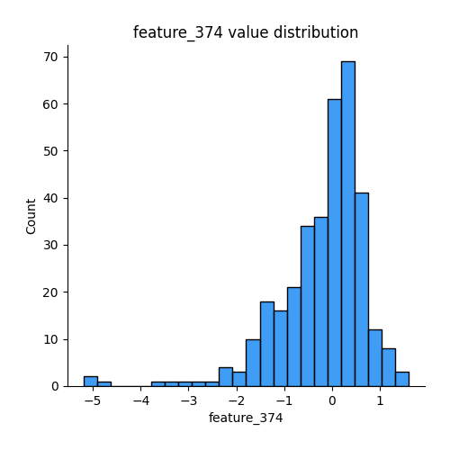
## Feature : feature_375
- **Feature type** : continous
- **Missing** : 0.0%
- **Unique** : 344
- **Count** :344.0
- **Mean** :0.17950122080483158
- **Std** :0.9453290038958903
- **Min** :-3.605580447203626
- **25%th Percentile** : -0.23919569389532638
- **50%th Percentile** : 0.022668920204816714
- **75%th Percentile** : 0.37373526464737244
- **Max** :6.079023777060573

## Feature : feature_376
- **Feature type** : continous
- **Missing** : 0.0%
- **Unique** : 344
- **Count** :344.0
- **Mean** :-0.0006123446435071879
- **Std** :1.0029277777504761
- **Min** :-4.931442052730512
- **25%th Percentile** : -0.67507816127245
- **50%th Percentile** : -0.0022844682931168355
- **75%th Percentile** : 0.6603591789333383
- **Max** :2.91317635619113

## Feature : feature_377
- **Feature type** : continous
- **Missing** : 0.0%
- **Unique** : 344
- **Count** :344.0
- **Mean** :0.07920827996881175
- **Std** :1.0226542946856525
- **Min** :-2.5944792255702676
- **25%th Percentile** : -0.5515994852428969
- **50%th Percentile** : -0.05994258608546605
- **75%th Percentile** : 0.49669866562593473
- **Max** :4.9036512819912375

## Feature : feature_378
- **Feature type** : continous
- **Missing** : 0.0%
- **Unique** : 344
- **Count** :344.0
- **Mean** :0.23956239709452226
- **Std** :0.965581921316792
- **Min** :-1.7701779254721894
- **25%th Percentile** : -0.30891808917577734
- **50%th Percentile** : -0.01127968532267629
- **75%th Percentile** : 0.41117837644672905
- **Max** :4.168654727768101

## Feature : feature_379
- **Feature type** : continous
- **Missing** : 0.0%
- **Unique** : 344
- **Count** :344.0
- **Mean** :-0.07013286889710807
- **Std** :0.969720691771243
- **Min** :-3.78606698198126
- **25%th Percentile** : -0.5710544516281255
- **50%th Percentile** : -0.029476963011711717
- **75%th Percentile** : 0.5610788644355811
- **Max** :2.6737382539203662

## Feature : feature_380
- **Feature type** : continous
- **Missing** : 0.0%
- **Unique** : 344
- **Count** :344.0
- **Mean** :0.011801081419914476
- **Std** :0.9912990213846472
- **Min** :-3.116875513814839
- **25%th Percentile** : -0.6082683401273878
- **50%th Percentile** : 0.025155918131248838
- **75%th Percentile** : 0.6611765563808922
- **Max** :2.88327570001404

## Feature : feature_381
- **Feature type** : continous
- **Missing** : 0.0%
- **Unique** : 344
- **Count** :344.0
- **Mean** :-0.023145597894695204
- **Std** :0.9740914145038269
- **Min** :-2.8686221449673748
- **25%th Percentile** : -0.6175716598253347
- **50%th Percentile** : 0.05628389250502805
- **75%th Percentile** : 0.6859825004643357
- **Max** :2.3966470652895695

## Feature : feature_382
- **Feature type** : continous
- **Missing** : 0.0%
- **Unique** : 344
- **Count** :344.0
- **Mean** :-0.0676226032026579
- **Std** :1.0357668111259108
- **Min** :-4.367709624099675
- **25%th Percentile** : -0.6067375237336224
- **50%th Percentile** : 0.0353541844705742
- **75%th Percentile** : 0.5621207643125465
- **Max** :3.3639309096309127

## Feature : feature_383
- **Feature type** : continous
- **Missing** : 0.0%
- **Unique** : 344
- **Count** :344.0
- **Mean** :-0.03310941395709848
- **Std** :0.9690323965290426
- **Min** :-2.6005155033098797
- **25%th Percentile** : -0.6974811714784912
- **50%th Percentile** : 0.05285901550585432
- **75%th Percentile** : 0.6325439763379033
- **Max** :2.3332795198691647

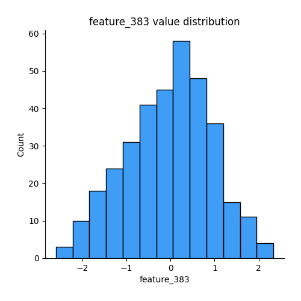
## Feature : feature_384
- **Feature type** : continous
- **Missing** : 0.0%
- **Unique** : 344
- **Count** :344.0
- **Mean** :-0.10375205618316684
- **Std** :1.0321891009071487
- **Min** :-7.983651439055277
- **25%th Percentile** : -0.5737129759712399
- **50%th Percentile** : 0.060628279810101736
- **75%th Percentile** : 0.5224687276553687
- **Max** :1.9573865252491554

## Feature : feature_385
- **Feature type** : continous
- **Missing** : 0.0%
- **Unique** : 344
- **Count** :344.0
- **Mean** :-0.367590074075165
- **Std** :0.986538719068472
- **Min** :-2.1348855816694097
- **25%th Percentile** : -0.5096523902737055
- **50%th Percentile** : 0.0
- **75%th Percentile** : 0.3122536938853241
- **Max** :1.0089237992750313

## Feature : feature_386
- **Feature type** : continous
- **Missing** : 0.0%
- **Unique** : 344
- **Count** :344.0
- **Mean** :-0.029906114040731874
- **Std** :0.9755483137008935
- **Min** :-6.227130681388324
- **25%th Percentile** : -0.452313252836122
- **50%th Percentile** : -0.007380676040548234
- **75%th Percentile** : 0.46669111303025834
- **Max** :3.6184082640930173

## Feature : feature_387
- **Feature type** : continous
- **Missing** : 0.0%
- **Unique** : 344
- **Count** :344.0
- **Mean** :-0.0009923897959007333
- **Std** :0.8434717600709251
- **Min** :-3.1627070425001764
- **25%th Percentile** : -0.4593739734597406
- **50%th Percentile** : 0.004290928353416106
- **75%th Percentile** : 0.47947833874682755
- **Max** :2.674435920773082

## Feature : feature_388
- **Feature type** : continous
- **Missing** : 0.0%
- **Unique** : 344
- **Count** :344.0
- **Mean** :0.025826622189198574
- **Std** :0.8231540891655026
- **Min** :-3.4049324736328104
- **25%th Percentile** : -0.43215287429152766
- **50%th Percentile** : 0.0035426548542811065
- **75%th Percentile** : 0.46533466906214277
- **Max** :3.9765170359255824

## Feature : feature_389
- **Feature type** : continous
- **Missing** : 0.0%
- **Unique** : 344
- **Count** :344.0
- **Mean** :0.24969715162133962
- **Std** :0.9466327124867886
- **Min** :-2.5287608719143977
- **25%th Percentile** : -0.24955459127284402
- **50%th Percentile** : 0.010077527714631496
- **75%th Percentile** : 0.42723319581718205
- **Max** :2.9132985777243303

## Feature : feature_390
- **Feature type** : continous
- **Missing** : 0.0%
- **Unique** : 344
- **Count** :344.0
- **Mean** :-0.18737281276276374
- **Std** :1.0437589873938367
- **Min** :-6.227153556627294
- **25%th Percentile** : -0.5381008991922477
- **50%th Percentile** : -0.04931772166169613
- **75%th Percentile** : 0.36504889676897445
- **Max** :1.8592578366408248

## Feature : feature_391
- **Feature type** : continous
- **Missing** : 0.0%
- **Unique** : 344
- **Count** :344.0
- **Mean** :0.17644703697652198
- **Std** :0.9539032015359877
- **Min** :-1.9684672129191627
- **25%th Percentile** : -0.47696856229384743
- **50%th Percentile** : -0.007687549216713636
- **75%th Percentile** : 0.8135990561004465
- **Max** :2.8414121679002338

## Feature : feature_392
- **Feature type** : continous
- **Missing** : 0.0%
- **Unique** : 344
- **Count** :344.0
- **Mean** :-0.026017005174421876
- **Std** :1.0321433174607262
- **Min** :-2.8835430164510294
- **25%th Percentile** : -0.6832667118353052
- **50%th Percentile** : -0.019444886953407833
- **75%th Percentile** : 0.679783038058996
- **Max** :3.1467623981673998

## Feature : feature_393
- **Feature type** : continous
- **Missing** : 0.0%
- **Unique** : 344
- **Count** :344.0
- **Mean** :-0.004079930330456019
- **Std** :0.9933230795145828
- **Min** :-2.4396467948405145
- **25%th Percentile** : -0.7800712417581911
- **50%th Percentile** : 0.01952802875317064
- **75%th Percentile** : 0.6488837531767176
- **Max** :2.849871901840275

## Feature : feature_394
- **Feature type** : continous
- **Missing** : 0.0%
- **Unique** : 344
- **Count** :344.0
- **Mean** :-0.0659005599012643
- **Std** :0.9356853826304646
- **Min** :-2.2572567001316552
- **25%th Percentile** : -0.6899073279093874
- **50%th Percentile** : -0.05720079764362168
- **75%th Percentile** : 0.5040893427963375
- **Max** :5.203201253353147

## Feature : feature_395
- **Feature type** : continous
- **Missing** : 0.0%
- **Unique** : 344
- **Count** :344.0
- **Mean** :-0.12704071724322052
- **Std** :0.9809008418728744
- **Min** :-3.5145507420955586
- **25%th Percentile** : -0.3758385017837218
- **50%th Percentile** : -0.00045890946580391006
- **75%th Percentile** : 0.3463603820259142
- **Max** :3.045983756228075

## Feature : feature_396
- **Feature type** : continous
- **Missing** : 0.0%
- **Unique** : 344
- **Count** :344.0
- **Mean** :-0.2072788096300695
- **Std** :1.0660179372813245
- **Min** :-4.574284472420884
- **25%th Percentile** : -0.49487958703930923
- **50%th Percentile** : -0.0522885765009153
- **75%th Percentile** : 0.2986371471461646
- **Max** :3.4196208826305825

## Feature : feature_397
- **Feature type** : continous
- **Missing** : 0.0%
- **Unique** : 344
- **Count** :344.0
- **Mean** :-0.0516280589443555
- **Std** :1.0109184051994349
- **Min** :-4.947938196814435
- **25%th Percentile** : -0.6433685494421003
- **50%th Percentile** : -0.028074464675253107
- **75%th Percentile** : 0.6347577674526148
- **Max** :2.4614631664154634

## Feature : feature_398
- **Feature type** : continous
- **Missing** : 0.0%
- **Unique** : 344
- **Count** :344.0
- **Mean** :0.01454833851611136
- **Std** :1.0456943658274322
- **Min** :-2.6171491920789736
- **25%th Percentile** : -0.7501878777684426
- **50%th Percentile** : -0.04621692538774261
- **75%th Percentile** : 0.7141993194481464
- **Max** :3.4588194109513695

## Feature : feature_399
- **Feature type** : continous
- **Missing** : 0.0%
- **Unique** : 344
- **Count** :344.0
- **Mean** :-0.03685348286775943
- **Std** :0.9996747181650093
- **Min** :-3.6065694320724577
- **25%th Percentile** : -0.6775921937071301
- **50%th Percentile** : -0.025550289651420522
- **75%th Percentile** : 0.5946276184056571
- **Max** :2.786627329001836

## Feature : feature_400
- **Feature type** : continous
- **Missing** : 0.0%
- **Unique** : 344
- **Count** :344.0
- **Mean** :-0.2141307619518036
- **Std** :1.029432133043986
- **Min** :-6.789904892423541
- **25%th Percentile** : -0.802114154260985
- **50%th Percentile** : -0.08924813959659209
- **75%th Percentile** : 0.5013122698318394
- **Max** :2.1564856440503677

## Feature : feature_401
- **Feature type** : continous
- **Missing** : 0.0%
- **Unique** : 344
- **Count** :344.0
- **Mean** :-0.027748827619297877
- **Std** :0.9723158584640486
- **Min** :-4.011028357418685
- **25%th Percentile** : -0.6005453423835794
- **50%th Percentile** : -0.014427370378263946
- **75%th Percentile** : 0.5929887314405926
- **Max** :2.7127443630104446

## Feature : feature_402
- **Feature type** : continous
- **Missing** : 0.0%
- **Unique** : 344
- **Count** :344.0
- **Mean** :-0.12346902227520223
- **Std** :0.9959375973763367
- **Min** :-4.340770553658378
- **25%th Percentile** : -0.8162772574554091
- **50%th Percentile** : -0.09810949766421884
- **75%th Percentile** : 0.4544425726727038
- **Max** :2.5155048356721452

## Feature : feature_403
- **Feature type** : continous
- **Missing** : 0.0%
- **Unique** : 344
- **Count** :344.0
- **Mean** :0.02559696191060232
- **Std** :0.9822275018625782
- **Min** :-2.5911229112019374
- **25%th Percentile** : -0.6716877498783203
- **50%th Percentile** : -0.0040931616980862465
- **75%th Percentile** : 0.6973410688166375
- **Max** :3.093610215843379

## Feature : feature_404
- **Feature type** : continous
- **Missing** : 0.0%
- **Unique** : 344
- **Count** :344.0
- **Mean** :0.03076179177519195
- **Std** :1.0405593485329219
- **Min** :-2.445189822381334
- **25%th Percentile** : -0.628282805498028
- **50%th Percentile** : -0.059776544573732784
- **75%th Percentile** : 0.616137760804668
- **Max** :4.743942207229488

## Feature : feature_405
- **Feature type** : continous
- **Missing** : 0.0%
- **Unique** : 344
- **Count** :344.0
- **Mean** :-0.011952171553716745
- **Std** :0.9447428417437471
- **Min** :-3.2029848665588236
- **25%th Percentile** : -0.6041667634206707
- **50%th Percentile** : -0.018498924232590495
- **75%th Percentile** : 0.5476356816199672
- **Max** :2.7080156979428276

## Feature : feature_406
- **Feature type** : continous
- **Missing** : 0.0%
- **Unique** : 344
- **Count** :344.0
- **Mean** :-0.01946936638952566
- **Std** :1.0015148957631472
- **Min** :-6.896774552747004
- **25%th Percentile** : -0.6344565817786809
- **50%th Percentile** : -0.023157252441981212
- **75%th Percentile** : 0.6035830316339752
- **Max** :2.8185177246376933

## Feature : feature_407
- **Feature type** : continous
- **Missing** : 0.0%
- **Unique** : 344
- **Count** :344.0
- **Mean** :-0.04809945832184485
- **Std** :0.7787136264459052
- **Min** :-2.7726993236535584
- **25%th Percentile** : -0.5835689745584345
- **50%th Percentile** : -0.005526209064091483
- **75%th Percentile** : 0.4627969256783655
- **Max** :2.8485366778365315

## Feature : feature_408
- **Feature type** : continous
- **Missing** : 0.0%
- **Unique** : 344
- **Count** :344.0
- **Mean** :-0.029152766027937174
- **Std** :0.951734202183118
- **Min** :-2.6373641400705115
- **25%th Percentile** : -0.6752019493232162
- **50%th Percentile** : -0.006018575240739742
- **75%th Percentile** : 0.556583836226779
- **Max** :3.1491819799243252

## Feature : feature_409
- **Feature type** : continous
- **Missing** : 0.0%
- **Unique** : 344
- **Count** :344.0
- **Mean** :-0.04821065883667062
- **Std** :0.9451431394514908
- **Min** :-4.4802150822356435
- **25%th Percentile** : -0.6386299323968699
- **50%th Percentile** : -0.021848658898076353
- **75%th Percentile** : 0.4974920687057006
- **Max** :2.6241868984708403

## Feature : feature_410
- **Feature type** : continous
- **Missing** : 0.0%
- **Unique** : 344
- **Count** :344.0
- **Mean** :0.03300605327110964
- **Std** :1.0422279553231044
- **Min** :-4.196775179590986
- **25%th Percentile** : -0.6093803385390074
- **50%th Percentile** : 0.03624834750725791
- **75%th Percentile** : 0.6089776851299263
- **Max** :5.635215815223907

## Feature : feature_411
- **Feature type** : continous
- **Missing** : 0.0%
- **Unique** : 344
- **Count** :344.0
- **Mean** :0.06935513956275999
- **Std** :0.9813931958342335
- **Min** :-3.3334575364151866
- **25%th Percentile** : -0.639986856750833
- **50%th Percentile** : 0.09131427852337166
- **75%th Percentile** : 0.690952329521612
- **Max** :2.8355951528479966

## Feature : feature_412
- **Feature type** : continous
- **Missing** : 0.0%
- **Unique** : 344
- **Count** :344.0
- **Mean** :-0.04825484348361178
- **Std** :0.9766580136014333
- **Min** :-3.918638356131166
- **25%th Percentile** : -0.6754742877765065
- **50%th Percentile** : -0.07498270998599357
- **75%th Percentile** : 0.5117105210340533
- **Max** :3.3582434539387793

## Feature : feature_413
- **Feature type** : continous
- **Missing** : 0.0%
- **Unique** : 344
- **Count** :344.0
- **Mean** :0.02837716588058624
- **Std** :0.947934998663062
- **Min** :-2.7180721842185664
- **25%th Percentile** : -0.6263078139472505
- **50%th Percentile** : 0.034675144188789114
- **75%th Percentile** : 0.6142122846132538
- **Max** :2.6522322301238948

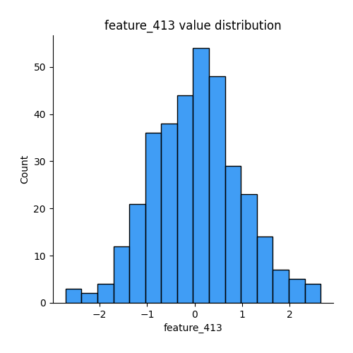
## Feature : feature_414
- **Feature type** : continous
- **Missing** : 0.0%
- **Unique** : 344
- **Count** :344.0
- **Mean** :0.0016980155458038515
- **Std** :0.9525845684141269
- **Min** :-7.224387614412884
- **25%th Percentile** : -0.4726084108905868
- **50%th Percentile** : -0.0011929887958994343
- **75%th Percentile** : 0.5662731671905543
- **Max** :2.277561010605313

## Feature : feature_415
- **Feature type** : continous
- **Missing** : 0.0%
- **Unique** : 344
- **Count** :344.0
- **Mean** :-0.13928597997984296
- **Std** :1.0484242551623537
- **Min** :-7.2054486525199115
- **25%th Percentile** : -0.7763115792850875
- **50%th Percentile** : -0.05897330726130263
- **75%th Percentile** : 0.559396624124359
- **Max** :2.5276866453584015

## Feature : feature_416
- **Feature type** : continous
- **Missing** : 0.0%
- **Unique** : 344
- **Count** :344.0
- **Mean** :-0.06222655543343673
- **Std** :1.001983189803174
- **Min** :-3.4649247488915345
- **25%th Percentile** : -0.6295407607838395
- **50%th Percentile** : 0.0222798421521975
- **75%th Percentile** : 0.5906455280908349
- **Max** :3.3196982351535747

## Feature : feature_417
- **Feature type** : continous
- **Missing** : 0.0%
- **Unique** : 344
- **Count** :344.0
- **Mean** :0.03138885236720813
- **Std** :0.924010440781721
- **Min** :-3.583150871720506
- **25%th Percentile** : -0.5145971526283146
- **50%th Percentile** : 0.08742749840303976
- **75%th Percentile** : 0.6386513253282831
- **Max** :2.6471761333979873

## Feature : feature_418
- **Feature type** : continous
- **Missing** : 0.0%
- **Unique** : 344
- **Count** :344.0
- **Mean** :0.013766237398881397
- **Std** :0.9692825871809805
- **Min** :-2.5930933142620747
- **25%th Percentile** : -0.6355420699911885
- **50%th Percentile** : 0.019075573113944144
- **75%th Percentile** : 0.661476674468062
- **Max** :2.720812499887591

## Feature : feature_419
- **Feature type** : continous
- **Missing** : 0.0%
- **Unique** : 344
- **Count** :344.0
- **Mean** :-0.022399086757515858
- **Std** :0.9653811558820347
- **Min** :-2.999004472918796
- **25%th Percentile** : -0.6234423977037982
- **50%th Percentile** : -0.03818049864636118
- **75%th Percentile** : 0.6559822351106869
- **Max** :2.7669763811075025

## Feature : feature_420
- **Feature type** : continous
- **Missing** : 0.0%
- **Unique** : 344
- **Count** :344.0
- **Mean** :-0.047599338498567026
- **Std** :0.9613560552313775
- **Min** :-3.3709660171412668
- **25%th Percentile** : -0.599468716519057
- **50%th Percentile** : -0.0503764674152449
- **75%th Percentile** : 0.5621486313231818
- **Max** :2.384528791029494

## Feature : feature_421
- **Feature type** : continous
- **Missing** : 0.0%
- **Unique** : 344
- **Count** :344.0
- **Mean** :0.05021182890940402
- **Std** :1.00224362783037
- **Min** :-3.41146030974368
- **25%th Percentile** : -0.7146867283118576
- **50%th Percentile** : 0.010478330258505962
- **75%th Percentile** : 0.7329702171272978
- **Max** :3.2503594553891397

## Feature : feature_422
- **Feature type** : continous
- **Missing** : 0.0%
- **Unique** : 344
- **Count** :344.0
- **Mean** :0.01765214196782387
- **Std** :0.9649104200687677
- **Min** :-3.61193742768637
- **25%th Percentile** : -0.6145099358681562
- **50%th Percentile** : 0.02527218543457266
- **75%th Percentile** : 0.6637827274056557
- **Max** :2.4079257228366635

## Feature : feature_423
- **Feature type** : continous
- **Missing** : 0.0%
- **Unique** : 344
- **Count** :344.0
- **Mean** :0.01812940174564363
- **Std** :0.9446894918629923
- **Min** :-2.3784563855617105
- **25%th Percentile** : -0.6211701103002356
- **50%th Percentile** : 0.029429355030604266
- **75%th Percentile** : 0.6634944993929996
- **Max** :2.596719041246614

## Feature : feature_424
- **Feature type** : continous
- **Missing** : 0.0%
- **Unique** : 344
- **Count** :344.0
- **Mean** :-0.0220380693859735
- **Std** :1.021536526726736
- **Min** :-4.259395807826215
- **25%th Percentile** : -0.5083929324507477
- **50%th Percentile** : 0.017922076742228295
- **75%th Percentile** : 0.6143706209755788
- **Max** :2.6631150756210644

## Feature : feature_425
- **Feature type** : continous
- **Missing** : 0.0%
- **Unique** : 344
- **Count** :344.0
- **Mean** :-0.2413113746597304
- **Std** :0.9723827001925526
- **Min** :-3.202466744178895
- **25%th Percentile** : -0.41495588424578017
- **50%th Percentile** : 0.01453719771353592
- **75%th Percentile** : 0.3550838156199096
- **Max** :1.0312557308919068

## Feature : feature_426
- **Feature type** : continous
- **Missing** : 0.0%
- **Unique** : 344
- **Count** :344.0
- **Mean** :-0.022304499001866002
- **Std** :0.9655534408348474
- **Min** :-3.326199843442422
- **25%th Percentile** : -0.6383775606415072
- **50%th Percentile** : 0.014963639774328179
- **75%th Percentile** : 0.6030861413459776
- **Max** :2.597615297401402

## Feature : feature_427
- **Feature type** : continous
- **Missing** : 0.0%
- **Unique** : 344
- **Count** :344.0
- **Mean** :-0.00327500713804312
- **Std** :0.9532819540099897
- **Min** :-3.751690410523442
- **25%th Percentile** : -0.665264145218866
- **50%th Percentile** : -0.014792254006142869
- **75%th Percentile** : 0.6126713930848272
- **Max** :3.271389897554171

## Feature : feature_428
- **Feature type** : continous
- **Missing** : 0.0%
- **Unique** : 344
- **Count** :344.0
- **Mean** :0.07753653040015492
- **Std** :0.9359993626207196
- **Min** :-3.4811372200297193
- **25%th Percentile** : -0.538179441590489
- **50%th Percentile** : 0.027207667466090227
- **75%th Percentile** : 0.6380689543790656
- **Max** :3.3548049105934155

## Feature : feature_429
- **Feature type** : continous
- **Missing** : 0.0%
- **Unique** : 344
- **Count** :344.0
- **Mean** :-0.12768601731885218
- **Std** :0.8552030928441979
- **Min** :-5.352109521359234
- **25%th Percentile** : -0.4330614841648213
- **50%th Percentile** : -0.012314906623143416
- **75%th Percentile** : 0.3594853991624444
- **Max** :1.284124508906476

## Feature : feature_430
- **Feature type** : continous
- **Missing** : 0.0%
- **Unique** : 344
- **Count** :344.0
- **Mean** :0.03163004018821599
- **Std** :0.9928312829182744
- **Min** :-3.189831811459169
- **25%th Percentile** : -0.5267619805722886
- **50%th Percentile** : -0.028175986652348668
- **75%th Percentile** : 0.6331757415807472
- **Max** :3.1245108924752487

## Feature : feature_431
- **Feature type** : continous
- **Missing** : 0.0%
- **Unique** : 344
- **Count** :344.0
- **Mean** :-0.12911252406577356
- **Std** :0.9360242109223058
- **Min** :-4.11384233447558
- **25%th Percentile** : -0.7033789683350857
- **50%th Percentile** : -0.01713943585775644
- **75%th Percentile** : 0.5252809999526471
- **Max** :2.1510185158162383

## Feature : feature_432
- **Feature type** : continous
- **Missing** : 0.0%
- **Unique** : 344
- **Count** :344.0
- **Mean** :-0.09881000735651548
- **Std** :1.0278159403453997
- **Min** :-4.163799093057779
- **25%th Percentile** : -0.7107707431988376
- **50%th Percentile** : 0.0054088525026686
- **75%th Percentile** : 0.5963567435811366
- **Max** :2.979456322619198

## Feature : feature_433
- **Feature type** : continous
- **Missing** : 0.0%
- **Unique** : 344
- **Count** :344.0
- **Mean** :0.006254268123147373
- **Std** :0.9838852708714373
- **Min** :-3.1869774947639704
- **25%th Percentile** : -0.6834013920094626
- **50%th Percentile** : -0.019828874316177924
- **75%th Percentile** : 0.6601679948425897
- **Max** :3.1403617203467613

## Feature : feature_434
- **Feature type** : continous
- **Missing** : 0.0%
- **Unique** : 344
- **Count** :344.0
- **Mean** :0.03165867975149108
- **Std** :0.962929403521182
- **Min** :-3.9458822062356136
- **25%th Percentile** : -0.6203203871877564
- **50%th Percentile** : 0.09118923783479033
- **75%th Percentile** : 0.64213180981068
- **Max** :2.5955449413162306

## Feature : feature_435
- **Feature type** : continous
- **Missing** : 0.0%
- **Unique** : 344
- **Count** :344.0
- **Mean** :0.03071447930196387
- **Std** :0.9717652668466669
- **Min** :-3.5455252221544846
- **25%th Percentile** : -0.5576121634990724
- **50%th Percentile** : -0.002776638194600515
- **75%th Percentile** : 0.6172531361296639
- **Max** :3.098111194464844

## Feature : feature_436
- **Feature type** : continous
- **Missing** : 0.0%
- **Unique** : 344
- **Count** :344.0
- **Mean** :-0.33942565440210754
- **Std** :1.0077633055951982
- **Min** :-4.539228981852981
- **25%th Percentile** : -0.8708948352852168
- **50%th Percentile** : 0.009861229293819742
- **75%th Percentile** : 0.37538036443001654
- **Max** :1.2330161098834993

## Feature : feature_437
- **Feature type** : continous
- **Missing** : 0.0%
- **Unique** : 344
- **Count** :344.0
- **Mean** :-0.0009674156020862877
- **Std** :0.9688110778387895
- **Min** :-2.5385576592807
- **25%th Percentile** : -0.6181729294391991
- **50%th Percentile** : 0.03595930915751676
- **75%th Percentile** : 0.6234916147024077
- **Max** :2.9800316291014397

## Feature : feature_438
- **Feature type** : continous
- **Missing** : 0.0%
- **Unique** : 344
- **Count** :344.0
- **Mean** :-0.04357470682637478
- **Std** :0.7772047573119933
- **Min** :-3.334916576833276
- **25%th Percentile** : -0.5025479525294511
- **50%th Percentile** : 0.00601241662815202
- **75%th Percentile** : 0.5103413890906114
- **Max** :2.058522234520151

## Feature : feature_439
- **Feature type** : continous
- **Missing** : 0.0%
- **Unique** : 344
- **Count** :344.0
- **Mean** :0.030877478002205288
- **Std** :0.9801749948369511
- **Min** :-3.8125327290086095
- **25%th Percentile** : -0.5824324231454219
- **50%th Percentile** : -0.01879558312412396
- **75%th Percentile** : 0.5434971881997459
- **Max** :2.4652690304819123

## Feature : feature_440
- **Feature type** : continous
- **Missing** : 0.0%
- **Unique** : 344
- **Count** :344.0
- **Mean** :-0.03355463159151397
- **Std** :0.9794001485450333
- **Min** :-4.152504437141975
- **25%th Percentile** : -0.648716897256627
- **50%th Percentile** : -0.032488234924892
- **75%th Percentile** : 0.5835181942961137
- **Max** :2.461924870894188

## Feature : feature_441
- **Feature type** : continous
- **Missing** : 0.0%
- **Unique** : 344
- **Count** :344.0
- **Mean** :-0.1602610195966451
- **Std** :0.9604369947706852
- **Min** :-3.492597928831326
- **25%th Percentile** : -0.6931735675061826
- **50%th Percentile** : -0.07032514705741
- **75%th Percentile** : 0.5271091228029732
- **Max** :2.0209416991498004

## Feature : feature_442
- **Feature type** : continous
- **Missing** : 0.0%
- **Unique** : 344
- **Count** :344.0
- **Mean** :0.023835302011744056
- **Std** :0.9965692175793829
- **Min** :-2.9705146758704215
- **25%th Percentile** : -0.6672785215121428
- **50%th Percentile** : -0.00841273361799746
- **75%th Percentile** : 0.7116320143760636
- **Max** :3.0514293844245834

## Feature : feature_443
- **Feature type** : continous
- **Missing** : 0.0%
- **Unique** : 344
- **Count** :344.0
- **Mean** :-0.06112345996454832
- **Std** :1.02282263627453
- **Min** :-5.4537006763136535
- **25%th Percentile** : -0.5104928641079953
- **50%th Percentile** : 0.04198969024171895
- **75%th Percentile** : 0.6093566916347454
- **Max** :2.3701986564543125

## Feature : feature_444
- **Feature type** : continous
- **Missing** : 0.0%
- **Unique** : 344
- **Count** :344.0
- **Mean** :-0.00443608768336762
- **Std** :0.9560956429147484
- **Min** :-6.697328004047683
- **25%th Percentile** : -0.568193308825762
- **50%th Percentile** : -0.008490638120471777
- **75%th Percentile** : 0.5436384202359869
- **Max** :4.080113838125673

## Feature : feature_445
- **Feature type** : continous
- **Missing** : 0.0%
- **Unique** : 344
- **Count** :344.0
- **Mean** :-0.00483616633493991
- **Std** :0.9540306860533716
- **Min** :-5.960445744186844
- **25%th Percentile** : -0.42812184304085127
- **50%th Percentile** : 0.0708999128582484
- **75%th Percentile** : 0.599773436831603
- **Max** :2.071967991267231

## Feature : feature_446
- **Feature type** : continous
- **Missing** : 0.0%
- **Unique** : 344
- **Count** :344.0
- **Mean** :-0.11953883814155496
- **Std** :0.9564679148772242
- **Min** :-4.324646675848931
- **25%th Percentile** : -0.684302747417566
- **50%th Percentile** : -0.015322416356175882
- **75%th Percentile** : 0.5207968866303055
- **Max** :2.126380948376502

## Feature : feature_447
- **Feature type** : continous
- **Missing** : 0.0%
- **Unique** : 344
- **Count** :344.0
- **Mean** :-0.06124582450807133
- **Std** :0.9852854545330543
- **Min** :-3.1192173556183835
- **25%th Percentile** : -0.6895921468817549
- **50%th Percentile** : 0.02459259167835247
- **75%th Percentile** : 0.6721221205601143
- **Max** :2.715591074301263

## Feature : feature_448
- **Feature type** : continous
- **Missing** : 0.0%
- **Unique** : 344
- **Count** :344.0
- **Mean** :-0.06355841246844346
- **Std** :0.9465128554421597
- **Min** :-5.0543816522290035
- **25%th Percentile** : -0.5449158977950479
- **50%th Percentile** : -0.009121017737487951
- **75%th Percentile** : 0.551847355625391
- **Max** :2.2782603267050967

## Feature : feature_449
- **Feature type** : continous
- **Missing** : 0.0%
- **Unique** : 344
- **Count** :344.0
- **Mean** :0.14895434687910106
- **Std** :0.9724226463931603
- **Min** :-2.268325830913935
- **25%th Percentile** : -0.5192420890871057
- **50%th Percentile** : -0.008105989623151797
- **75%th Percentile** : 0.6966471888493129
- **Max** :4.670151694638663

## Feature : feature_450
- **Feature type** : continous
- **Missing** : 0.0%
- **Unique** : 344
- **Count** :344.0
- **Mean** :-0.020426166500396893
- **Std** :0.975671269150401
- **Min** :-2.804442858058622
- **25%th Percentile** : -0.6914624430692679
- **50%th Percentile** : -0.045015331650891846
- **75%th Percentile** : 0.7066515397639447
- **Max** :2.4597895055372723

## Feature : feature_451
- **Feature type** : continous
- **Missing** : 0.0%
- **Unique** : 344
- **Count** :344.0
- **Mean** :0.2558990755898416
- **Std** :1.0237258049252986
- **Min** :-1.8600586504098349
- **25%th Percentile** : -0.5557181028061347
- **50%th Percentile** : 0.0450251533150304
- **75%th Percentile** : 0.8267793805577069
- **Max** :3.476614910347189

## Feature : feature_452
- **Feature type** : continous
- **Missing** : 0.0%
- **Unique** : 344
- **Count** :344.0
- **Mean** :0.03762049369668561
- **Std** :0.9738244387148876
- **Min** :-2.6319440500328115
- **25%th Percentile** : -0.5845219412367701
- **50%th Percentile** : 0.0015010671372519416
- **75%th Percentile** : 0.6008697927443376
- **Max** :3.205737544540093

## Feature : feature_453
- **Feature type** : continous
- **Missing** : 0.0%
- **Unique** : 344
- **Count** :344.0
- **Mean** :-0.15114855315751582
- **Std** :1.0052975874223928
- **Min** :-5.3104230935368015
- **25%th Percentile** : -0.738186425801919
- **50%th Percentile** : -0.049103876231629075
- **75%th Percentile** : 0.5444516775837874
- **Max** :1.9931083067407949

## Feature : feature_454
- **Feature type** : continous
- **Missing** : 0.0%
- **Unique** : 344
- **Count** :344.0
- **Mean** :-0.3749582342504493
- **Std** :1.0171233559985577
- **Min** :-3.5335242304071266
- **25%th Percentile** : -0.5066163533209582
- **50%th Percentile** : -0.038218044355760886
- **75%th Percentile** : 0.24657991397717768
- **Max** :0.8057909169486498

## Feature : feature_455
- **Feature type** : continous
- **Missing** : 0.0%
- **Unique** : 344
- **Count** :344.0
- **Mean** :-0.10692405813465929
- **Std** :1.0375843747909723
- **Min** :-3.436759189783537
- **25%th Percentile** : -0.803883439382006
- **50%th Percentile** : -0.040155353162200785
- **75%th Percentile** : 0.6869184431758824
- **Max** :2.191982551939508

## Feature : feature_456
- **Feature type** : continous
- **Missing** : 0.0%
- **Unique** : 344
- **Count** :344.0
- **Mean** :-0.04541694276577715
- **Std** :1.0027766528351227
- **Min** :-2.996418023562882
- **25%th Percentile** : -0.7052046920611087
- **50%th Percentile** : -0.018886288719167314
- **75%th Percentile** : 0.5973471130657003
- **Max** :2.3670538839997426

## Feature : feature_457
- **Feature type** : continous
- **Missing** : 0.0%
- **Unique** : 344
- **Count** :344.0
- **Mean** :-0.05171579320311666
- **Std** :1.0019841518791657
- **Min** :-2.9418732380125974
- **25%th Percentile** : -0.7433114054863679
- **50%th Percentile** : -0.01128333636925324
- **75%th Percentile** : 0.6319126550686676
- **Max** :2.3846557137099404

## Feature : feature_458
- **Feature type** : continous
- **Missing** : 0.0%
- **Unique** : 344
- **Count** :344.0
- **Mean** :-0.047506810297435066
- **Std** :0.9807729920223344
- **Min** :-3.1934040992336623
- **25%th Percentile** : -0.6488274370837397
- **50%th Percentile** : 0.026550415419788788
- **75%th Percentile** : 0.5469256454280138
- **Max** :2.7150796645842568

## Feature : feature_459
- **Feature type** : continous
- **Missing** : 0.0%
- **Unique** : 344
- **Count** :344.0
- **Mean** :0.019484707214256748
- **Std** :0.9612421528478665
- **Min** :-2.7439866610307844
- **25%th Percentile** : -0.5961311348711893
- **50%th Percentile** : 0.017407550076975982
- **75%th Percentile** : 0.6272575463784991
- **Max** :2.8066242984683414

## Feature : feature_460
- **Feature type** : continous
- **Missing** : 0.0%
- **Unique** : 344
- **Count** :344.0
- **Mean** :-0.1007155229514063
- **Std** :1.0198788292111853
- **Min** :-5.538778683358331
- **25%th Percentile** : -0.7268831560935723
- **50%th Percentile** : -0.09630115328269243
- **75%th Percentile** : 0.5859491319834148
- **Max** :2.217739424032172

## Feature : feature_461
- **Feature type** : continous
- **Missing** : 0.0%
- **Unique** : 344
- **Count** :344.0
- **Mean** :-0.07849678873239495
- **Std** :1.0213467786102983
- **Min** :-3.629343452802148
- **25%th Percentile** : -0.6219371439781205
- **50%th Percentile** : 0.004492722145596314
- **75%th Percentile** : 0.6291640242956067
- **Max** :2.1752646456056572

## Feature : feature_462
- **Feature type** : continous
- **Missing** : 0.0%
- **Unique** : 344
- **Count** :344.0
- **Mean** :0.17874956833584915
- **Std** :0.9643304928530454
- **Min** :-2.44814871650712
- **25%th Percentile** : -0.5012028281603151
- **50%th Percentile** : 0.00955446380910534
- **75%th Percentile** : 0.68257093973872
- **Max** :3.9192430880049307

## Feature : feature_463
- **Feature type** : continous
- **Missing** : 0.0%
- **Unique** : 344
- **Count** :344.0
- **Mean** :0.05957137658145187
- **Std** :1.0229876430497218
- **Min** :-3.4256366986791185
- **25%th Percentile** : -0.6016085941041527
- **50%th Percentile** : 0.04243824786547396
- **75%th Percentile** : 0.6855870398854867
- **Max** :3.473672771628231

## Feature : feature_464
- **Feature type** : continous
- **Missing** : 0.0%
- **Unique** : 344
- **Count** :344.0
- **Mean** :0.023382030835681935
- **Std** :0.9981241842968541
- **Min** :-1.6196336411080192
- **25%th Percentile** : -0.5711140583652214
- **50%th Percentile** : 2.2258670601127406e-16
- **75%th Percentile** : 0.704400525659953
- **Max** :2.9123590595318074

## Feature : feature_465
- **Feature type** : continous
- **Missing** : 0.0%
- **Unique** : 344
- **Count** :344.0
- **Mean** :0.002232765564815335
- **Std** :0.9552082574132299
- **Min** :-3.1010565114520805
- **25%th Percentile** : -0.5526171673059321
- **50%th Percentile** : -0.06766808195666796
- **75%th Percentile** : 0.6924858844696602
- **Max** :2.698327215799997

## Feature : feature_466
- **Feature type** : continous
- **Missing** : 0.0%
- **Unique** : 344
- **Count** :344.0
- **Mean** :0.03602324797028651
- **Std** :1.0050490284644735
- **Min** :-2.7323896955139855
- **25%th Percentile** : -0.7572516554956592
- **50%th Percentile** : -0.07015213147658897
- **75%th Percentile** : 0.9169266349479177
- **Max** :2.1517305310734924

## Feature : feature_467
- **Feature type** : continous
- **Missing** : 0.0%
- **Unique** : 344
- **Count** :344.0
- **Mean** :0.05906701604506745
- **Std** :0.975295146667517
- **Min** :-6.763351501691184
- **25%th Percentile** : -0.5129362040148504
- **50%th Percentile** : 0.0558961753652453
- **75%th Percentile** : 0.6664625383663341
- **Max** :3.4443914300019567

## Feature : feature_468
- **Feature type** : continous
- **Missing** : 0.0%
- **Unique** : 343
- **Count** :344.0
- **Mean** :-0.2737874266806095
- **Std** :0.9770493299460913
- **Min** :-1.82652617373163
- **25%th Percentile** : -1.6978201818344465
- **50%th Percentile** : 0.016224415656151722
- **75%th Percentile** : 0.4772500962970043
- **Max** :1.3171473948388068

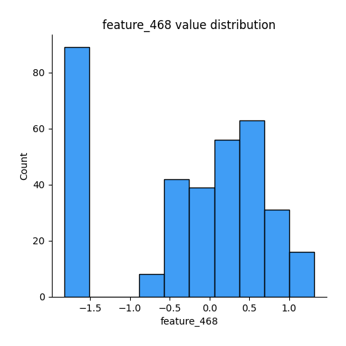
## Feature : feature_469
- **Feature type** : continous
- **Missing** : 0.0%
- **Unique** : 344
- **Count** :344.0
- **Mean** :0.07235898670067395
- **Std** :1.0342848512134701
- **Min** :-2.303445011144395
- **25%th Percentile** : -0.5942139405181346
- **50%th Percentile** : 0.022042685248088216
- **75%th Percentile** : 0.6920119229587339
- **Max** :4.28357116856239

## Feature : feature_470
- **Feature type** : continous
- **Missing** : 0.0%
- **Unique** : 344
- **Count** :344.0
- **Mean** :0.21864830427276574
- **Std** :0.9310594528383332
- **Min** :-1.201195300880917
- **25%th Percentile** : -0.49853280548856793
- **50%th Percentile** : -0.09124722396780047
- **75%th Percentile** : 0.759485190621909
- **Max** :3.73512672495934

## Feature : feature_471
- **Feature type** : continous
- **Missing** : 0.0%
- **Unique** : 344
- **Count** :344.0
- **Mean** :-0.041118278528234437
- **Std** :1.0134103404806583
- **Min** :-4.230798284788792
- **25%th Percentile** : -0.616721656874308
- **50%th Percentile** : -0.01731906360407392
- **75%th Percentile** : 0.6259631874714149
- **Max** :2.240815320674912

## Feature : feature_472
- **Feature type** : continous
- **Missing** : 0.0%
- **Unique** : 344
- **Count** :344.0
- **Mean** :0.11692725975167868
- **Std** :0.9319783385910083
- **Min** :-1.9404451664002462
- **25%th Percentile** : -0.49464150468665397
- **50%th Percentile** : -0.010855426212112926
- **75%th Percentile** : 0.572577114698903
- **Max** :6.334729269979934

## Feature : feature_473
- **Feature type** : continous
- **Missing** : 0.0%
- **Unique** : 344
- **Count** :344.0
- **Mean** :0.010082504411956449
- **Std** :0.9497212308440429
- **Min** :-3.5186514740618144
- **25%th Percentile** : -0.4617347158212396
- **50%th Percentile** : -0.07516936215190409
- **75%th Percentile** : 0.3880975638849055
- **Max** :3.338151567788492

## Feature : feature_474
- **Feature type** : continous
- **Missing** : 0.0%
- **Unique** : 344
- **Count** :344.0
- **Mean** :0.008336042556567048
- **Std** :0.992531093824477
- **Min** :-2.701872327740093
- **25%th Percentile** : -0.6520200684589361
- **50%th Percentile** : -0.07731748922073806
- **75%th Percentile** : 0.6509181656850191
- **Max** :3.1758287418091635

## Feature : feature_475
- **Feature type** : continous
- **Missing** : 0.0%
- **Unique** : 344
- **Count** :344.0
- **Mean** :-0.044932005038575334
- **Std** :0.8504141309211166
- **Min** :-3.724519806320286
- **25%th Percentile** : -0.5114117344499778
- **50%th Percentile** : -0.013351235423146042
- **75%th Percentile** : 0.4619811274660999
- **Max** :2.3303137666195024

## Feature : feature_476
- **Feature type** : continous
- **Missing** : 0.0%
- **Unique** : 344
- **Count** :344.0
- **Mean** :-0.02673207107401992
- **Std** :0.982112431577871
- **Min** :-3.1520098038643183
- **25%th Percentile** : -0.7180822085937846
- **50%th Percentile** : -0.03277941458101959
- **75%th Percentile** : 0.7123223469747884
- **Max** :2.4809381415937484

## Feature : feature_477
- **Feature type** : continous
- **Missing** : 0.0%
- **Unique** : 344
- **Count** :344.0
- **Mean** :-0.3364597654079205
- **Std** :1.0447751666136509
- **Min** :-5.295705444874785
- **25%th Percentile** : -0.7058627985930721
- **50%th Percentile** : -0.01879039963666538
- **75%th Percentile** : 0.2879128639779076
- **Max** :2.031832579221192

## Feature : feature_478
- **Feature type** : continous
- **Missing** : 0.0%
- **Unique** : 343
- **Count** :344.0
- **Mean** :-0.2746689426713447
- **Std** :0.99432087641403
- **Min** :-1.3013577021408513
- **25%th Percentile** : -1.272603416842004
- **50%th Percentile** : -0.04420444589068888
- **75%th Percentile** : 0.6393072944539482
- **Max** :1.6117047031958356

## Feature : feature_479
- **Feature type** : continous
- **Missing** : 0.0%
- **Unique** : 344
- **Count** :344.0
- **Mean** :0.04423292126965144
- **Std** :0.935839493370881
- **Min** :-2.2146050596026132
- **25%th Percentile** : -0.6910790757274752
- **50%th Percentile** : 0.03265798942907866
- **75%th Percentile** : 0.7531480065474946
- **Max** :4.7899030796801

## Feature : feature_480
- **Feature type** : continous
- **Missing** : 0.0%
- **Unique** : 344
- **Count** :344.0
- **Mean** :-0.057758579529582126
- **Std** :0.977459861440615
- **Min** :-2.8833818123382873
- **25%th Percentile** : -0.6896277278992327
- **50%th Percentile** : -0.033227391874328126
- **75%th Percentile** : 0.6030247239790363
- **Max** :2.819836924931684

## Feature : feature_481
- **Feature type** : continous
- **Missing** : 0.0%
- **Unique** : 344
- **Count** :344.0
- **Mean** :-0.09841001916655147
- **Std** :1.0101767804153183
- **Min** :-5.252214942787284
- **25%th Percentile** : -0.7098899287367981
- **50%th Percentile** : -0.0491576995014177
- **75%th Percentile** : 0.5712959321666974
- **Max** :2.8356076401447154

## Feature : feature_482
- **Feature type** : continous
- **Missing** : 0.0%
- **Unique** : 344
- **Count** :344.0
- **Mean** :0.3778745015057824
- **Std** :1.0358908837592267
- **Min** :-1.2067159882913026
- **25%th Percentile** : -0.48181484955024667
- **50%th Percentile** : 0.061497282670132575
- **75%th Percentile** : 1.1503171306340274
- **Max** :3.370764458166687

## Feature : feature_483
- **Feature type** : continous
- **Missing** : 0.0%
- **Unique** : 344
- **Count** :344.0
- **Mean** :-0.2547238721015842
- **Std** :1.0239934555811931
- **Min** :-1.9712948651401994
- **25%th Percentile** : -1.0490502991381025
- **50%th Percentile** : -0.030424044162243657
- **75%th Percentile** : 0.5229241857740903
- **Max** :1.875151056572776

## Feature : feature_484
- **Feature type** : continous
- **Missing** : 0.0%
- **Unique** : 344
- **Count** :344.0
- **Mean** :0.1240510981245343
- **Std** :0.9882152408387291
- **Min** :-2.6258492114039353
- **25%th Percentile** : -0.500830827090473
- **50%th Percentile** : 0.11735990578832266
- **75%th Percentile** : 0.7153530192728632
- **Max** :3.5094087058214742

## Feature : feature_485
- **Feature type** : continous
- **Missing** : 0.0%
- **Unique** : 344
- **Count** :344.0
- **Mean** :-0.04029185134373045
- **Std** :0.9371853476155511
- **Min** :-2.9145929930508805
- **25%th Percentile** : -0.6820653964179356
- **50%th Percentile** : -0.0008506678546608116
- **75%th Percentile** : 0.618098228572925
- **Max** :2.732258907498878

## Feature : feature_486
- **Feature type** : continous
- **Missing** : 0.0%
- **Unique** : 344
- **Count** :344.0
- **Mean** :0.03450139930369364
- **Std** :0.9560472211568994
- **Min** :-2.743768184560799
- **25%th Percentile** : -0.5983213220284553
- **50%th Percentile** : 0.06969985294354106
- **75%th Percentile** : 0.7071619340656433
- **Max** :2.489861101280572

## Feature : feature_487
- **Feature type** : continous
- **Missing** : 0.0%
- **Unique** : 344
- **Count** :344.0
- **Mean** :0.026605327819979502
- **Std** :0.9724858798281906
- **Min** :-2.841677064718941
- **25%th Percentile** : -0.5929207504948867
- **50%th Percentile** : 0.029885596003934832
- **75%th Percentile** : 0.6222926771830355
- **Max** :2.686944993838937

## Feature : feature_488
- **Feature type** : continous
- **Missing** : 0.0%
- **Unique** : 344
- **Count** :344.0
- **Mean** :0.05139055784345562
- **Std** :0.9832533122042965
- **Min** :-3.0439861277577163
- **25%th Percentile** : -0.5516224296597876
- **50%th Percentile** : 0.0022229877963696213
- **75%th Percentile** : 0.6797469787548744
- **Max** :3.5025902934754263

## Feature : feature_489
- **Feature type** : continous
- **Missing** : 0.0%
- **Unique** : 344
- **Count** :344.0
- **Mean** :-0.1458820729120876
- **Std** :1.0098589671313696
- **Min** :-5.7020721171545405
- **25%th Percentile** : -0.6899114104603054
- **50%th Percentile** : -0.08782276824863995
- **75%th Percentile** : 0.5053694544747347
- **Max** :3.0339109712917525

## Feature : feature_490
- **Feature type** : continous
- **Missing** : 0.0%
- **Unique** : 344
- **Count** :344.0
- **Mean** :-0.3560108015103643
- **Std** :1.0353543803587135
- **Min** :-3.3051486271855706
- **25%th Percentile** : -0.9410703154704204
- **50%th Percentile** : -0.04368029961116178
- **75%th Percentile** : 0.38854632142309165
- **Max** :1.628049482149599

## Feature : feature_491
- **Feature type** : continous
- **Missing** : 0.0%
- **Unique** : 344
- **Count** :344.0
- **Mean** :0.052070691403859795
- **Std** :0.9426006912308649
- **Min** :-2.851599555866171
- **25%th Percentile** : -0.5057061983668895
- **50%th Percentile** : 0.03459165286356565
- **75%th Percentile** : 0.6653950350564041
- **Max** :3.3890587312264366

## Feature : feature_492
- **Feature type** : continous
- **Missing** : 0.0%
- **Unique** : 344
- **Count** :344.0
- **Mean** :0.9103382678020009
- **Std** :1.0044876198016315
- **Min** :-0.16953228610828522
- **25%th Percentile** : -0.09473904922499513
- **50%th Percentile** : 0.9306001522427516
- **75%th Percentile** : 1.90089629410272
- **Max** :3.0334588040734487

## Feature : feature_493
- **Feature type** : continous
- **Missing** : 0.0%
- **Unique** : 344
- **Count** :344.0
- **Mean** :0.020672997107118115
- **Std** :0.9706801635668401
- **Min** :-2.309908108686179
- **25%th Percentile** : -0.6012160313280064
- **50%th Percentile** : -0.030941929863186817
- **75%th Percentile** : 0.5754137628826372
- **Max** :3.6248049848723634

## Feature : feature_494
- **Feature type** : continous
- **Missing** : 0.0%
- **Unique** : 344
- **Count** :344.0
- **Mean** :0.06249511090891193
- **Std** :0.9847926229661903
- **Min** :-3.298612629347765
- **25%th Percentile** : -0.5988454646296648
- **50%th Percentile** : 0.009511826929737881
- **75%th Percentile** : 0.6386365700370391
- **Max** :3.430780313806733

## Feature : feature_495
- **Feature type** : continous
- **Missing** : 0.0%
- **Unique** : 344
- **Count** :344.0
- **Mean** :0.10511589131355262
- **Std** :1.0203769573534385
- **Min** :-3.9775875671264944
- **25%th Percentile** : -0.5038432104127433
- **50%th Percentile** : 0.022534607364635095
- **75%th Percentile** : 0.5932150966526282
- **Max** :4.9657581836168125

## Feature : feature_496
- **Feature type** : continous
- **Missing** : 0.0%
- **Unique** : 344
- **Count** :344.0
- **Mean** :-0.3718197525550594
- **Std** :1.0379991682485346
- **Min** :-3.810898277530659
- **25%th Percentile** : -0.5787631513316719
- **50%th Percentile** : -0.04500190957660531
- **75%th Percentile** : 0.2745410322293419
- **Max** :0.6941813903801816

## Feature : feature_497
- **Feature type** : continous
- **Missing** : 0.0%
- **Unique** : 344
- **Count** :344.0
- **Mean** :0.028827838025879748
- **Std** :0.9512721142025018
- **Min** :-2.9744233327640757
- **25%th Percentile** : -0.5699932169063407
- **50%th Percentile** : -0.03189387468561677
- **75%th Percentile** : 0.5476831671769142
- **Max** :2.893256362154792

## Feature : feature_498
- **Feature type** : continous
- **Missing** : 0.0%
- **Unique** : 344
- **Count** :344.0
- **Mean** :-0.02813435668496592
- **Std** :0.9810721626231103
- **Min** :-3.39567628138741
- **25%th Percentile** : -0.7061214563270461
- **50%th Percentile** : -0.015902560588878362
- **75%th Percentile** : 0.5983120258720444
- **Max** :2.940048316076434

## Feature : feature_499
- **Feature type** : continous
- **Missing** : 0.0%
- **Unique** : 344
- **Count** :344.0
- **Mean** :0.09849692243401112
- **Std** :0.9209383263845748
- **Min** :-2.435729679843631
- **25%th Percentile** : -0.4664686043421987
- **50%th Percentile** : -0.030012412274473856
- **75%th Percentile** : 0.6842775842712677
- **Max** :3.195231687475034

## Feature : feature_500
- **Feature type** : continous
- **Missing** : 0.0%
- **Unique** : 344
- **Count** :344.0
- **Mean** :-0.18748065070742723
- **Std** :1.0077300512066953
- **Min** :-1.528040165073146
- **25%th Percentile** : -1.4905875050281572
- **50%th Percentile** : -0.005394831702121665
- **75%th Percentile** : 0.643754115278469
- **Max** :1.9572317046862142

## Feature : feature_501
- **Feature type** : continous
- **Missing** : 0.0%
- **Unique** : 344
- **Count** :344.0
- **Mean** :-0.18268840407617126
- **Std** :0.9382130448982341
- **Min** :-5.316100315130143
- **25%th Percentile** : -0.2209839083902051
- **50%th Percentile** : 0.0007602068066187984
- **75%th Percentile** : 0.23084109063239058
- **Max** :0.7925454789550395

## Feature : feature_502
- **Feature type** : continous
- **Missing** : 0.0%
- **Unique** : 344
- **Count** :344.0
- **Mean** :-0.06672503727045927
- **Std** :0.9263988442814751
- **Min** :-4.505470526500839
- **25%th Percentile** : -0.5532228822124978
- **50%th Percentile** : -0.07220000594162668
- **75%th Percentile** : 0.3935560599588627
- **Max** :3.5411190045275545

## Feature : feature_503
- **Feature type** : continous
- **Missing** : 0.0%
- **Unique** : 344
- **Count** :344.0
- **Mean** :-0.12308850137636038
- **Std** :0.9682309507358241
- **Min** :-5.2335964429244255
- **25%th Percentile** : -0.7090941831669788
- **50%th Percentile** : -0.0567544784305358
- **75%th Percentile** : 0.5130549768014439
- **Max** :2.0789115012478288

## Feature : feature_504
- **Feature type** : continous
- **Missing** : 0.0%
- **Unique** : 344
- **Count** :344.0
- **Mean** :0.1581240345789063
- **Std** :0.9226228781077296
- **Min** :-1.3277019106100223
- **25%th Percentile** : -0.49323527545285456
- **50%th Percentile** : -0.038129680990322726
- **75%th Percentile** : 0.5033267888408446
- **Max** :4.868126950380621

## Feature : feature_505
- **Feature type** : continous
- **Missing** : 0.0%
- **Unique** : 344
- **Count** :344.0
- **Mean** :-0.01953409923634367
- **Std** :0.995281303224959
- **Min** :-3.0059478667100903
- **25%th Percentile** : -0.6321580403746005
- **50%th Percentile** : -0.027635537028013923
- **75%th Percentile** : 0.6642857160986939
- **Max** :3.3317222297530305

## Feature : feature_506
- **Feature type** : continous
- **Missing** : 0.0%
- **Unique** : 344
- **Count** :344.0
- **Mean** :-0.1983088118244125
- **Std** :0.997438751065382
- **Min** :-1.2478277590588351
- **25%th Percentile** : -1.2119438465855483
- **50%th Percentile** : -0.07217124395256812
- **75%th Percentile** : 0.7451461401830262
- **Max** :1.8086339718265088

## Feature : feature_507
- **Feature type** : continous
- **Missing** : 0.0%
- **Unique** : 344
- **Count** :344.0
- **Mean** :-0.040635560412073446
- **Std** :0.8958338183545178
- **Min** :-3.6400165668481232
- **25%th Percentile** : -0.479114757267876
- **50%th Percentile** : 0.023723387615787173
- **75%th Percentile** : 0.4959017536340934
- **Max** :2.033647749486174

## Feature : feature_508
- **Feature type** : continous
- **Missing** : 0.0%
- **Unique** : 344
- **Count** :344.0
- **Mean** :-0.11436089150834912
- **Std** :1.0120767488636928
- **Min** :-6.512475351756053
- **25%th Percentile** : -0.651807006945156
- **50%th Percentile** : -0.019161142061396047
- **75%th Percentile** : 0.49350874011850454
- **Max** :3.335300914076788

## Feature : feature_509
- **Feature type** : continous
- **Missing** : 0.0%
- **Unique** : 344
- **Count** :344.0
- **Mean** :-0.06004012310563774
- **Std** :1.0026062792449009
- **Min** :-4.656889451189654
- **25%th Percentile** : -0.6421717146918985
- **50%th Percentile** : -0.008517362678436639
- **75%th Percentile** : 0.5587309098162455
- **Max** :2.3016102743962383

## Feature : feature_510
- **Feature type** : continous
- **Missing** : 0.0%
- **Unique** : 344
- **Count** :344.0
- **Mean** :-0.08589040969391157
- **Std** :0.969614578799617
- **Min** :-2.949130514389774
- **25%th Percentile** : -0.6923691688577314
- **50%th Percentile** : -0.0008205618928235423
- **75%th Percentile** : 0.5168845917219325
- **Max** :2.7973478834041825

## Feature : feature_511
- **Feature type** : continous
- **Missing** : 0.0%
- **Unique** : 344
- **Count** :344.0
- **Mean** :0.009021992175071585
- **Std** :1.0165524195934321
- **Min** :-1.0936842623700034
- **25%th Percentile** : -1.0426983562785006
- **50%th Percentile** : 0.04970945983291489
- **75%th Percentile** : 0.9136094509366387
- **Max** :2.2137901017507167

## Feature : feature_512
- **Feature type** : continous
- **Missing** : 0.0%
- **Unique** : 344
- **Count** :344.0
- **Mean** :-0.1480315672867406
- **Std** :1.0139147699506035
- **Min** :-5.852955081970687
- **25%th Percentile** : -0.6628990213752365
- **50%th Percentile** : -0.005001204116817846
- **75%th Percentile** : 0.45232981454020815
- **Max** :2.4269746080317103

## Feature : feature_513
- **Feature type** : continous
- **Missing** : 0.0%
- **Unique** : 344
- **Count** :344.0
- **Mean** :0.018525182452515245
- **Std** :0.952698453204401
- **Min** :-3.2748732667229805
- **25%th Percentile** : -0.5524806222471939
- **50%th Percentile** : 0.057019748596448226
- **75%th Percentile** : 0.6755925762529975
- **Max** :2.6424743474576524

## Feature : feature_514
- **Feature type** : continous
- **Missing** : 0.0%
- **Unique** : 344
- **Count** :344.0
- **Mean** :-0.2658190550276606
- **Std** :0.9847076487781142
- **Min** :-3.6222039083196833
- **25%th Percentile** : -0.7130256703040783
- **50%th Percentile** : -0.11226672002633453
- **75%th Percentile** : 0.3559829947408293
- **Max** :2.128124798783173

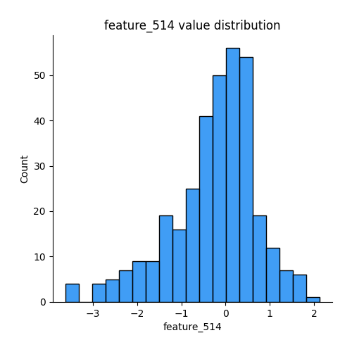
## Feature : feature_515
- **Feature type** : continous
- **Missing** : 0.0%
- **Unique** : 344
- **Count** :344.0
- **Mean** :-0.04757408200263169
- **Std** :1.0085636701323704
- **Min** :-4.499230998881115
- **25%th Percentile** : -0.655453234827395
- **50%th Percentile** : 0.041247715306793706
- **75%th Percentile** : 0.6149607877452128
- **Max** :2.5281672321399746

## Feature : feature_516
- **Feature type** : continous
- **Missing** : 0.0%
- **Unique** : 344
- **Count** :344.0
- **Mean** :0.16541510174760032
- **Std** :1.0413180421048218
- **Min** :-4.867847732557279
- **25%th Percentile** : -0.4230602773244801
- **50%th Percentile** : 0.013001945347391203
- **75%th Percentile** : 0.47870519250993815
- **Max** :3.7125887180227717

## Feature : feature_517
- **Feature type** : continous
- **Missing** : 0.0%
- **Unique** : 344
- **Count** :344.0
- **Mean** :-0.024411042916372066
- **Std** :0.9519217276827127
- **Min** :-3.375537563762707
- **25%th Percentile** : -0.5671324502030998
- **50%th Percentile** : -0.025326778940707527
- **75%th Percentile** : 0.49360497674842674
- **Max** :4.238588615166151

## Feature : feature_518
- **Feature type** : continous
- **Missing** : 0.0%
- **Unique** : 344
- **Count** :344.0
- **Mean** :0.09296641056114403
- **Std** :0.9706113260124863
- **Min** :-2.207509070371186
- **25%th Percentile** : -0.590694668858129
- **50%th Percentile** : 0.016228775737449387
- **75%th Percentile** : 0.737966914568656
- **Max** :3.900238571141076

## Feature : feature_519
- **Feature type** : continous
- **Missing** : 0.0%
- **Unique** : 344
- **Count** :344.0
- **Mean** :0.02521869700160408
- **Std** :1.0124618739723168
- **Min** :-2.2500512729183506
- **25%th Percentile** : -0.6820878088327491
- **50%th Percentile** : 0.018620274331762603
- **75%th Percentile** : 0.6295528689464048
- **Max** :3.209954478860678

## Feature : feature_520
- **Feature type** : continous
- **Missing** : 0.0%
- **Unique** : 344
- **Count** :344.0
- **Mean** :0.10521580686986072
- **Std** :0.9939467987499165
- **Min** :-2.4621903729989367
- **25%th Percentile** : -0.5148605353206267
- **50%th Percentile** : -0.01649350977478868
- **75%th Percentile** : 0.5637724066218912
- **Max** :4.041981079037162

## Feature : feature_521
- **Feature type** : continous
- **Missing** : 0.0%
- **Unique** : 344
- **Count** :344.0
- **Mean** :-0.5311283440068744
- **Std** :1.0122257273528588
- **Min** :-2.017737230829646
- **25%th Percentile** : -1.973318094381717
- **50%th Percentile** : -0.020633977992375985
- **75%th Percentile** : 0.27155495344925823
- **Max** :0.7086038940995755

[<< Go back](../README.md)
