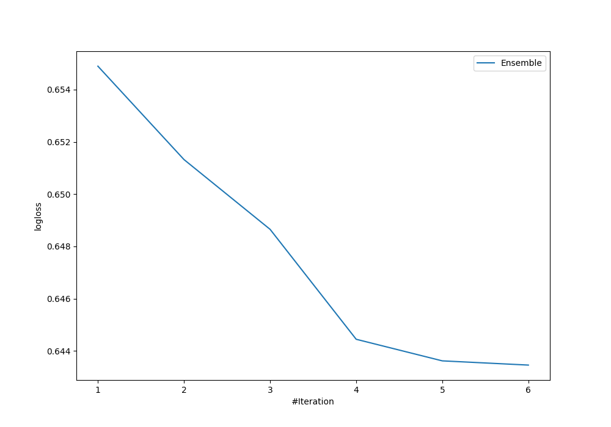
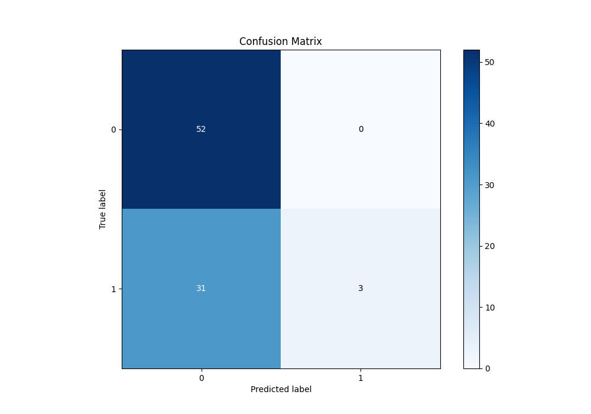
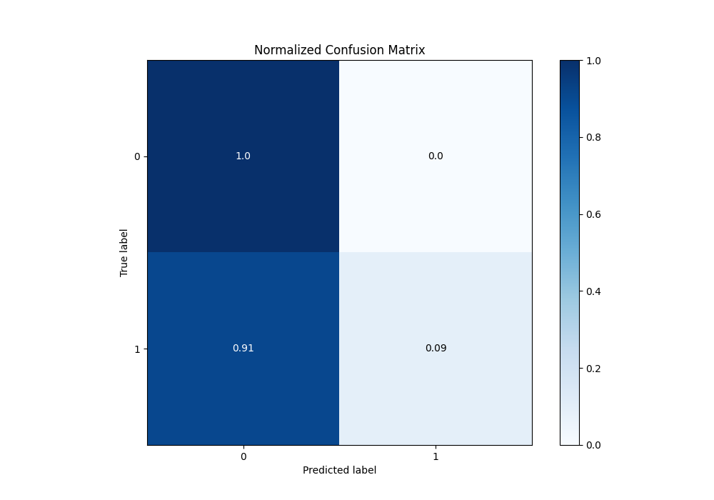
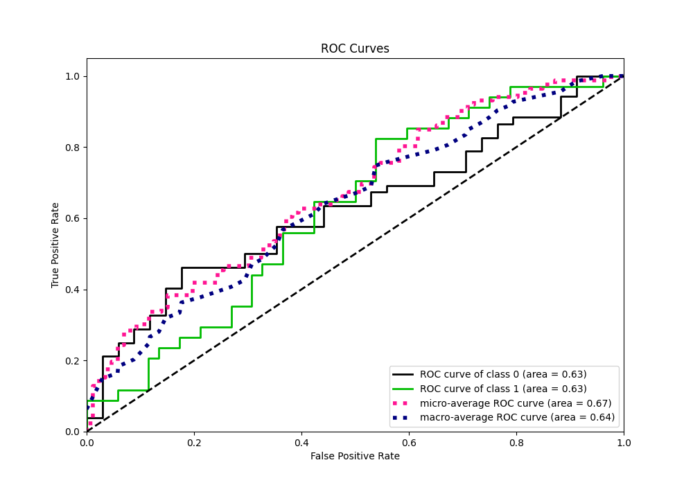
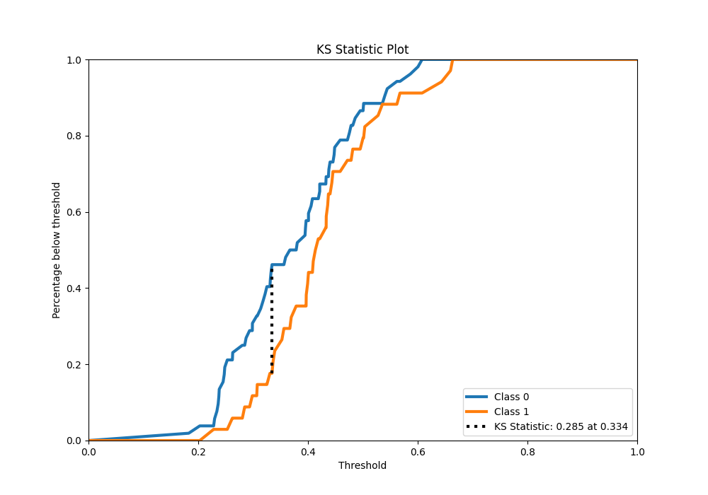
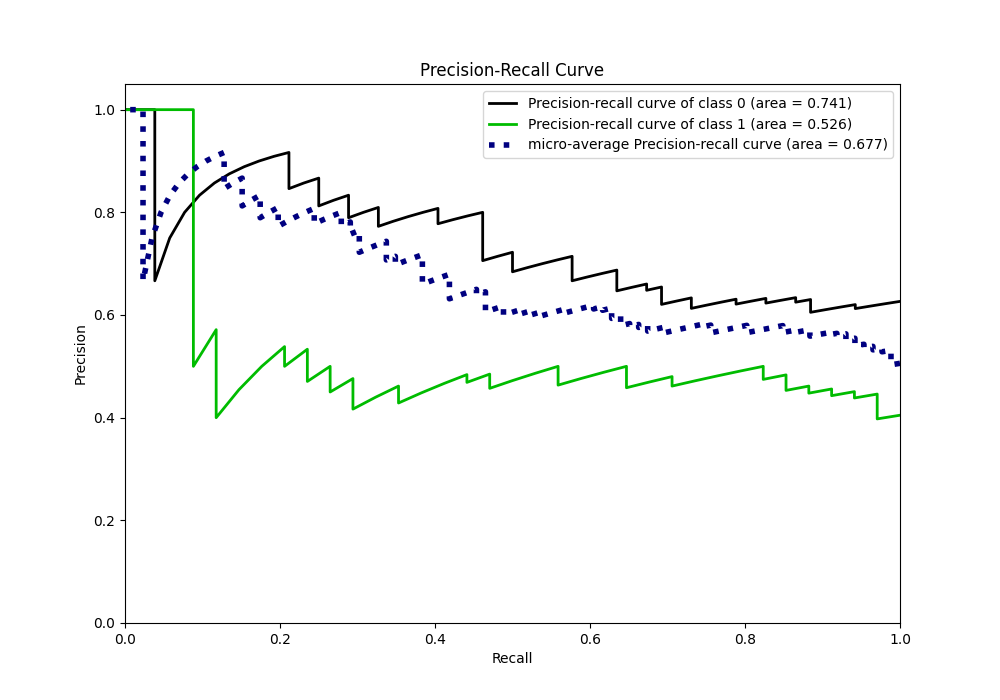
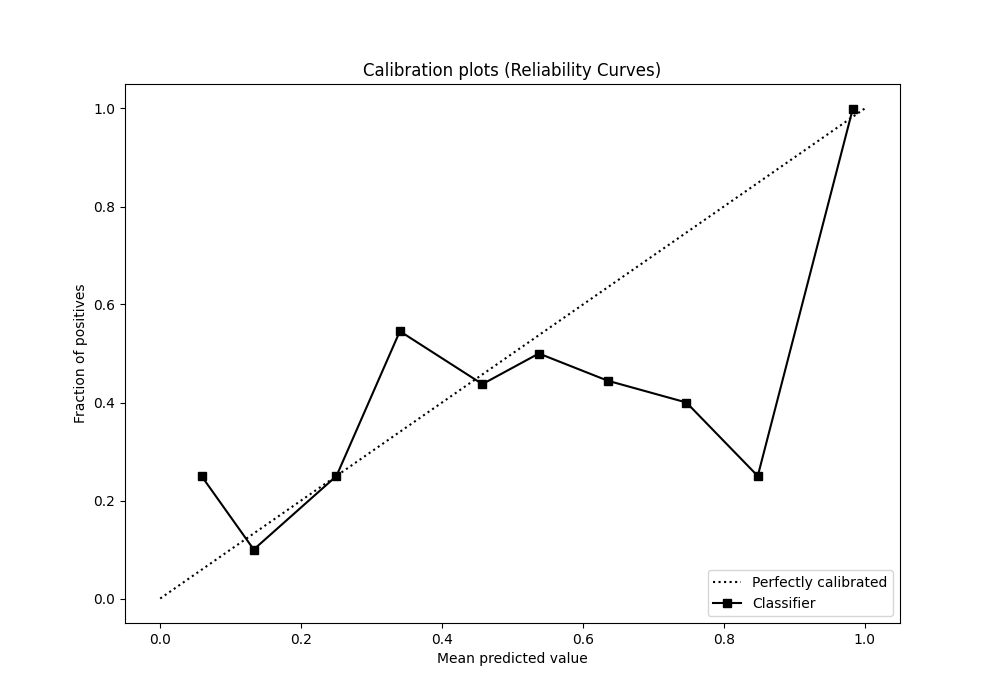
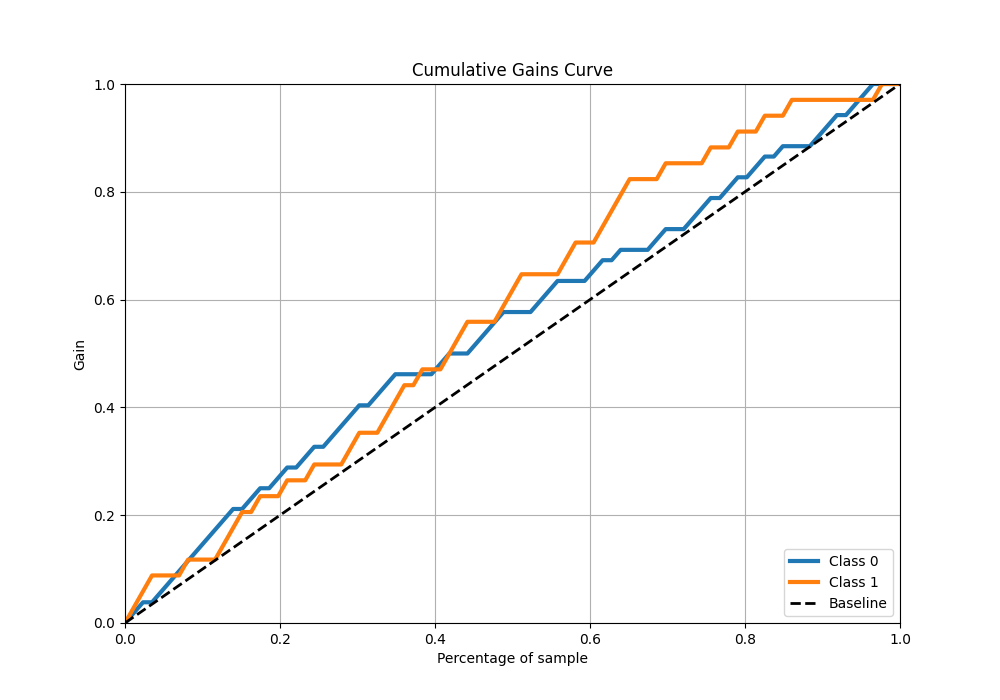
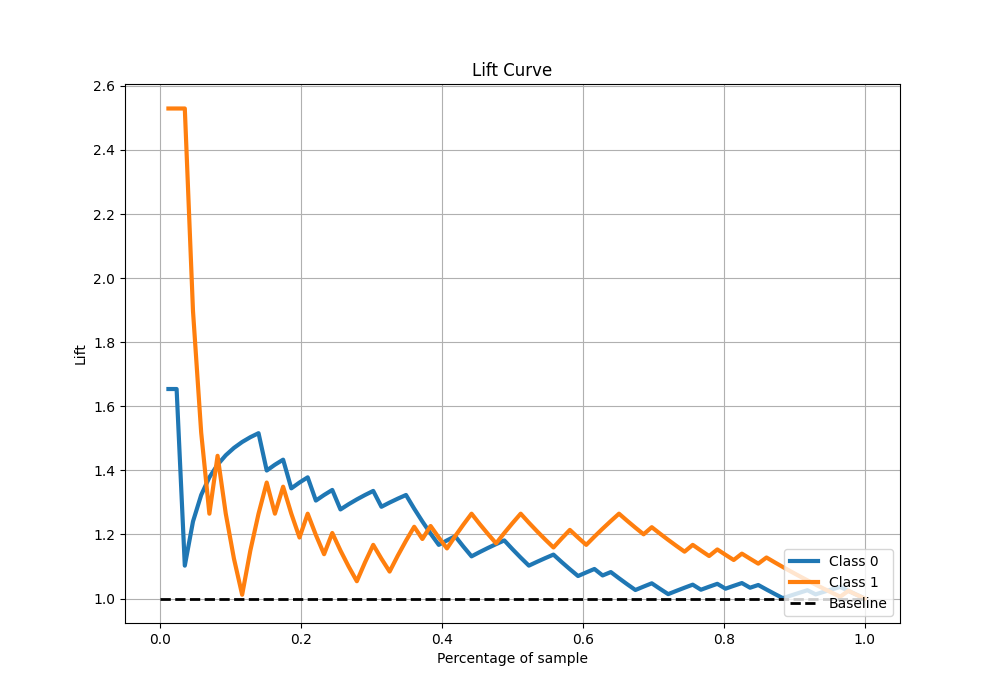

# Summary of Ensemble

[<< Go back](../README.md)

## Ensemble structure
| Model                   |   Weight |
|:------------------------|---------:|
| 1_Baseline              |        2 |
| 5_Default_NeuralNetwork |        1 |
| 6_Default_RandomForest  |        3 |

## Metric details
|           |    score |   threshold |
|:----------|---------:|------------:|
| logloss   | 0.643458 |  nan        |
| auc       | 0.626131 |  nan        |
| f1        | 0.610526 |    0.323582 |
| accuracy  | 0.639535 |    0.610889 |
| precision | 1        |    0.610889 |
| recall    | 1        |    0.164395 |
| mcc       | 0.260337 |    0.33785  |

## Confusion matrix (at threshold=0.610889)
|              |   Predicted as 0 |   Predicted as 1 |
|:-------------|-----------------:|-----------------:|
| Labeled as 0 |               52 |                0 |
| Labeled as 1 |               31 |                3 |

## Learning curves

## Confusion Matrix

## Normalized Confusion Matrix

## ROC Curve

## Kolmogorov-Smirnov Statistic

## Precision-Recall Curve

## Calibration Curve

## Cumulative Gains Curve

## Lift Curve

[<< Go back](../README.md)
