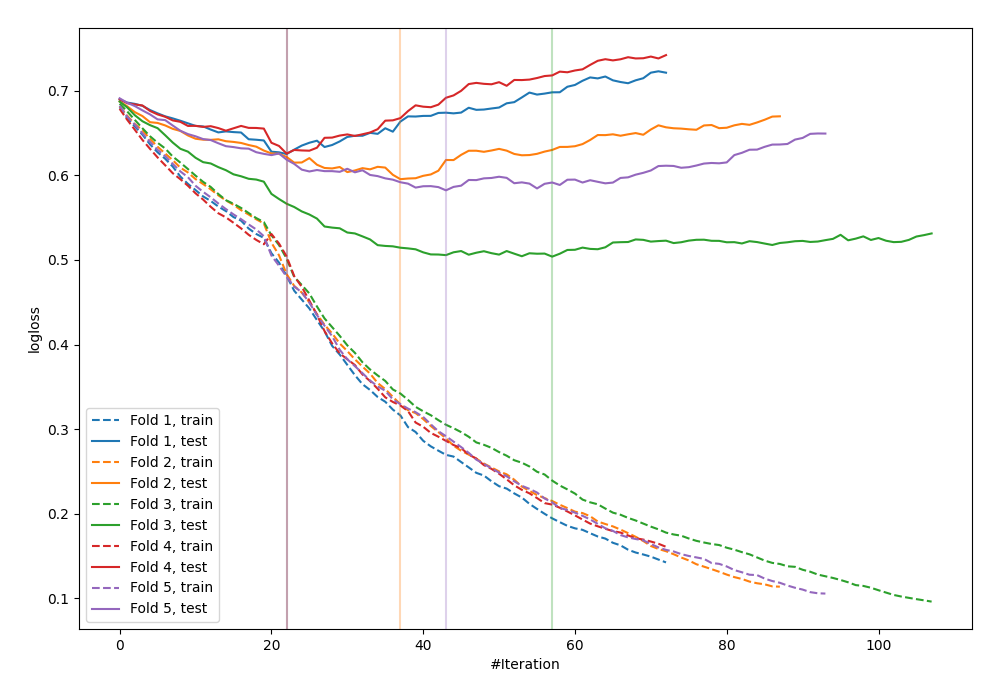
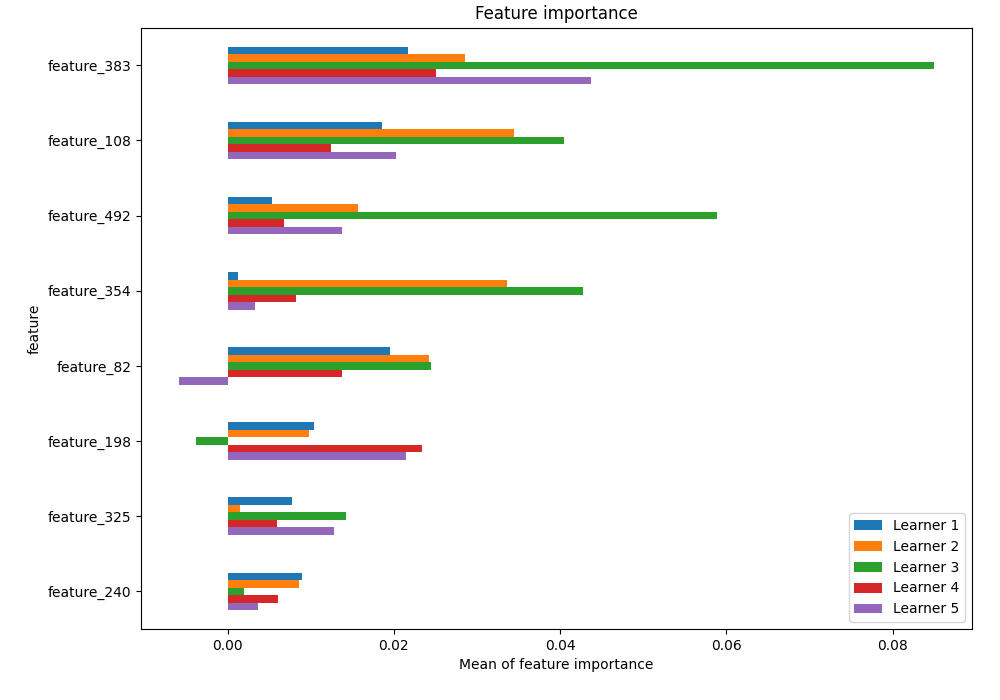
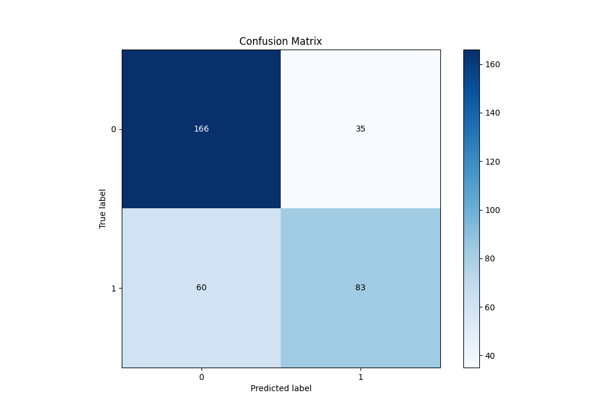
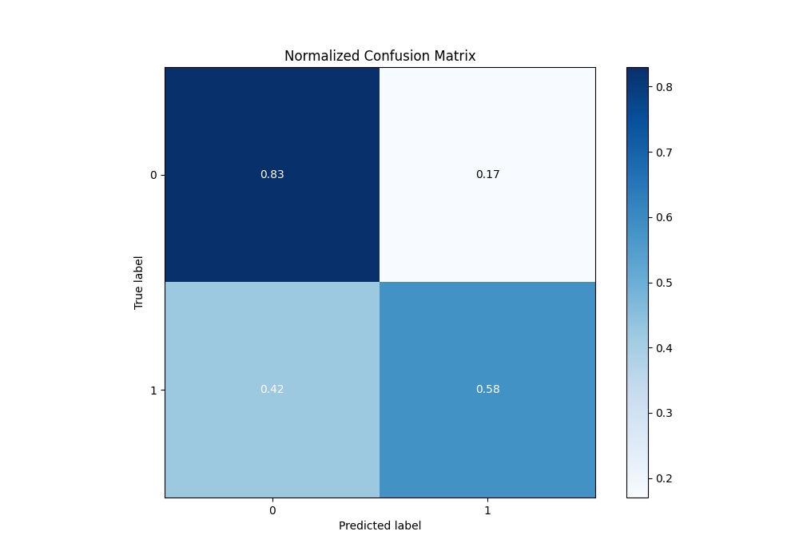
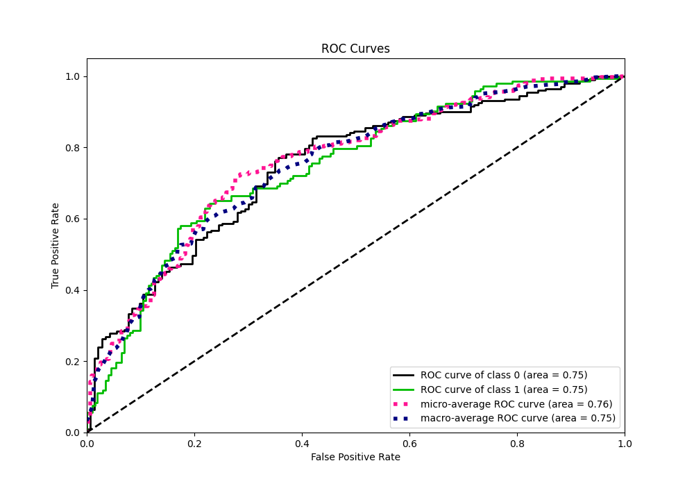
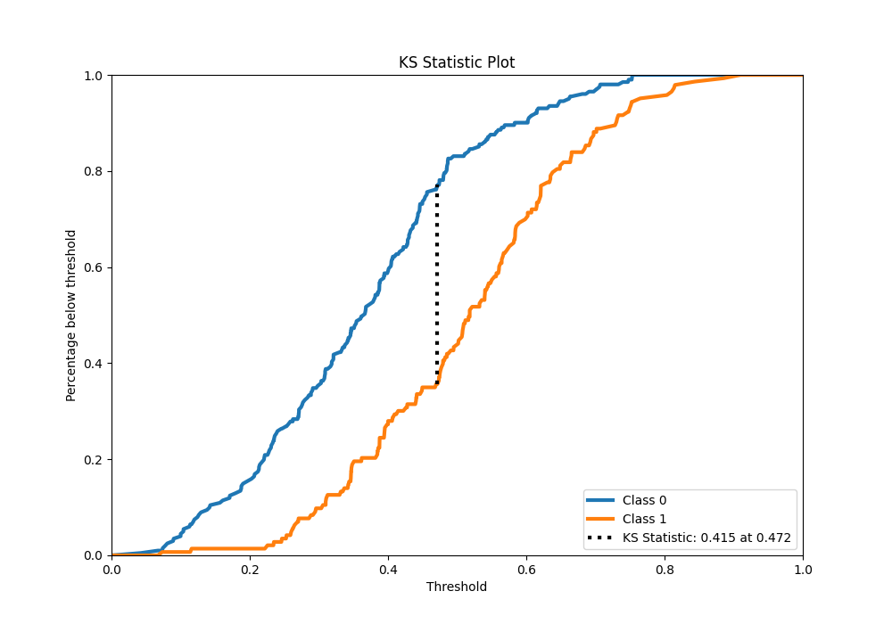
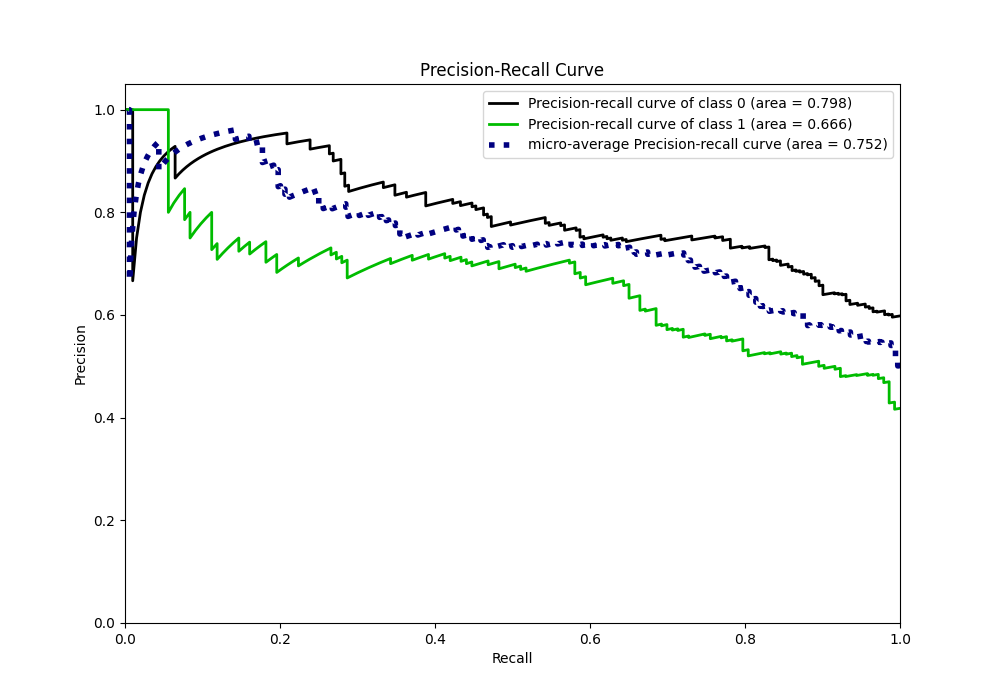
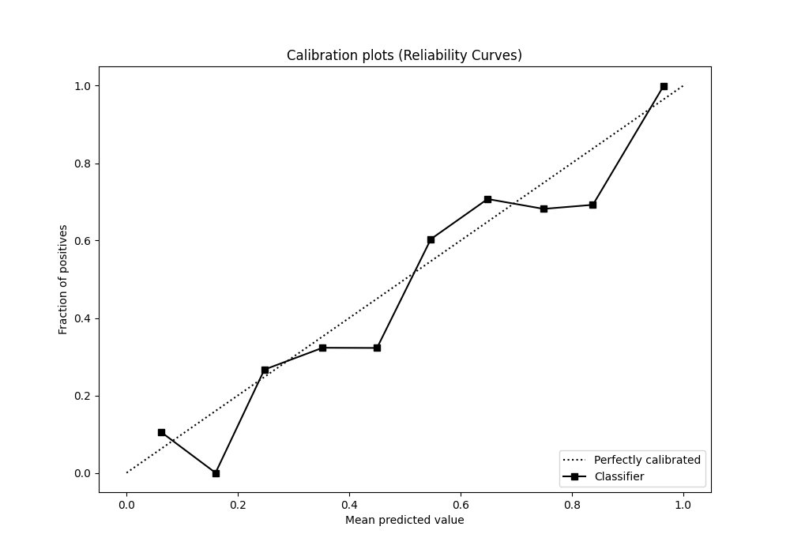
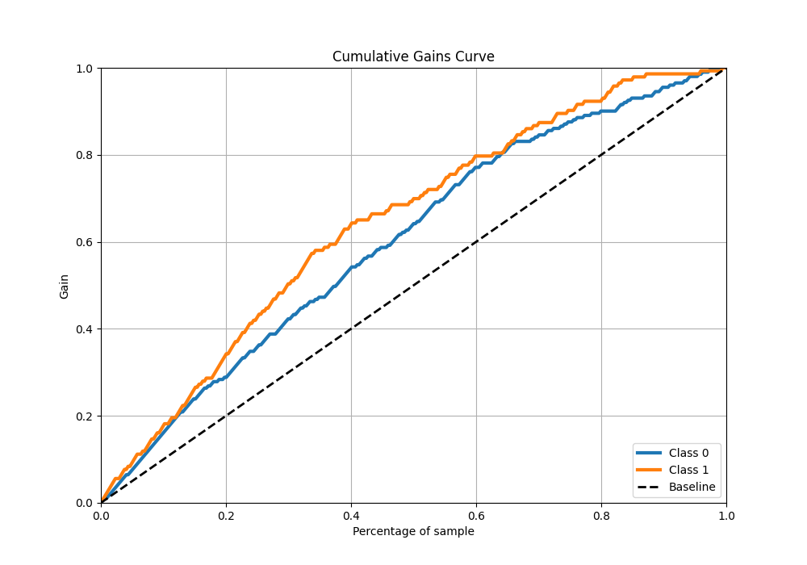
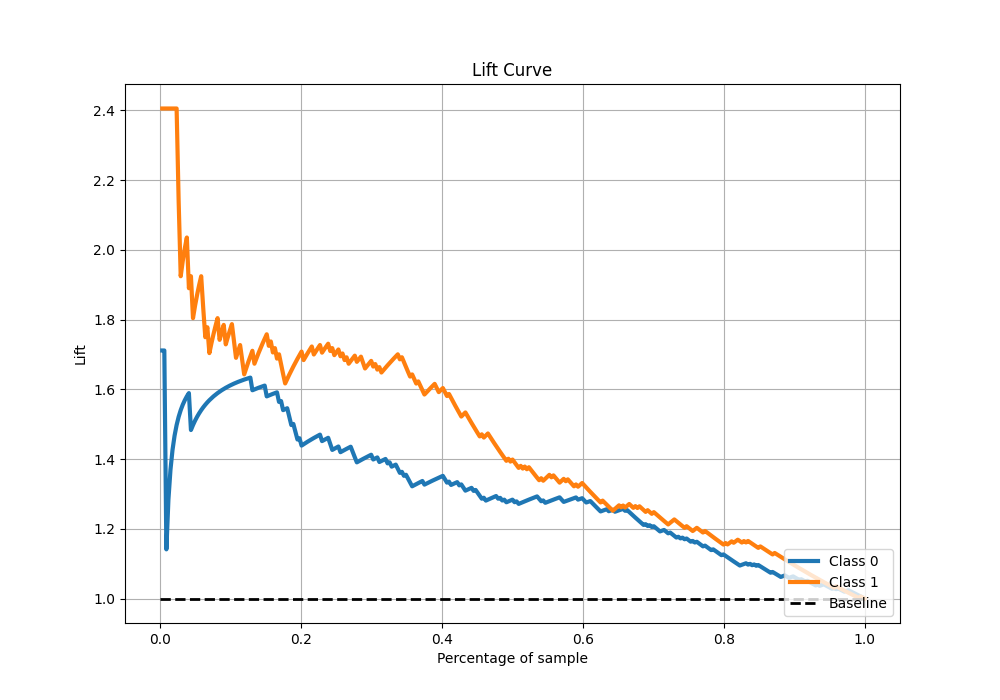

# Summary of 17_CatBoost_SelectedFeatures

[<< Go back](../README.md)

## CatBoost
- **n_jobs**: -1
- **learning_rate**: 0.1
- **depth**: 7
- **rsm**: 1.0
- **loss_function**: Logloss
- **eval_metric**: Logloss
- **explain_level**: 1

## Validation
 - **validation_type**: kfold
 - **k_folds**: 5
 - **shuffle**: True
 - **stratify**: True

## Optimized metric
logloss

## Training time

2.8 seconds

## Metric details
|           |    score |   threshold |
|:----------|---------:|------------:|
| logloss   | 0.586664 | nan         |
| auc       | 0.746791 | nan         |
| f1        | 0.653295 |   0.382873  |
| accuracy  | 0.723837 |   0.489132  |
| precision | 0.8      |   0.709318  |
| recall    | 1        |   0.0384375 |
| mcc       | 0.421801 |   0.489132  |

## Confusion matrix (at threshold=0.489132)
|              |   Predicted as 0 |   Predicted as 1 |
|:-------------|-----------------:|-----------------:|
| Labeled as 0 |              166 |               35 |
| Labeled as 1 |               60 |               83 |

## Learning curves

## Permutation-based Importance

## Confusion Matrix

## Normalized Confusion Matrix

## ROC Curve

## Kolmogorov-Smirnov Statistic

## Precision-Recall Curve

## Calibration Curve

## Cumulative Gains Curve

## Lift Curve

[<< Go back](../README.md)
