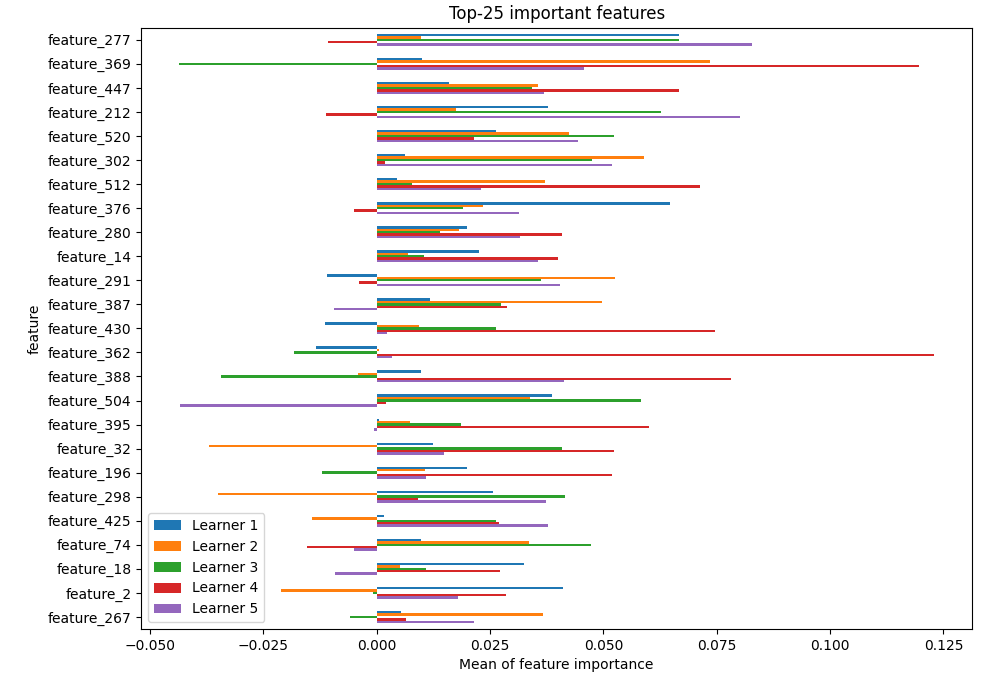

# Summary of 1_Linear

[<< Go back](../README.md)

## Logistic Regression (Linear)
- **n_jobs**: -1
- **explain_level**: 1

## Validation
 - **validation_type**: kfold
 - **k_folds**: 5
 - **shuffle**: True
 - **stratify**: True

## Optimized metric
logloss

## Training time

46.4 seconds

## Metric details
|           |    score |     threshold |
|:----------|---------:|--------------:|
| logloss   | 1.66983  | nan           |
| auc       | 0.608009 | nan           |
| f1        | 0.601336 |   0.0010097   |
| accuracy  | 0.616279 |   0.990348    |
| precision | 1        |   0.999988    |
| recall    | 1        |   5.53986e-06 |
| mcc       | 0.182939 |   0.999988    |

## Confusion matrix (at threshold=0.990348)
|              |   Predicted as 0 |   Predicted as 1 |
|:-------------|-----------------:|-----------------:|
| Labeled as 0 |              177 |               24 |
| Labeled as 1 |              108 |               35 |

## Learning curves

## Permutation-based Importance

## Confusion Matrix

## Normalized Confusion Matrix

## ROC Curve

## Kolmogorov-Smirnov Statistic

## Precision-Recall Curve

## Calibration Curve

## Cumulative Gains Curve

## Lift Curve

[<< Go back](../README.md)
