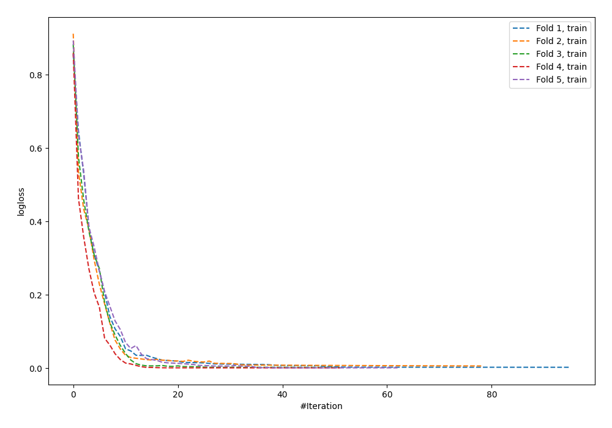
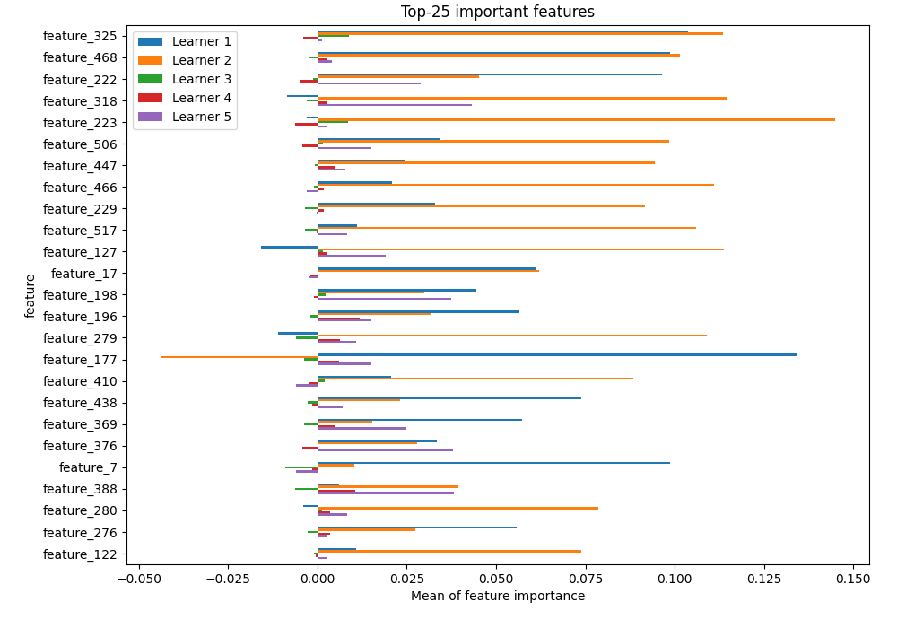
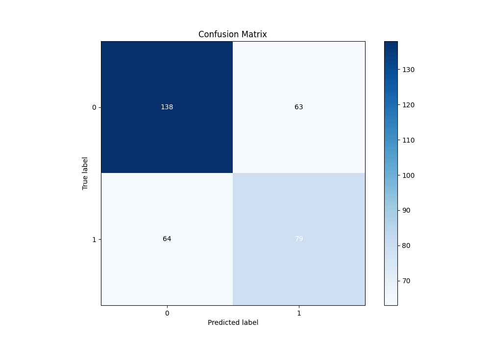
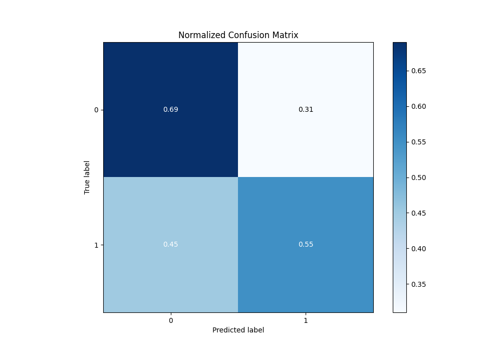
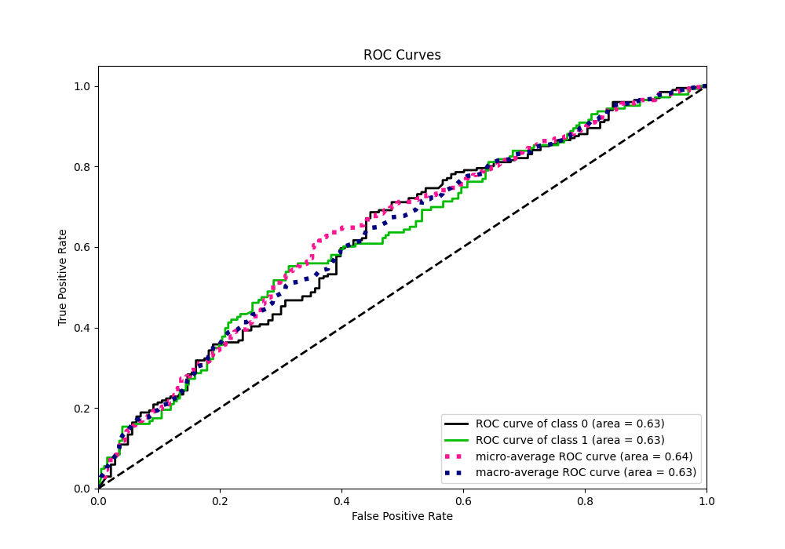
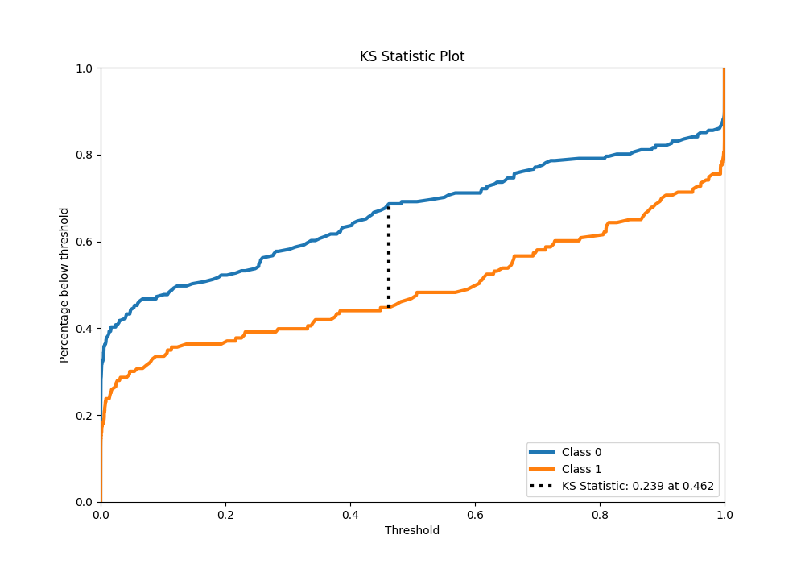
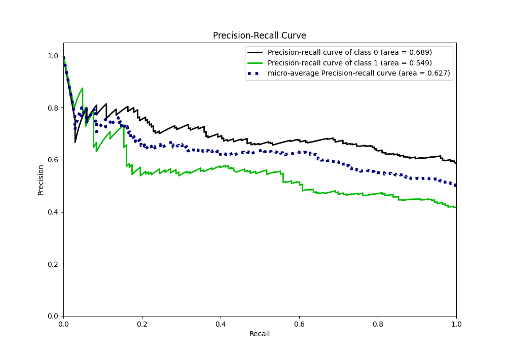
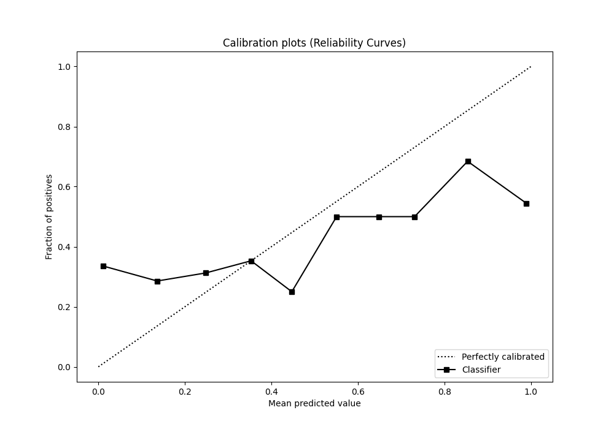
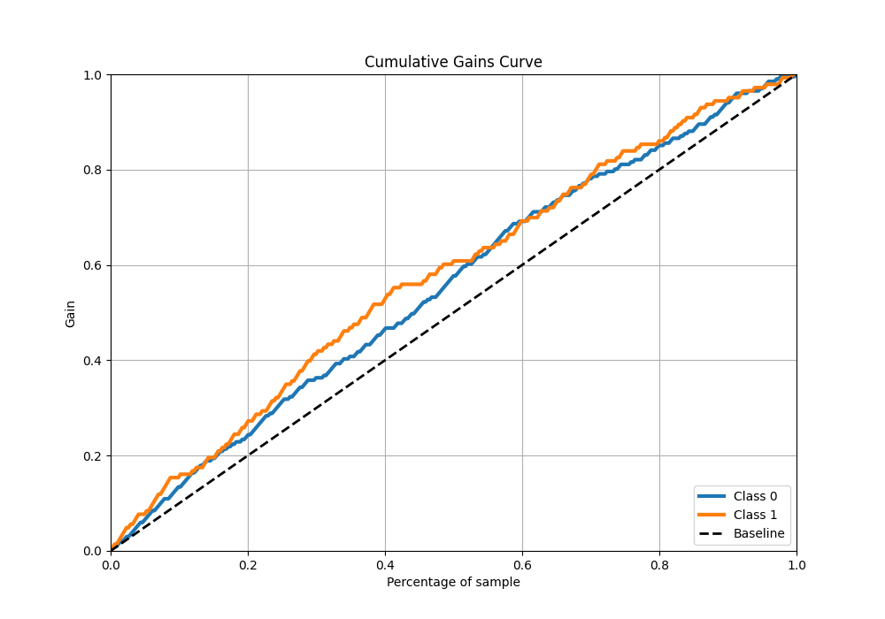
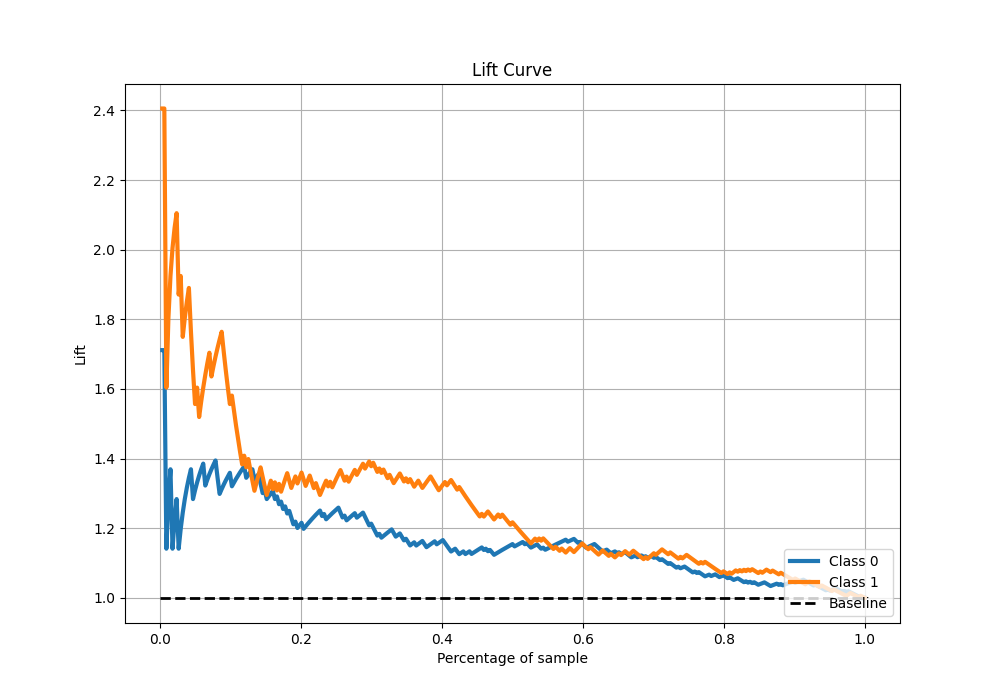

# Summary of 23_NeuralNetwork

[<< Go back](../README.md)

## Neural Network
- **n_jobs**: -1
- **dense_1_size**: 32
- **dense_2_size**: 4
- **learning_rate**: 0.05
- **explain_level**: 1

## Validation
 - **validation_type**: kfold
 - **k_folds**: 5
 - **shuffle**: True
 - **stratify**: True

## Optimized metric
logloss

## Training time

8.4 seconds

## Metric details
|           |    score |     threshold |
|:----------|---------:|--------------:|
| logloss   | 2.28946  | nan           |
| auc       | 0.628223 | nan           |
| f1        | 0.604966 |   5.14916e-06 |
| accuracy  | 0.630814 |   0.47208     |
| precision | 0.572816 |   0.714747    |
| recall    | 1        |   1.0493e-29  |
| mcc       | 0.23926  |   0.47208     |

## Confusion matrix (at threshold=0.47208)
|              |   Predicted as 0 |   Predicted as 1 |
|:-------------|-----------------:|-----------------:|
| Labeled as 0 |              138 |               63 |
| Labeled as 1 |               64 |               79 |

## Learning curves

## Permutation-based Importance

## Confusion Matrix

## Normalized Confusion Matrix

## ROC Curve

## Kolmogorov-Smirnov Statistic

## Precision-Recall Curve

## Calibration Curve

## Cumulative Gains Curve

## Lift Curve

[<< Go back](../README.md)
