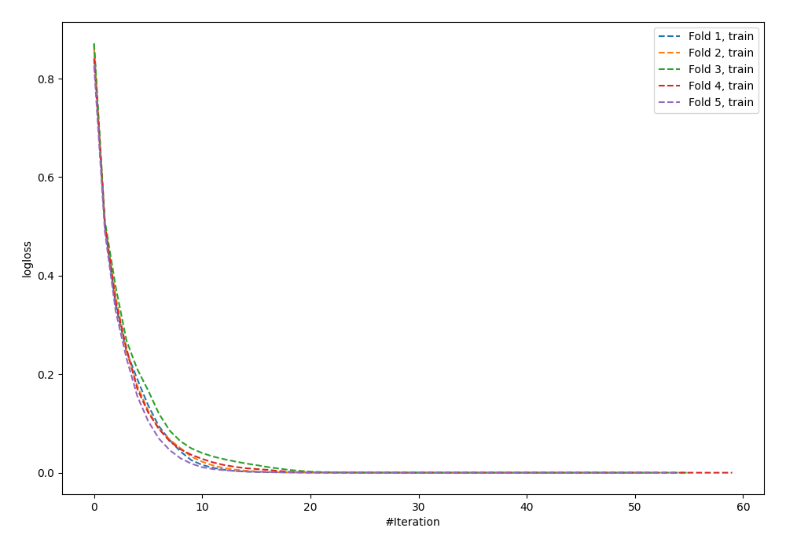
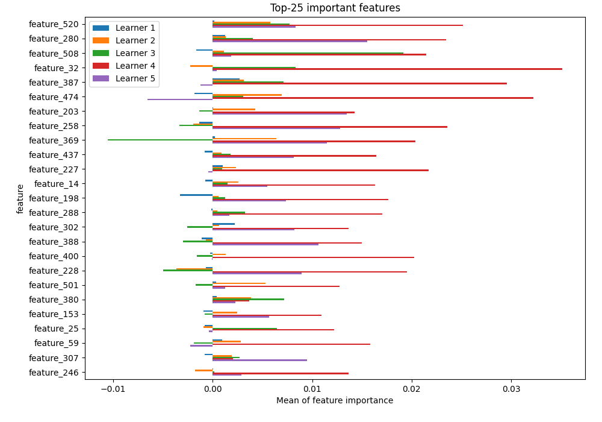
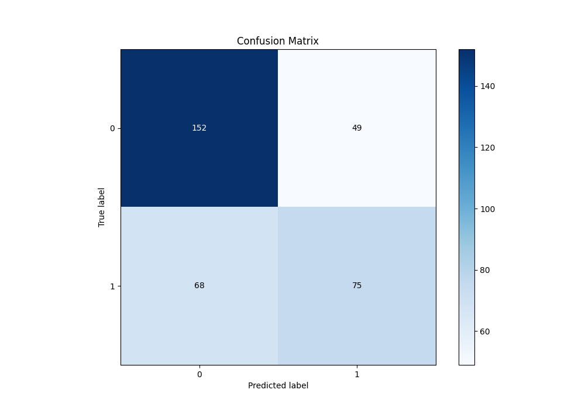
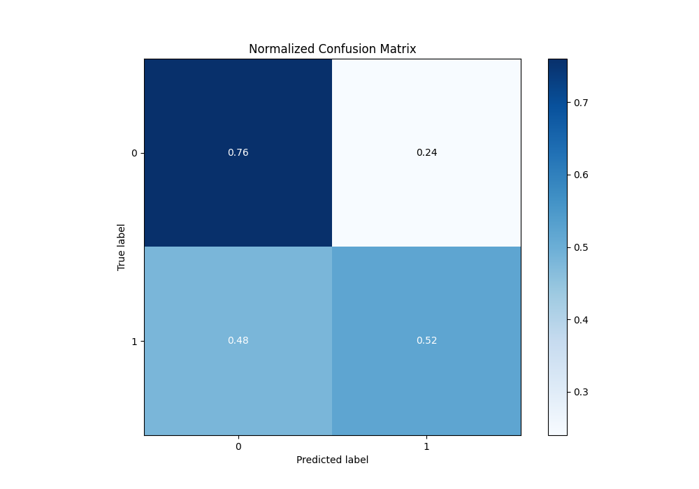
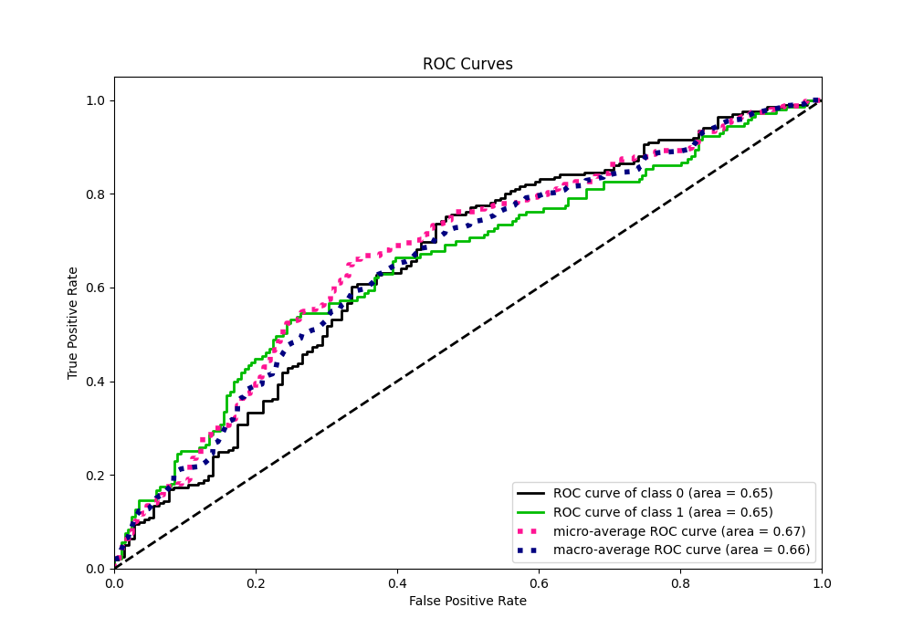
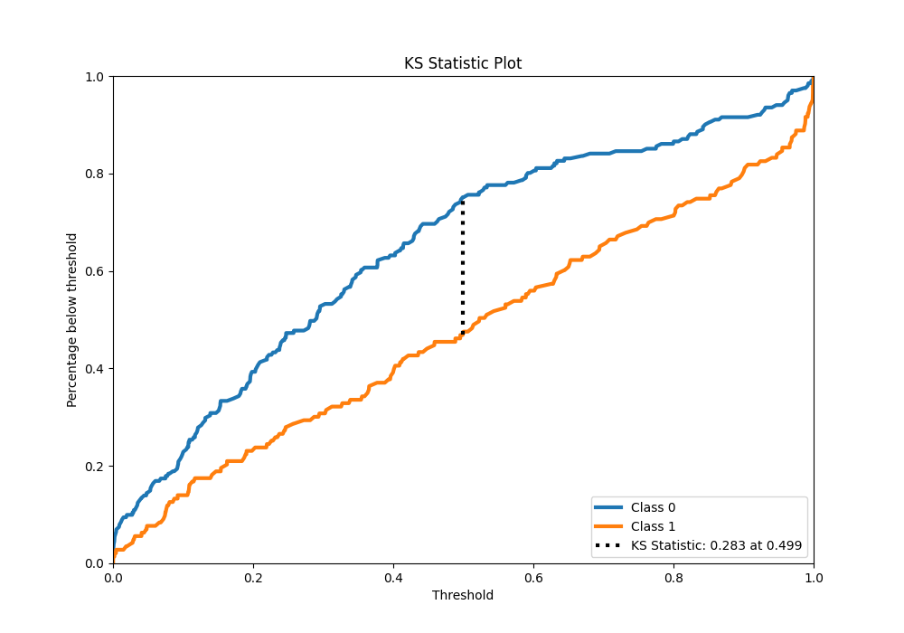
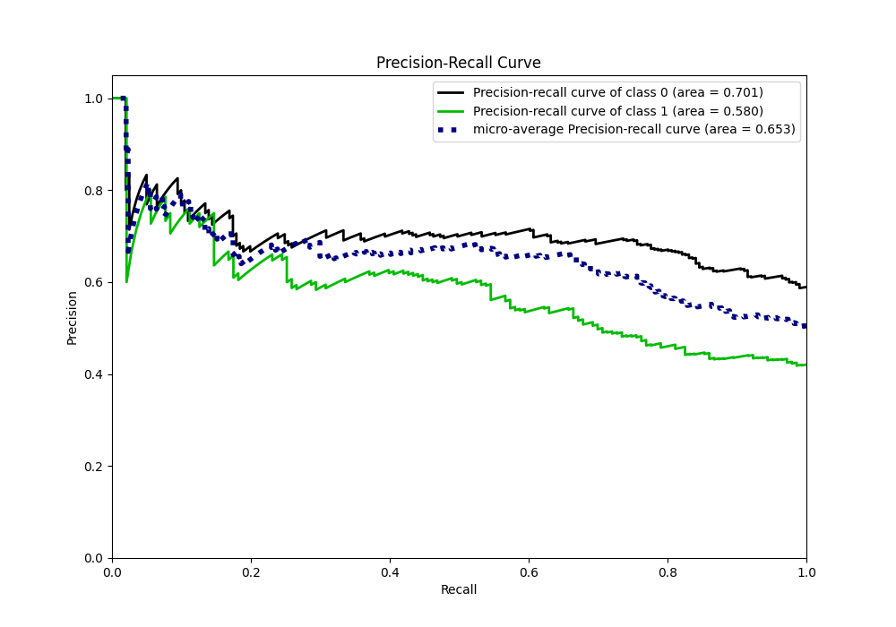
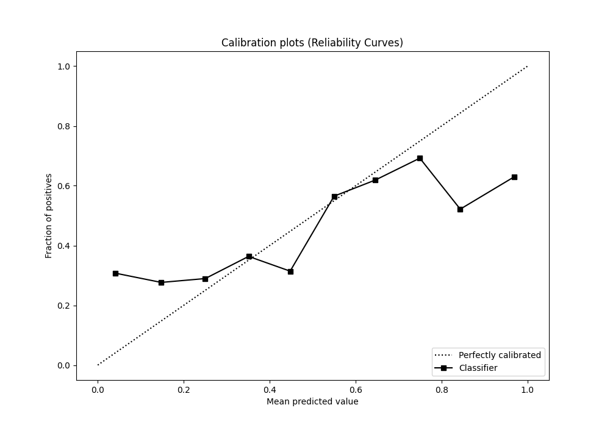
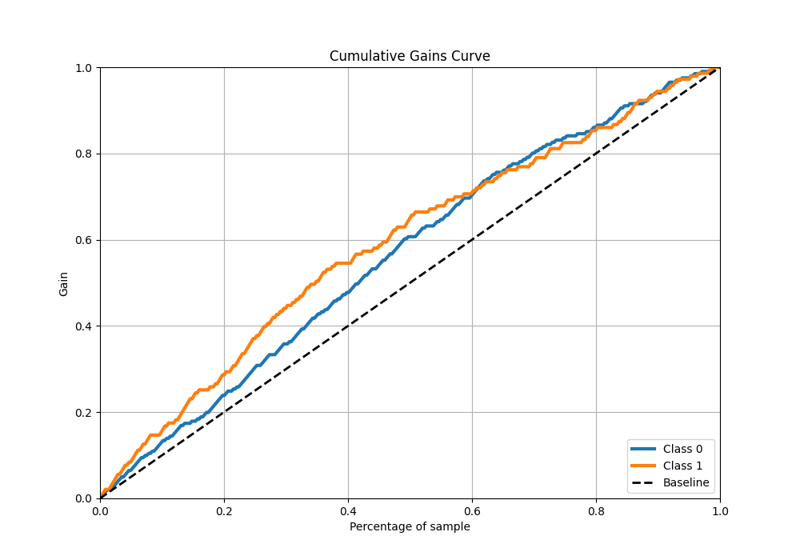
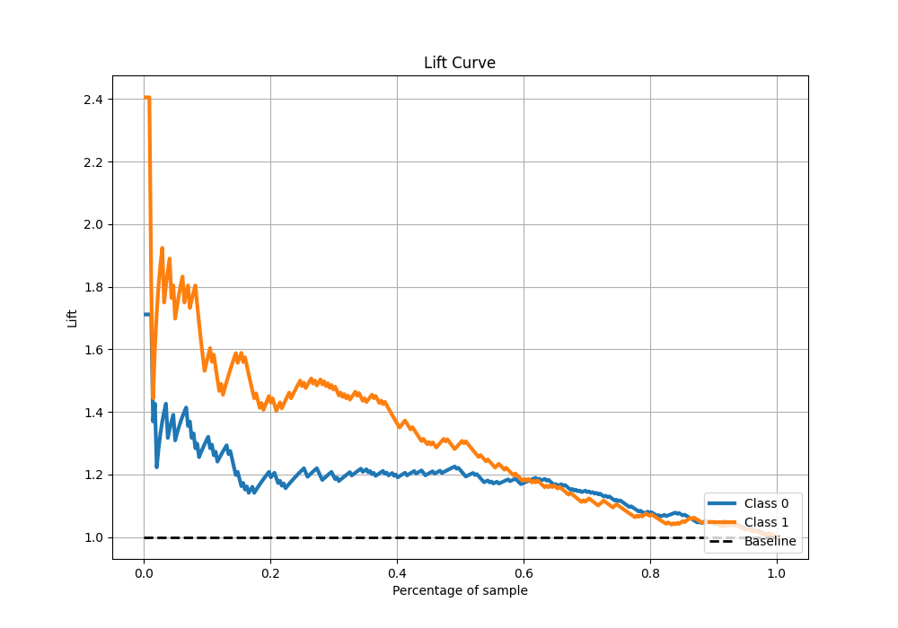

# Summary of 24_NeuralNetwork

[<< Go back](../README.md)

## Neural Network
- **n_jobs**: -1
- **dense_1_size**: 64
- **dense_2_size**: 16
- **learning_rate**: 0.01
- **explain_level**: 1

## Validation
 - **validation_type**: kfold
 - **k_folds**: 5
 - **shuffle**: True
 - **stratify**: True

## Optimized metric
logloss

## Training time

9.1 seconds

## Metric details
|           |    score |     threshold |
|:----------|---------:|--------------:|
| logloss   | 0.893568 | nan           |
| auc       | 0.652507 | nan           |
| f1        | 0.597403 |   0.0241688   |
| accuracy  | 0.659884 |   0.510971    |
| precision | 0.66     |   0.869753    |
| recall    | 1        |   2.34671e-05 |
| mcc       | 0.288123 |   0.510971    |

## Confusion matrix (at threshold=0.510971)
|              |   Predicted as 0 |   Predicted as 1 |
|:-------------|-----------------:|-----------------:|
| Labeled as 0 |              152 |               49 |
| Labeled as 1 |               68 |               75 |

## Learning curves

## Permutation-based Importance

## Confusion Matrix

## Normalized Confusion Matrix

## ROC Curve

## Kolmogorov-Smirnov Statistic

## Precision-Recall Curve

## Calibration Curve

## Cumulative Gains Curve

## Lift Curve

[<< Go back](../README.md)
