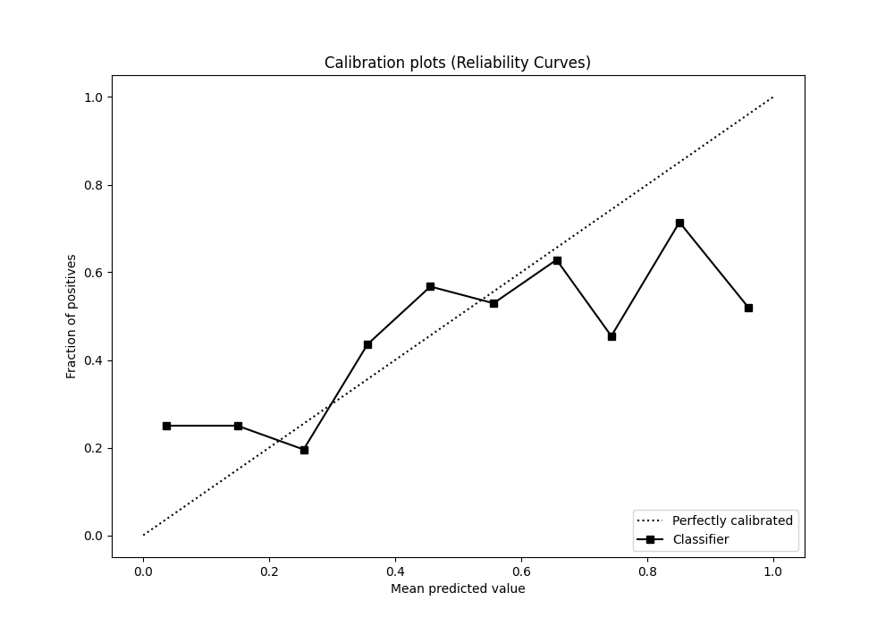

# Summary of 24_NeuralNetwork_SelectedFeatures

[<< Go back](../README.md)

## Neural Network
- **n_jobs**: -1
- **dense_1_size**: 64
- **dense_2_size**: 16
- **learning_rate**: 0.01
- **explain_level**: 1

## Validation
 - **validation_type**: kfold
 - **k_folds**: 5
 - **shuffle**: True
 - **stratify**: True

## Optimized metric
logloss

## Training time

3.2 seconds

## Metric details
|           |    score |     threshold |
|:----------|---------:|--------------:|
| logloss   | 0.799705 | nan           |
| auc       | 0.66197  | nan           |
| f1        | 0.640449 |   0.294378    |
| accuracy  | 0.651163 |   0.447762    |
| precision | 0.6      |   0.998235    |
| recall    | 1        |   1.17194e-05 |
| mcc       | 0.309217 |   0.294378    |

## Confusion matrix (at threshold=0.447762)
|              |   Predicted as 0 |   Predicted as 1 |
|:-------------|-----------------:|-----------------:|
| Labeled as 0 |              135 |               66 |
| Labeled as 1 |               54 |               89 |

## Learning curves

## Permutation-based Importance

## Confusion Matrix

## Normalized Confusion Matrix

## ROC Curve

## Kolmogorov-Smirnov Statistic

## Precision-Recall Curve

## Calibration Curve

## Cumulative Gains Curve

## Lift Curve

[<< Go back](../README.md)
