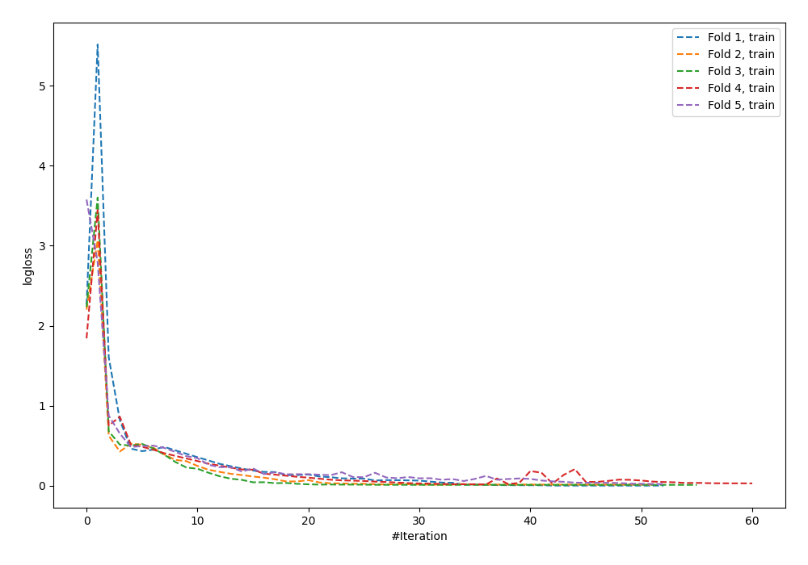
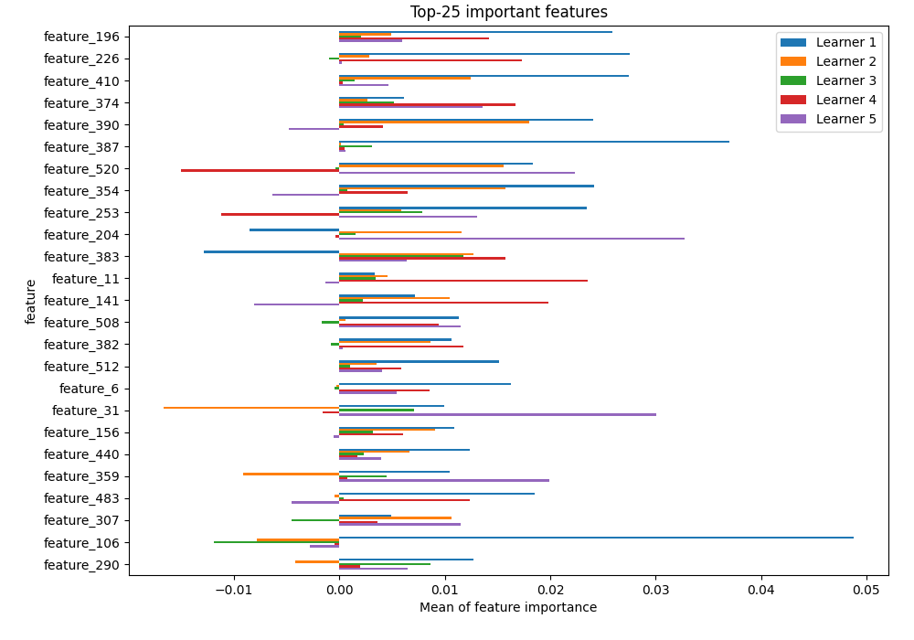
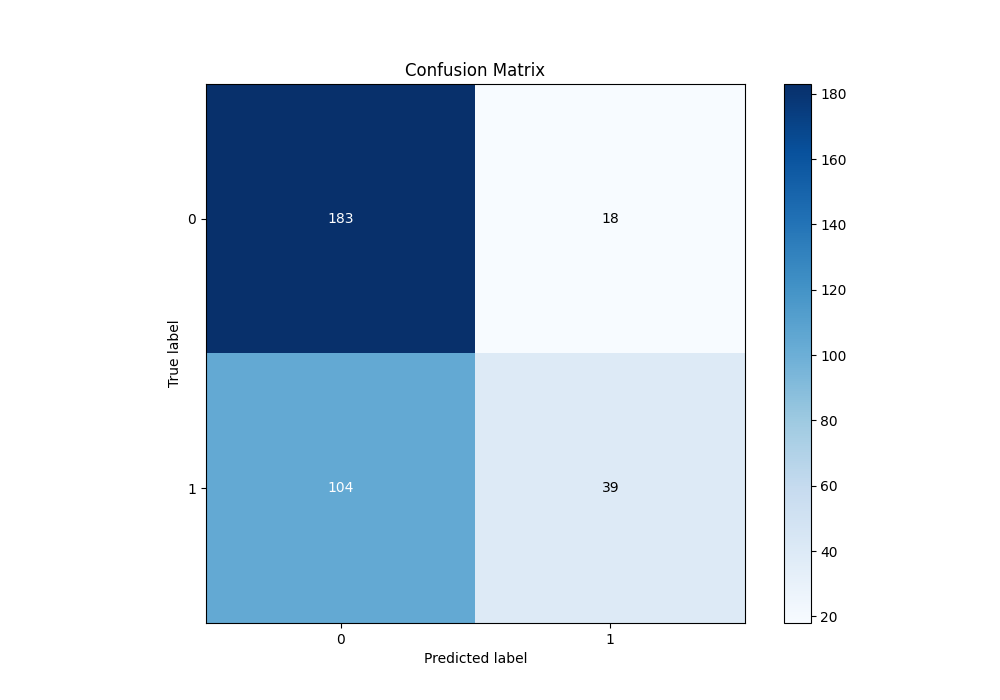
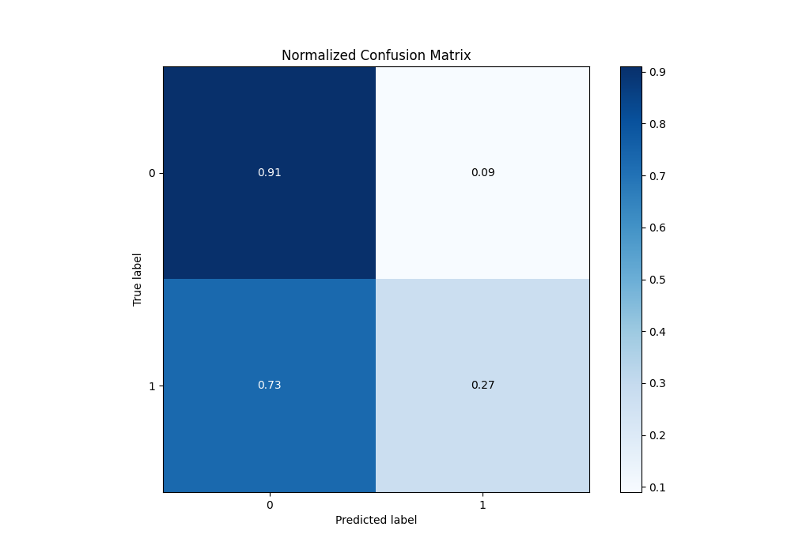
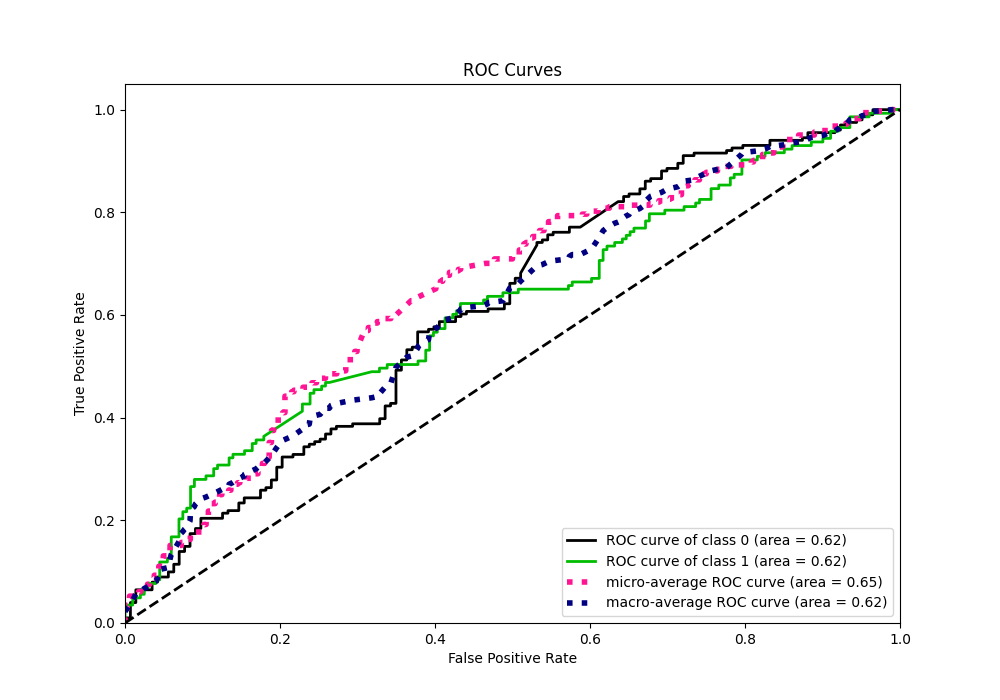
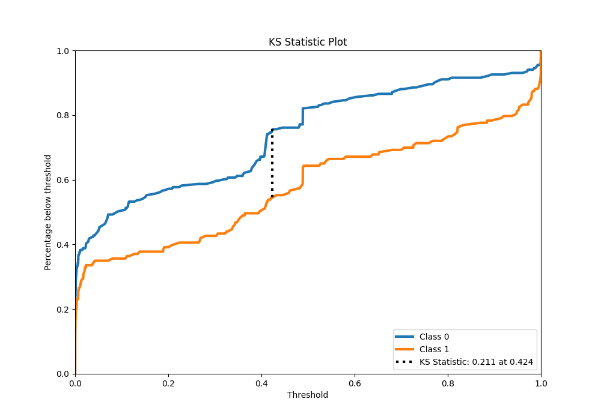
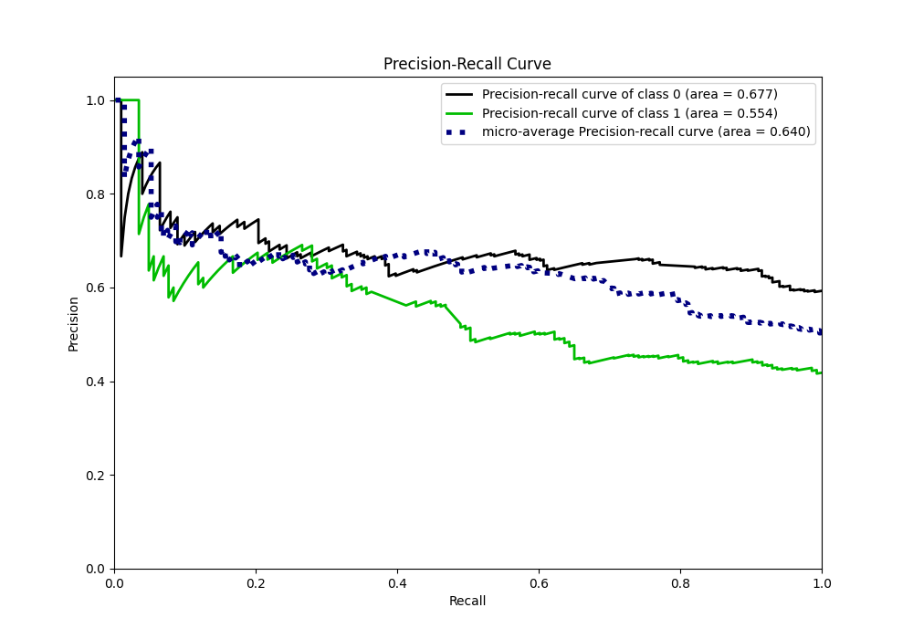
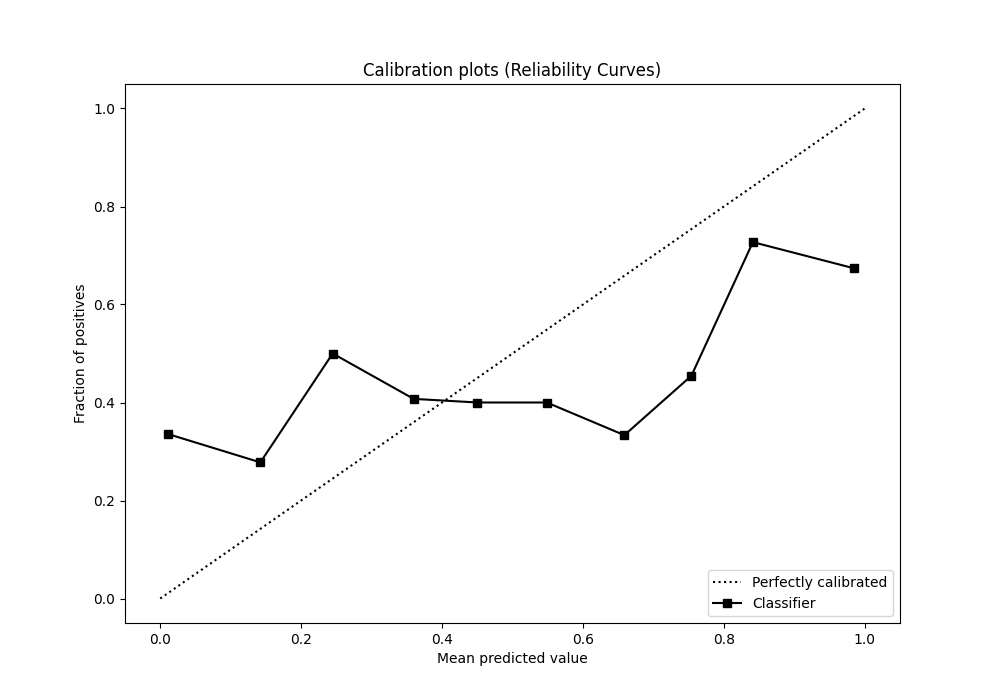
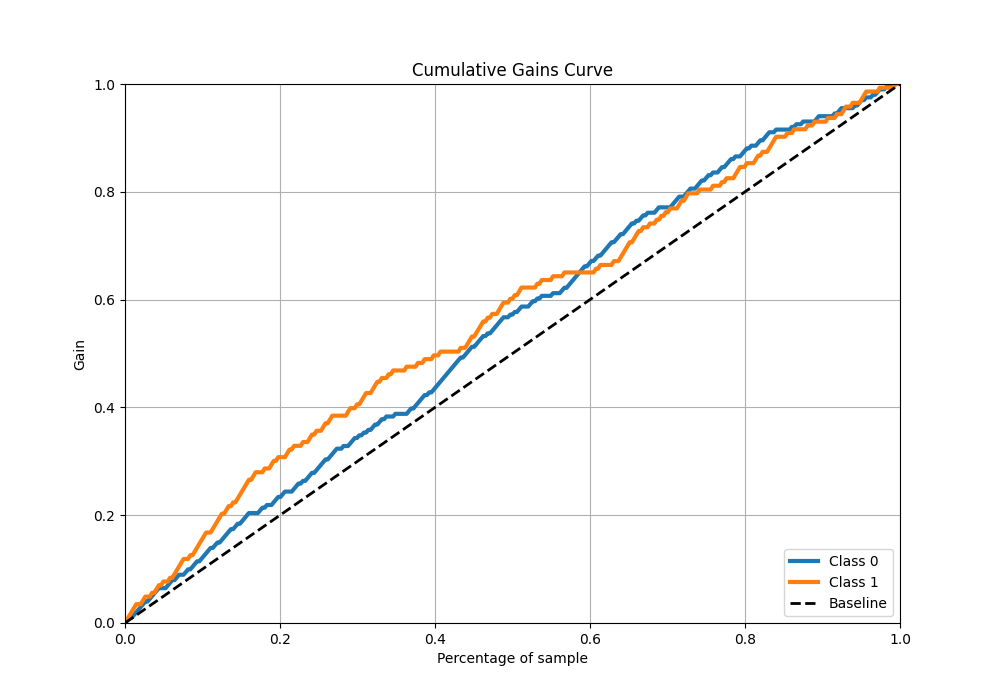
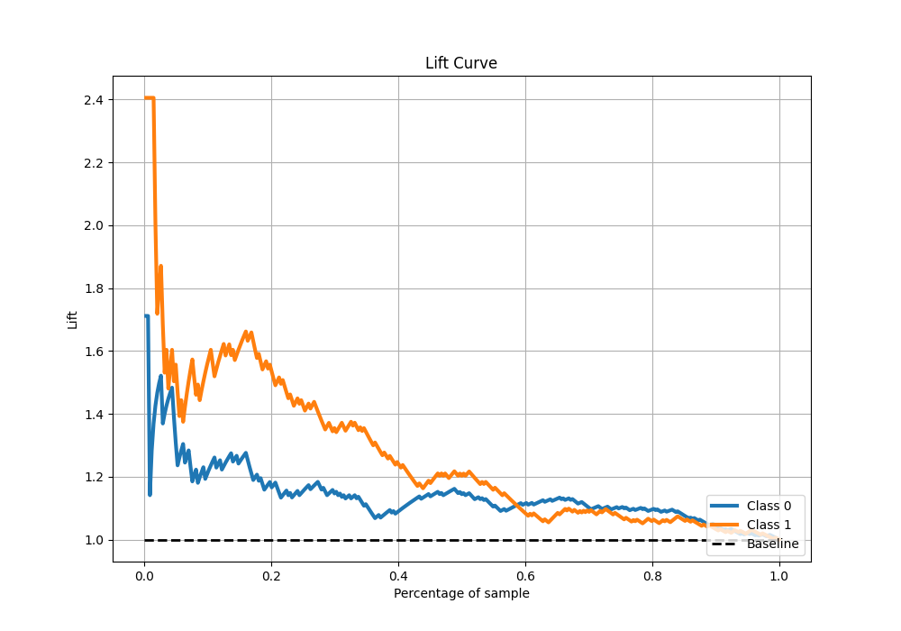

# Summary of 25_NeuralNetwork

[<< Go back](../README.md)

## Neural Network
- **n_jobs**: -1
- **dense_1_size**: 64
- **dense_2_size**: 32
- **learning_rate**: 0.08
- **explain_level**: 1

## Validation
 - **validation_type**: kfold
 - **k_folds**: 5
 - **shuffle**: True
 - **stratify**: True

## Optimized metric
logloss

## Training time

9.5 seconds

## Metric details
|           |    score |     threshold |
|:----------|---------:|--------------:|
| logloss   | 1.80514  | nan           |
| auc       | 0.617107 | nan           |
| f1        | 0.593607 |   7.37429e-05 |
| accuracy  | 0.645349 |   0.797318    |
| precision | 0.684211 |   0.797318    |
| recall    | 1        |   2.39178e-14 |
| mcc       | 0.242803 |   0.797318    |

## Confusion matrix (at threshold=0.797318)
|              |   Predicted as 0 |   Predicted as 1 |
|:-------------|-----------------:|-----------------:|
| Labeled as 0 |              183 |               18 |
| Labeled as 1 |              104 |               39 |

## Learning curves

## Permutation-based Importance

## Confusion Matrix

## Normalized Confusion Matrix

## ROC Curve

## Kolmogorov-Smirnov Statistic

## Precision-Recall Curve

## Calibration Curve

## Cumulative Gains Curve

## Lift Curve

[<< Go back](../README.md)
