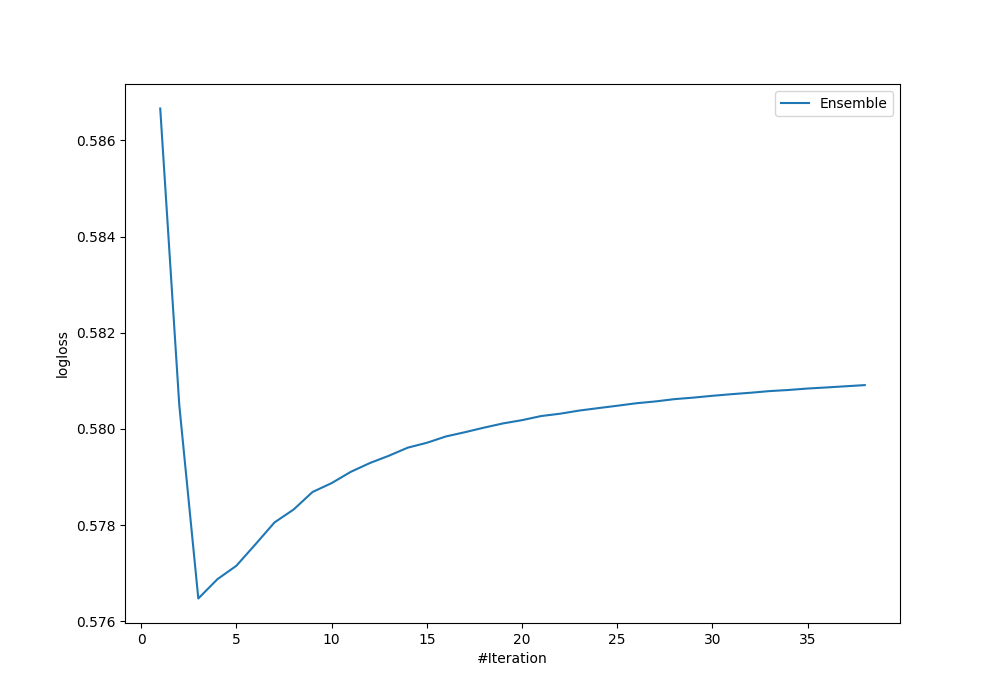
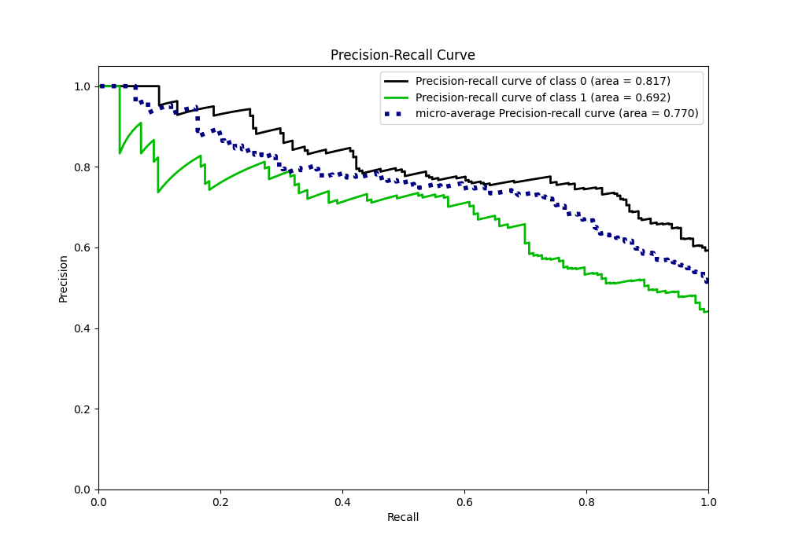

# Summary of Ensemble

[<< Go back](../README.md)

## Ensemble structure
| Model                            |   Weight |
|:---------------------------------|---------:|
| 17_CatBoost                      |        1 |
| 17_CatBoost_SelectedFeatures     |        1 |
| 28_RandomForest_SelectedFeatures |        1 |

## Metric details
|           |    score |   threshold |
|:----------|---------:|------------:|
| logloss   | 0.576474 | nan         |
| auc       | 0.762133 | nan         |
| f1        | 0.666667 |   0.432499  |
| accuracy  | 0.732558 |   0.48995   |
| precision | 0.866667 |   0.71695   |
| recall    | 1        |   0.0695731 |
| mcc       | 0.44195  |   0.473934  |

## Confusion matrix (at threshold=0.48995)
|              |   Predicted as 0 |   Predicted as 1 |
|:-------------|-----------------:|-----------------:|
| Labeled as 0 |              170 |               31 |
| Labeled as 1 |               61 |               82 |

## Learning curves

## Confusion Matrix

## Normalized Confusion Matrix

## ROC Curve

## Kolmogorov-Smirnov Statistic

## Precision-Recall Curve

## Calibration Curve

## Cumulative Gains Curve

## Lift Curve

[<< Go back](../README.md)
