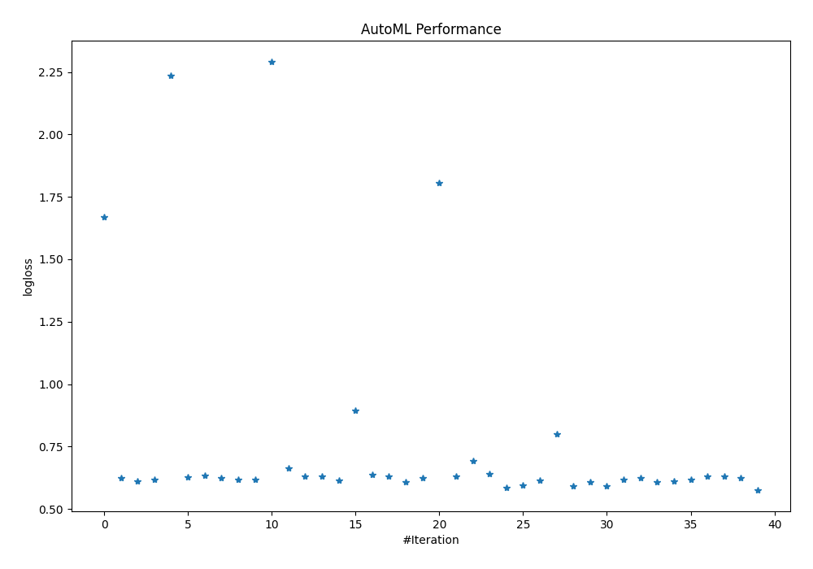
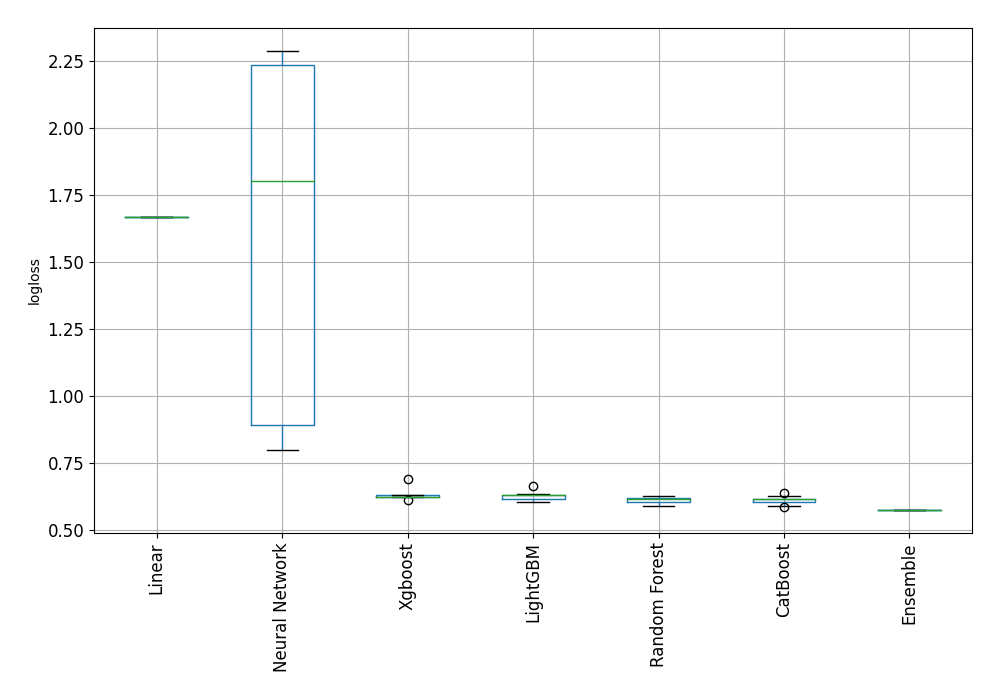
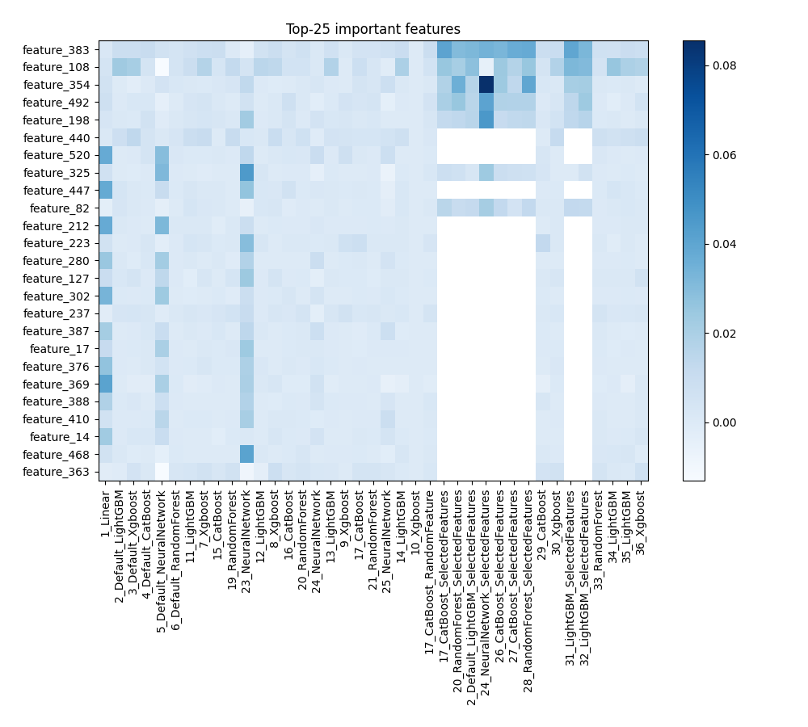
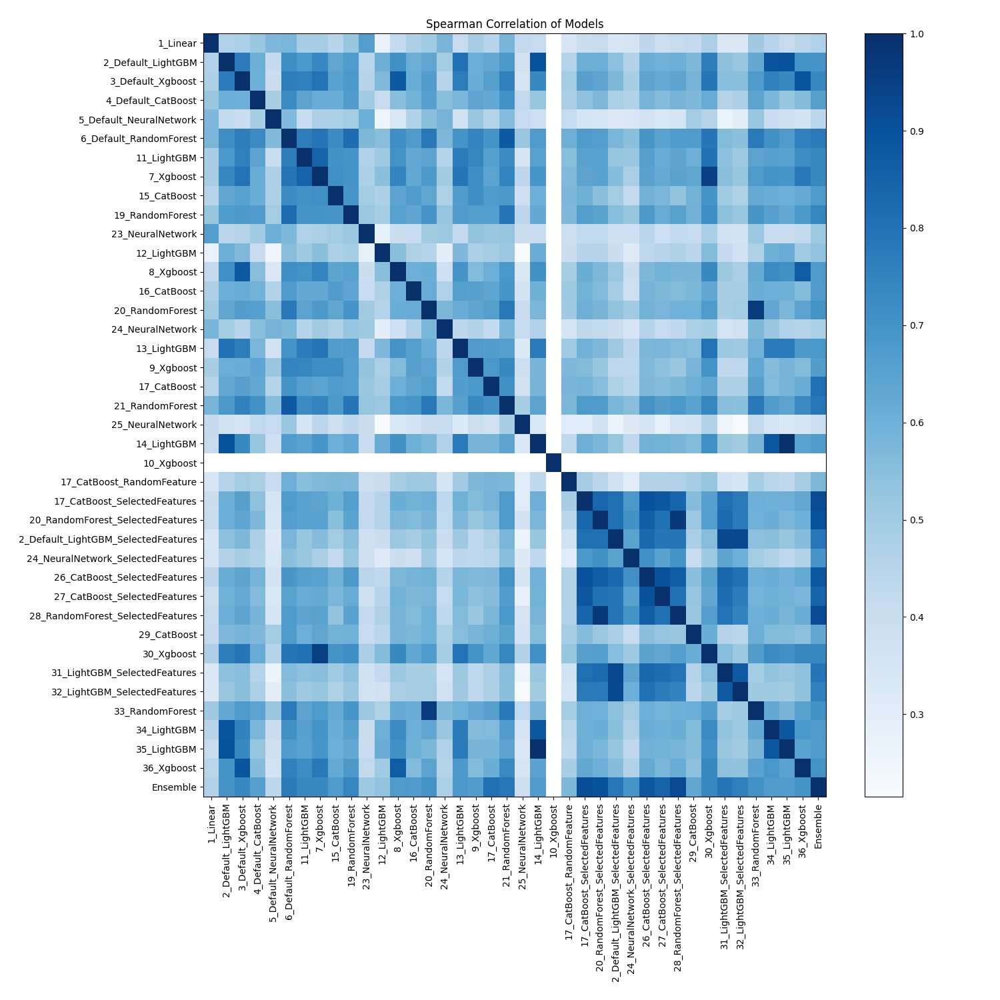

# AutoML Leaderboard

| Best model   | name                                                                                 | model_type     | metric_type   |   metric_value |   train_time |   single_prediction_time |
|:-------------|:-------------------------------------------------------------------------------------|:---------------|:--------------|---------------:|-------------:|-------------------------:|
|              | [1_Linear](1_Linear/README.md)                                                       | Linear         | logloss       |       1.66983  |        47.02 |                   0.2917 |
|              | [2_Default_LightGBM](2_Default_LightGBM/README.md)                                   | LightGBM       | logloss       |       0.62357  |         5.63 |                   0.2773 |
|              | [3_Default_Xgboost](3_Default_Xgboost/README.md)                                     | Xgboost        | logloss       |       0.611399 |       421.02 |                   0.285  |
|              | [4_Default_CatBoost](4_Default_CatBoost/README.md)                                   | CatBoost       | logloss       |       0.616243 |        55.2  |                   0.3436 |
|              | [5_Default_NeuralNetwork](5_Default_NeuralNetwork/README.md)                         | Neural Network | logloss       |       2.23502  |         8.64 |                   0.3918 |
|              | [6_Default_RandomForest](6_Default_RandomForest/README.md)                           | Random Forest  | logloss       |       0.6278   |        42.73 |                   0.3675 |
|              | [11_LightGBM](11_LightGBM/README.md)                                                 | LightGBM       | logloss       |       0.634161 |         5.48 |                   0.2782 |
|              | [7_Xgboost](7_Xgboost/README.md)                                                     | Xgboost        | logloss       |       0.625457 |       406.41 |                   0.2809 |
|              | [15_CatBoost](15_CatBoost/README.md)                                                 | CatBoost       | logloss       |       0.617327 |        99.51 |                   0.3408 |
|              | [19_RandomForest](19_RandomForest/README.md)                                         | Random Forest  | logloss       |       0.616654 |        27.14 |                   0.3325 |
|              | [23_NeuralNetwork](23_NeuralNetwork/README.md)                                       | Neural Network | logloss       |       2.28946  |         9.04 |                   0.3891 |
|              | [12_LightGBM](12_LightGBM/README.md)                                                 | LightGBM       | logloss       |       0.663489 |         5.66 |                   0.2851 |
|              | [8_Xgboost](8_Xgboost/README.md)                                                     | Xgboost        | logloss       |       0.630069 |       409.3  |                   0.2822 |
|              | [16_CatBoost](16_CatBoost/README.md)                                                 | CatBoost       | logloss       |       0.629594 |        99.23 |                   0.3626 |
|              | [20_RandomForest](20_RandomForest/README.md)                                         | Random Forest  | logloss       |       0.615712 |        22.55 |                   0.3197 |
|              | [24_NeuralNetwork](24_NeuralNetwork/README.md)                                       | Neural Network | logloss       |       0.893568 |         9.77 |                   0.3886 |
|              | [13_LightGBM](13_LightGBM/README.md)                                                 | LightGBM       | logloss       |       0.635894 |         6.07 |                   0.2787 |
|              | [9_Xgboost](9_Xgboost/README.md)                                                     | Xgboost        | logloss       |       0.631836 |       404.38 |                   0.2839 |
|              | [17_CatBoost](17_CatBoost/README.md)                                                 | CatBoost       | logloss       |       0.606855 |        67.95 |                   0.348  |
|              | [21_RandomForest](21_RandomForest/README.md)                                         | Random Forest  | logloss       |       0.622754 |        25.19 |                   0.3309 |
|              | [25_NeuralNetwork](25_NeuralNetwork/README.md)                                       | Neural Network | logloss       |       1.80514  |        10.13 |                   0.3891 |
|              | [14_LightGBM](14_LightGBM/README.md)                                                 | LightGBM       | logloss       |       0.631686 |         7.14 |                   0.2783 |
|              | [10_Xgboost](10_Xgboost/README.md)                                                   | Xgboost        | logloss       |       0.693147 |       408.67 |                   0.2915 |
|              | [17_CatBoost_RandomFeature](17_CatBoost_RandomFeature/README.md)                     | CatBoost       | logloss       |       0.640051 |        61.36 |                   0.3448 |
|              | [17_CatBoost_SelectedFeatures](17_CatBoost_SelectedFeatures/README.md)               | CatBoost       | logloss       |       0.586664 |         3.38 |                   0.0198 |
|              | [20_RandomForest_SelectedFeatures](20_RandomForest_SelectedFeatures/README.md)       | Random Forest  | logloss       |       0.594476 |         4.78 |                   0.0399 |
|              | [2_Default_LightGBM_SelectedFeatures](2_Default_LightGBM_SelectedFeatures/README.md) | LightGBM       | logloss       |       0.615567 |         3.19 |                   0.0174 |
|              | [24_NeuralNetwork_SelectedFeatures](24_NeuralNetwork_SelectedFeatures/README.md)     | Neural Network | logloss       |       0.799705 |         3.77 |                   0.0271 |
|              | [26_CatBoost_SelectedFeatures](26_CatBoost_SelectedFeatures/README.md)               | CatBoost       | logloss       |       0.591951 |         3.51 |                   0.0202 |
|              | [27_CatBoost_SelectedFeatures](27_CatBoost_SelectedFeatures/README.md)               | CatBoost       | logloss       |       0.60816  |         3.79 |                   0.0201 |
|              | [28_RandomForest_SelectedFeatures](28_RandomForest_SelectedFeatures/README.md)       | Random Forest  | logloss       |       0.592273 |         5    |                   0.0392 |
|              | [29_CatBoost](29_CatBoost/README.md)                                                 | CatBoost       | logloss       |       0.618606 |        52.27 |                   0.3502 |
|              | [30_Xgboost](30_Xgboost/README.md)                                                   | Xgboost        | logloss       |       0.625119 |       405.85 |                   0.2858 |
|              | [31_LightGBM_SelectedFeatures](31_LightGBM_SelectedFeatures/README.md)               | LightGBM       | logloss       |       0.607325 |         3.62 |                   0.0196 |
|              | [32_LightGBM_SelectedFeatures](32_LightGBM_SelectedFeatures/README.md)               | LightGBM       | logloss       |       0.610673 |         3.64 |                   0.0173 |
|              | [33_RandomForest](33_RandomForest/README.md)                                         | Random Forest  | logloss       |       0.618311 |        23.64 |                   0.3236 |
|              | [34_LightGBM](34_LightGBM/README.md)                                                 | LightGBM       | logloss       |       0.630705 |         7.85 |                   0.2778 |
|              | [35_LightGBM](35_LightGBM/README.md)                                                 | LightGBM       | logloss       |       0.631686 |         7.95 |                   0.2812 |
|              | [36_Xgboost](36_Xgboost/README.md)                                                   | Xgboost        | logloss       |       0.622813 |       404.59 |                   0.2839 |
| **the best** | [Ensemble](Ensemble/README.md)                                                       | Ensemble       | logloss       |       0.576474 |         0.88 |                   0.4025 |

### AutoML Performance

### AutoML Performance Boxplot

### Features Importance

### Spearman Correlation of Models

